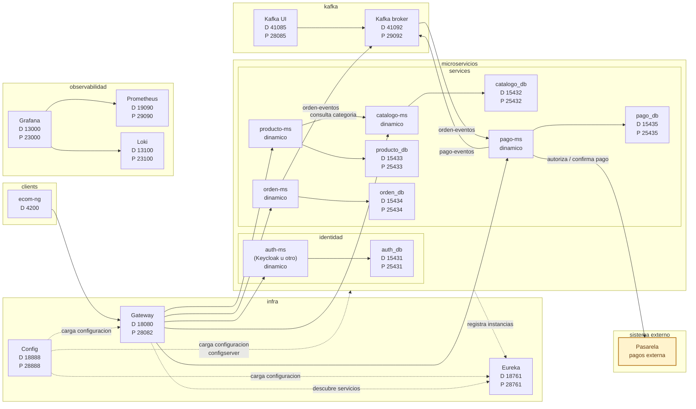

# DISTribuidas 2026

Curso practico de sistemas distribuidos con microservicios, configuracion centralizada, descubrimiento de servicios, Gateway, seguridad, resiliencia, mensajeria asincrona, consistencia distribuida, observabilidad e integracion frontend.

[`ecom`](https://github.com/261dist/ecom) es un entorno integrado para construir un sistema distribuido de comercio electronico mediante laboratorios reproducibles basados en Docker y Spring Cloud. El proyecto unifica infraestructura, microservicios, cliente frontend, mensajeria, observabilidad y documentacion para que cada equipo pueda adaptar el sistema a su proyecto final.

## Producto del curso

Producto del curso = Producto U3:

```text
Sistema distribuido de microservicios end-to-end, configurable, escalable,
seguro, resiliente, consistente, observable, integrado con frontend y defendido
tecnicamente.
```

Resultado esperado del curso:

Al finalizar el curso, el estudiante implementa, integra y sustenta un sistema distribuido basado en microservicios. La solucion debe ejecutarse de forma reproducible en desarrollo y produccion local, exponer evidencias de configuracion, registro, enrutamiento, escalado, seguridad, comunicacion entre servicios, mensajeria asincrona, consistencia distribuida, observabilidad, persistencia e integracion frontend. El producto se presenta en equipo, pero cada estudiante evidencia y defiende su aporte individual.

## Contenido

### U1: Sistema distribuido base orientado a produccion

Producto U1: sistema distribuido base funcional, configurable y preparado para multiples instancias.

Resultado esperado U1: el estudiante construye un primer servicio REST funcional, externaliza configuracion por ambientes, registra servicios dinamicamente, accede al sistema mediante un punto unico de entrada y demuestra distribucion de trafico entre instancias.

| Sesion | Tema | Producto de sesion |
|---|---|---|
| S1 | Construccion de un servicio base para un sistema distribuido | Servicio REST funcional, persistente, observable y preparado para ejecucion reproducible |
| S2 | Gestion centralizada de configuracion y ambientes | Configuracion externa por ambiente y evidencia inicial de observabilidad |
| S3 | Registro, descubrimiento y ejecucion concurrente de servicios | Servicios descubiertos dinamicamente y multiples instancias operativas |
| S4 | Punto unico de acceso y distribucion de trafico | Acceso centralizado con rutas y balanceo de carga |
| S5 | Evaluacion U1 | Sistema base integrado funcionando como un todo |

### U2: Sistema distribuido robusto

Producto U2: sistema distribuido seguro, resiliente, consistente, observable e integrado con cliente frontend.

Resultado esperado U2: el estudiante implementa comunicacion sincronica resiliente, seguridad distribuida, mensajeria asincrona, consistencia eventual en procesos de negocio, observabilidad operacional e integracion frontend mediante el punto unico de acceso.

| Sesion | Tema | Producto de sesion |
|---|---|---|
| S6 | Comunicacion sincronica resiliente entre servicios | Operacion distribuida con respuesta controlada ante fallos |
| S7 | Seguridad distribuida y control de acceso | Autenticacion, autorizacion y proteccion de rutas del sistema |
| S8 | Mensajeria asincrona entre servicios | Comunicacion por eventos entre servicios desacoplados |
| S9 | Consistencia distribuida en procesos de negocio | Proceso distribuido con consistencia eventual, compensacion e idempotencia |
| S10 | Observabilidad y diagnostico de sistemas distribuidos | Logs, health, metricas y paneles de diagnostico |
| S11 | Integracion con cliente frontend | Cliente integrado al sistema distribuido mediante Gateway |
| S12 | Evaluacion U2 | Sistema robusto validado en condiciones reales |

### U3: Validacion y consolidacion del producto del curso

Producto U3 / producto del curso: sistema distribuido de microservicios end-to-end, validado, documentado, estabilizado y defendido tecnicamente.

Resultado esperado U3: el estudiante integra los componentes desarrollados en las unidades anteriores, valida flujos completos, estabiliza documentacion y despliegue local, prepara evidencias tecnicas y sustenta el producto final. La defensa es grupal, pero la nota es individual.

| Sesion | Tema | Producto de sesion |
|---|---|---|
| S13 | Validacion end-to-end del producto del curso | Producto del curso probado integralmente |
| S14 | Revision tecnica y estabilizacion del producto | Documentacion, evidencias y estabilizacion |
| S15 | Defensa tecnica | Sustentacion grupal del producto |
| S16 | Evaluacion final | Demostracion individual de competencias pendientes |

## Arquitectura ecom v2026



Convencion del diagrama: las flechas continuas representan interacciones de negocio o consultas directas; las flechas punteadas representan dependencias de infraestructura, configuracion o descubrimiento.

## Flujo de trabajo

1. El alumno construye primero un microservicio base en `services/catalogo-ms` y replica el patron en otros servicios.
2. La infraestructura en `infra/` centraliza configuracion, descubrimiento y acceso por Gateway; los microservicios importan configuracion con `optional:configserver:${CONFIG_SERVER_URL:http://localhost:18888}`.
3. Los microservicios se ejecutan en DEV con Maven y bases de datos en Docker; al cierre de cada sesion se valida produccion local con Docker.
4. Las pruebas de API se realizan con PowerShell o bash/curl, sin depender de Postman.
5. Los flujos asincronos usan mensajeria para coordinar ordenes y pagos.
6. La observabilidad acompaña el curso desde S2 y se consolida en S10.
7. El frontend `clients/ecom-ng` consume el sistema mediante Gateway.
8. El producto final se valida end-to-end, se estabiliza y se defiende tecnicamente.

## Enlaces

- [Silabo detallado](silabo.md)
- [Guia del curso](guia-curso.md)
- [Puertos y accesos](referencias/puertos.md)
- [Comandos PowerShell](referencias/comandos-powershell.md)
- [Comandos bash macOS/Linux](referencias/comandos-bash.md)
- [Troubleshooting](referencias/troubleshooting.md)
- [Rubrica](referencias/rubrica.md)
