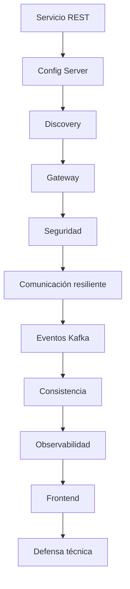

# Proyecto Sello de Desarrollo de Aplicaciones Distribuidas

## 1. Propósito

El Proyecto Sello integra las sesiones de **Desarrollo de Aplicaciones Distribuidas** alrededor de un sistema de microservicios construido de manera progresiva. Cada sesión agrega una capacidad real de arquitectura distribuida hasta llegar a un producto end-to-end configurable, seguro, resiliente, observable y defendible técnicamente.

```text
Servicio -> Configuración -> Descubrimiento -> Gateway -> Seguridad -> Eventos -> Observabilidad -> Frontend -> Defensa
```

## 2. El Proyecto

Durante el semestre desarrollarás un **sistema distribuido de microservicios end-to-end** aplicado a un flujo de negocio.

El proyecto debe integrar microservicios, infraestructura, Gateway, seguridad, comunicación síncrona y asíncrona, consistencia distribuida, observabilidad, persistencia, frontend y evidencias de operación reproducible.

No se busca solo ejecutar contenedores. Se espera una arquitectura distribuida que pueda explicar por qué cada servicio existe, cómo se comunica, cómo falla, cómo se observa y cómo se recupera.

No se considera Proyecto Sello:

- Microservicios aislados sin flujo de negocio.
- APIs sin configuración, descubrimiento o Gateway.
- Contenedores levantados sin evidencias de integración.
- Eventos sin relación con un proceso distribuido.
- Frontend desconectado del sistema.
- Un producto que el estudiante no pueda defender técnicamente.

## 3. Evolución del Proyecto

| Unidad | Temas principales | Evolución del proyecto |
|---|---|---|
| Unidad 1 | Servicio base, configuración centralizada, descubrimiento, Gateway y múltiples instancias. | Sistema distribuido base funcional, configurable y preparado para escalar. |
| Unidad 2 | Comunicación resiliente, seguridad, mensajería, consistencia, observabilidad e integración frontend. | Sistema distribuido robusto, seguro, observable e integrado. |
| Unidad 3 | Validación end-to-end, estabilización, documentación y defensa técnica. | Sistema distribuido final validado, documentado y defendido. |



### Alineamiento por sesiones

Este alineamiento muestra cómo cada bloque de sesiones agrega una capacidad distribuida verificable al mismo sistema de microservicios.

| Sesiones | Contenido central | Avance del proyecto |
|---|---|---|
| S1-S2 | Servicio base, persistencia, configuración centralizada y ambientes. | Brief técnico, primer microservicio y configuración externalizada. |
| S3-S4 | Registro, descubrimiento, Gateway y balanceo de carga. | Infraestructura distribuida base con acceso centralizado y múltiples instancias. |
| S5 | Evaluación U1. | Sistema distribuido base integrado y reproducible. |
| S6-S7 | Comunicación resiliente, seguridad distribuida y control de acceso. | Servicios protegidos y comunicación controlada ante fallos. |
| S8-S9 | Mensajería asíncrona y consistencia distribuida. | Flujo de negocio por eventos, compensación o idempotencia. |
| S10-S11 | Observabilidad e integración frontend. | Logs, métricas, health, paneles y cliente integrado por Gateway. |
| S12 | Evaluación U2. | Sistema robusto validado en condiciones reales. |
| S13-S14 | Validación end-to-end, estabilización y documentación. | Producto final probado, documentado y listo para defensa. |
| S15-S16 | Defensa técnica y evaluación final. | Sustentación grupal con aporte individual verificable. |

## 4. Cronograma

| Hito | Momento | Producto esperado |
|---|---|---|
| S2 | Brief técnico | Flujo de negocio, servicios previstos, datos, endpoints iniciales y alcance. |
| S5 | Producto U1 | Sistema base con servicio REST, configuración, descubrimiento, Gateway y balanceo. |
| S12 | Producto U2 | Sistema robusto con resiliencia, seguridad, eventos, consistencia, observabilidad y frontend. |
| S15 | Producto final | Sistema end-to-end validado, documentado y defendido técnicamente. |
| S16 | Cierre individual | Evaluación final y demostración de competencias pendientes. |

## 5. Producto Final

### Repositorio académico y topics

Desde la primera presentación del proyecto, el repositorio debe estar creado y configurado con los topics académicos mínimos. Esta configuración es obligatoria porque permite identificar campus, semestre, línea, tipo de proyecto, curso, sección y grupo.

El detalle oficial del estándar se encuentra en [Estándar transversal de topics para repositorios académicos](https://upeuoficial.github.io/planb/anexos/estandar-topics-repositorios/).

Ejemplo base para Distribuidas:

```text
campus-juliaca
semestre-2026-2
linea-software
tipo-ps
dist
seccion-g1
grupo-<numero>-<nombre-proyecto>
```

Componentes mínimos:

- Microservicios con responsabilidades claras.
- Configuración centralizada por ambiente.
- Registro y descubrimiento de servicios.
- API Gateway con rutas y balanceo.
- Persistencia por servicio según el caso.
- Seguridad distribuida con autenticación, autorización y rutas protegidas.
- Comunicación síncrona resiliente.
- Mensajería asíncrona con eventos de negocio.
- Consistencia distribuida, compensación o idempotencia según el flujo.
- Logs, health checks, métricas y paneles de observabilidad.
- Frontend integrado mediante Gateway.
- Docker o entorno reproducible.
- Documentación técnica y evidencias de ejecución.

## 6. Evaluación

Los criterios se organizan según una matriz común de evaluación de proyectos académicos: problema, arquitectura, implementación, datos o comunicación, integración, calidad, validación y sustentación. Cada criterio se adapta al enfoque de sistemas distribuidos y se verifica mediante evidencias del producto, el repositorio y la demostración.

| Dimensión común | Criterio del PS | Qué se observa |
|---|---|---|
| Problema y alcance | Alcance del sistema distribuido | El proyecto responde a una necesidad clara y delimita los servicios, actores y flujos principales. |
| Requerimientos o funcionalidad esperada | Flujos distribuidos esperados | Los servicios cubren los casos principales del negocio y exponen operaciones verificables. |
| Diseño, modelo o arquitectura | Arquitectura distribuida | Los servicios tienen responsabilidades claras y forman un flujo coherente. |
| Implementación técnica | Configuración, seguridad y resiliencia | Config Server, perfiles, registro de servicios, Gateway, seguridad y resiliencia funcionan integrados. |
| Datos, persistencia o procesamiento | Mensajería y consistencia | Los eventos, compensaciones e idempotencia responden al proceso de negocio. |
| Integración del producto | Integración frontend | El cliente consume flujos reales mediante Gateway y seguridad. |
| Calidad técnica | Reproducibilidad y observabilidad | El sistema puede levantarse con comandos documentados y cuenta con logs, métricas, health checks o paneles útiles para diagnóstico. |
| Validación, pruebas o resultados | Pruebas y resultados verificables | Se presentan pruebas, capturas, comandos, logs, accesos permitidos/denegados y resultados verificables. |
| Sustentación técnica | Sustentación técnica | El equipo explica arquitectura, comunicación entre servicios, decisiones técnicas, fallos controlados, limitaciones y evidencias generadas. |
| Sustentación profesional | Sustentación profesional | El equipo expone con orden, cada integrante defiende su aporte, demuestra el sistema en vivo y presenta el repositorio académico disponible desde la primera presentación con los topics mínimos configurados correctamente y evidencia el cumplimiento de estándares básicos de programación, organización del repositorio, documentación y reproducibilidad. |

## 7. Sustentación

| Momento | Tiempo sugerido | Propósito |
|---|---:|---|
| Exposición técnica | 10 minutos | Presentar arquitectura, servicios, flujo distribuido, seguridad, eventos y observabilidad. |
| Demostración en vivo | 5 minutos | Ejecutar el flujo end-to-end, evidenciar Gateway, servicios, eventos, seguridad y monitoreo. |

Cada integrante debe demostrar su aporte: servicio, configuración, seguridad, frontend, mensajería, observabilidad, documentación o pruebas. La defensa es grupal, pero la nota técnica exige aporte individual verificable.

Se espera presentación profesional: comunicación clara, puntualidad, vestimenta adecuada, apariencia ordenada y disposición para responder preguntas técnicas.

## 8. Resultado Esperado

Al finalizar el curso, el estudiante debe demostrar que puede construir y defender un sistema distribuido realista, reproducible y observable.

```text
Flujo de negocio -> Microservicios -> Infraestructura -> Seguridad -> Eventos -> Observabilidad -> Frontend -> Defensa
```
