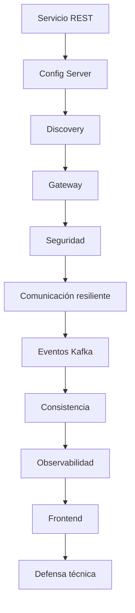

# Proyecto Sello de Desarrollo de Aplicaciones Distribuidas

## 1. Propósito

El Proyecto Sello integra las sesiones de **Desarrollo de Aplicaciones Distribuidas** alrededor de un sistema de microservicios construido de manera progresiva. Cada sesión agrega una capacidad real de arquitectura distribuida hasta llegar a un producto end-to-end configurable, seguro, resiliente, observable y defendible técnicamente.

### Competencia o capacidad del proyecto

Al finalizar el Proyecto Sello, el estudiante demuestra que puede diseñar, implementar y defender un sistema distribuido end-to-end, aplicando microservicios, configuración centralizada, descubrimiento, Gateway, seguridad, resiliencia, mensajería, observabilidad, integración frontend, reproducibilidad y sustentación integral del producto.

### Competencias relacionadas

| Código | Competencia | Relación con el proyecto |
|---|---|---|
| CE023 | Programación | Evidencia construcción de un sistema distribuido escalable basado en servicios interoperables. |
| CE022 | Ingeniería de la Información | Evidencia persistencia, mensajería, consistencia y procesamiento de datos entre servicios. |
| CE024 | Calidad de Software | Evidencia seguridad, resiliencia, observabilidad, reproducibilidad, documentación y sustentación integral. |

```text
Servicio -> Configuración -> Descubrimiento -> Gateway -> Seguridad -> Eventos -> Observabilidad -> Frontend -> Defensa
```

## 2. El Proyecto

Durante el semestre desarrollarás un **sistema distribuido de microservicios end-to-end** aplicado a un flujo de negocio.

El proyecto debe integrar microservicios, infraestructura, Gateway, seguridad, comunicación síncrona y asíncrona, consistencia distribuida, observabilidad, persistencia, frontend y evidencias de operación reproducible.

No se busca solo ejecutar contenedores. Se espera una arquitectura distribuida que pueda explicar por qué cada servicio existe, cómo se comunica, cómo falla, cómo se observa y cómo se recupera.

No se considera Proyecto Sello:

- Microservicios aislados sin flujo de negocio.
- APIs sin configuración, descubrimiento o Gateway.
- Contenedores levantados sin evidencias de integración.
- Eventos sin relación con un proceso distribuido.
- Frontend desconectado del sistema.
- Un producto que el estudiante no pueda defender técnicamente.

## 3. Evolución del Proyecto

| Unidad | Temas principales | Evolución del proyecto |
|---|---|---|
| Unidad 1 | Servicio base, configuración centralizada, descubrimiento, Gateway y múltiples instancias. | Sistema distribuido base funcional, configurable y preparado para escalar. |
| Unidad 2 | Comunicación resiliente, seguridad, mensajería, consistencia, observabilidad e integración frontend. | Sistema distribuido robusto, seguro, observable e integrado. |
| Unidad 3 | Validación end-to-end, estabilización, documentación y defensa técnica. | Sistema distribuido final validado, documentado y defendido. |



### Alineamiento por sesiones

Este alineamiento muestra cómo cada bloque de sesiones agrega una capacidad distribuida verificable al mismo sistema de microservicios.

| Sesiones | Contenido central | Avance del proyecto |
|---|---|---|
| S1-S2 | Servicio base, persistencia, configuración centralizada y ambientes. | Brief técnico, primer microservicio y configuración externalizada. |
| S3-S4 | Registro, descubrimiento, Gateway y balanceo de carga. | Infraestructura distribuida base con acceso centralizado y múltiples instancias. |
| S5 | Evaluación U1. | Sistema distribuido base integrado y reproducible. |
| S6-S7 | Comunicación resiliente, seguridad distribuida y control de acceso. | Servicios protegidos y comunicación controlada ante fallos. |
| S8-S9 | Mensajería asíncrona y consistencia distribuida. | Flujo de negocio por eventos, compensación o idempotencia. |
| S10-S11 | Observabilidad e integración frontend. | Logs, métricas, health, paneles y cliente integrado por Gateway. |
| S12 | Evaluación U2. | Sistema robusto validado en condiciones reales. |
| S13-S14 | Validación end-to-end, estabilización y documentación. | Producto final probado, documentado y listo para defensa. |
| S15-S16 | Defensa técnica y evaluación final. | Sustentación grupal con aporte individual verificable. |

## 4. Cronograma

| Hito | Momento | Producto esperado |
|---|---|---|
| S2 | Brief técnico | Flujo de negocio, servicios previstos, datos, endpoints iniciales y alcance. |
| S5 | Producto U1 | Sistema base con servicio REST, configuración, descubrimiento, Gateway y balanceo. |
| S12 | Producto U2 | Sistema robusto con resiliencia, seguridad, eventos, consistencia, observabilidad y frontend. |
| S15 | Producto final | Sistema end-to-end validado, documentado y defendido técnicamente. |
| S16 | Cierre individual | Evaluación final y demostración de competencias pendientes. |

## 5. Producto Final

### Repositorio académico y topics

Desde la primera presentación del proyecto, el repositorio debe estar creado y configurado con los topics académicos mínimos. Esta configuración es obligatoria porque permite identificar campus, semestre, línea, tipo de proyecto, curso, sección y grupo.

El detalle oficial del estándar se encuentra en [Estándar transversal de topics para repositorios académicos](https://upeuoficial.github.io/planb/anexos/estandar-topics-repositorios/).

Ejemplo base para Distribuidas:

```text
campus-juliaca
semestre-2026-2
linea-software
tipo-ps
dist
seccion-g1
grupo-<numero>-<nombre-proyecto>
```

Componentes mínimos:

- Microservicios con responsabilidades claras.
- Configuración centralizada por ambiente.
- Registro y descubrimiento de servicios.
- API Gateway con rutas y balanceo.
- Persistencia por servicio según el caso.
- Seguridad distribuida con autenticación, autorización y rutas protegidas.
- Comunicación síncrona resiliente.
- Mensajería asíncrona con eventos de negocio.
- Consistencia distribuida, compensación o idempotencia según el flujo.
- Logs, health checks, métricas y paneles de observabilidad.
- Frontend integrado mediante Gateway.
- Docker o entorno reproducible.
- Documentación técnica y evidencias de ejecución.

## 6. Evaluación por competencias

Los criterios se organizan según una matriz común de evaluación de proyectos académicos: problema, arquitectura, implementación, datos o comunicación, integración y calidad, validación y sustentación. Cada criterio se adapta al enfoque de sistemas distribuidos y se verifica mediante evidencias del producto, el repositorio y la demostración.

| Dimensión común | Criterio del PS | Capacidad evaluada | Evidencias esperadas |
|---|---|---|---|
| 1. Problema y alcance | Arquitectura distribuida | Delimita un problema que justifica distribución, servicios y comunicación entre componentes. | Problema, alcance, servicios, actores, restricciones y justificación técnica. |
| 2. Requerimientos o funcionalidad esperada | Funcionalidad distribuida | Define flujos verificables entre cliente, gateway, servicios y datos. | Endpoints, flujos, criterios de aceptación, seguridad esperada y escenarios de uso. |
| 3. Diseño, modelo o arquitectura | Diseño de microservicios | Diseña componentes distribuidos con responsabilidades claras y comunicación definida. | Diagrama de arquitectura, servicios, API Gateway, seguridad, mensajería o integración. |
| 4. Implementación técnica | Backend distribuido | Implementa servicios, APIs, seguridad, comunicación y despliegue básico según el alcance. | Código, endpoints, configuración, Docker o scripts, autenticación y servicios ejecutables. |
| 5. Datos, persistencia o procesamiento | Datos por servicio | Gestiona datos, persistencia o eventos de forma coherente con la arquitectura. | Bases, esquemas, datos de prueba, eventos, consultas o evidencias de persistencia. |
| 6. Integración del producto y calidad técnica | Integración frontend y calidad técnica | Integra cliente, Gateway y servicios en una experiencia funcional, ordenada y reproducible. | Cliente consumiendo servicios reales, autenticación, flujo end-to-end, comandos, logs, health checks y documentación. |
| 7. Validación, pruebas o resultados | Pruebas y resultados verificables | Comprueba comportamiento, seguridad, resiliencia y resultados del sistema. | Pruebas, capturas, comandos, accesos permitidos/denegados y evidencias de fallos controlados. |
| 8. Sustentación técnica y profesional | Sustentación integral | Defiende técnica y profesionalmente la solución distribuida, evidenciando autoría, comprensión y responsabilidad académica. | Pitch, demo end-to-end, defensa técnica, aporte individual, repositorio, topics y MkDocs o equivalente. |

### Rúbrica

| Criterios | % | A (20) | B (15) | C (10) | D (5) |
|---|---:|---|---|---|---|
| 1. Problema y alcance | 10% | Problema claro, viable y bien delimitado; el alcance responde al contexto y está justificado. | Problema y alcance comprensibles, con algunos límites o justificaciones por precisar. | Problema poco delimitado o alcance parcialmente viable. | Problema confuso, sin alcance definido o sin relación clara con el producto. |
| 2. Requerimientos o funcionalidad esperada | 10% | Funcionalidades o requerimientos completos, coherentes y verificables según la necesidad planteada. | Funcionalidades principales cubiertas, con detalles menores pendientes o poco precisos. | Funcionalidades incompletas o parcialmente alineadas al problema. | Funcionalidades ausentes, inconexas o sin relación verificable con la necesidad. |
| 3. Diseño, modelo o arquitectura | 10% | Diseño, modelo o arquitectura coherente, aplicado y alineado al producto; muestra estructura y decisiones claras. | Diseño funcional con limitaciones menores o decisiones parcialmente justificadas. | Diseño poco claro, incompleto o aplicado de forma parcial. | No presenta diseño, modelo o arquitectura verificable. |
| 4. Implementación técnica | 10% | Implementación correcta, funcional y alineada a los contenidos centrales del curso. | Implementación funcional con detalles técnicos menores por corregir. | Implementación parcial, con errores o uso limitado de los contenidos del curso. | Implementación insuficiente, no funcional o no relacionada con los contenidos del curso. |
| 5. Datos, persistencia o procesamiento | 10% | Los datos se gestionan, almacenan, consultan o procesan correctamente según el tipo de proyecto. | Gestión de datos funcional con detalles menores de consistencia, estructura o procesamiento. | Gestión de datos parcial, limitada o con errores relevantes. | No hay manejo de datos verificable o este impide el funcionamiento del producto. |
| 6. Integración del producto y calidad técnica | 10% | El producto funciona como sistema integrado, ordenado, documentado y reproducible. | Integración funcional con detalles menores de organización, documentación o reproducibilidad. | Integración parcial; existen componentes aislados, desorden o evidencias incompletas. | Componentes desconectados, sin organización técnica ni evidencia reproducible. |
| 7. Validación, pruebas o resultados | 10% | Presenta pruebas, evidencias o resultados claros que comprueban el funcionamiento y el valor del producto. | Presenta evidencias suficientes, con algunos casos o resultados por completar. | Evidencias limitadas, poco claras o con validación parcial. | No presenta pruebas, evidencias ni resultados verificables. |
| 8. Sustentación técnica y profesional | 30% | Explica y defiende el producto con solvencia; demuestra aporte individual, dominio técnico, comunicación clara, repositorio, documentación y actitud profesional. | Sustentación clara y funcional, con detalles menores en defensa técnica, evidencias, comunicación o documentación. | Sustentación parcial; dominio, evidencias, comunicación o aporte individual insuficientemente demostrados. | No sustenta adecuadamente, no demuestra autoría o no presenta evidencias mínimas del producto. |

### Subaspectos de la sustentación integral

La sustentación integral debe representar como mínimo el 30% de la evaluación del proyecto. Se revisa mediante los siguientes subaspectos:

| Subaspecto | Qué observa |
|---|---|
| 1. Defensa técnica | Explicación de arquitectura, comunicación entre servicios, decisiones técnicas, fallos controlados, limitaciones y evidencias generadas. |
| 2. Comunicación y orden | Claridad, estructura, tiempo y lenguaje técnico. |
| 3. Presentación personal y actitud | Puntualidad, vestimenta limpia y adecuada, higiene, cabello ordenado, actitud profesional, respeto, honestidad y coherencia con los valores y principios cristianos de la institución. |
| 4. Aporte individual | Cada integrante demuestra lo que hizo. |
| 5. Repositorio y estándares | Topics, organización, commits, documentación y reproducibilidad. |
| 6. MkDocs o equivalente | Documentación publicada, navegable y alineada al producto. |
| 7. Pitch/demo ejecutiva | Introducción clara del problema, solución y valor, seguida de una demo funcional. |

La sustentación profesional forma parte de la evaluación porque el producto final no solo debe funcionar; también debe ser presentado, explicado y defendido con responsabilidad académica, ética, respeto, honestidad y coherencia con los valores y principios cristianos de la institución.

## 7. Sustentación

La sustentación inicia con un video pitch breve o introducción ejecutiva de 1 a 3 minutos para presentar el problema, la solución, el valor del producto y la participación del equipo o estudiante.

| Momento | Tiempo sugerido | Propósito |
|---|---:|---|
| Exposición técnica | 10 minutos | Presentar arquitectura, servicios, flujo distribuido, seguridad, eventos y observabilidad. |
| Demostración en vivo | 5 minutos | Ejecutar el flujo end-to-end, evidenciar Gateway, servicios, eventos, seguridad y monitoreo. |

Cada integrante debe demostrar su aporte: servicio, configuración, seguridad, frontend, mensajería, observabilidad, documentación o pruebas. La defensa es grupal, pero la nota técnica exige aporte individual verificable.

## 8. Resultado Esperado

Al finalizar el curso, el estudiante debe demostrar que puede construir y defender un sistema distribuido realista, reproducible y observable.

```text
Flujo de negocio -> Microservicios -> Infraestructura -> Seguridad -> Eventos -> Observabilidad -> Frontend -> Defensa
```

## Anexo. Secuencia sugerida de presentación

La presentación puede organizarse con una secuencia breve de apoyo visual. El video pitch o introducción ejecutiva abre la sustentación y no reemplaza la demo ni la defensa técnica.

| Orden | Slide o momento | Propósito | Competencia evidenciada |
|---:|---|---|---|
| 1 | Título del proyecto y equipo | Identificar el proyecto, integrantes y dominio elegido. | CE024 |
| 2 | Video pitch o introducción ejecutiva | Presentar problema, solución, valor y participación del equipo. | CE024 |
| 3 | 1. Problema y alcance | Explicar el proceso distribuido y los límites del sistema. | CE023 |
| 4 | Arquitectura distribuida | Mostrar servicios, Gateway, configuración y comunicación. | CE023 |
| 5 | Seguridad | Evidenciar rutas protegidas, autenticación o autorización. | CE024 |
| 6 | Resiliencia y consistencia | Explicar fallos controlados, eventos, compensaciones o idempotencia. | CE022 + CE024 |
| 7 | Observabilidad | Mostrar logs, métricas, health checks o paneles. | CE024 |
| 8 | Integración frontend | Explicar cómo el cliente consume los servicios reales. | CE023 |
| 9 | Demo end-to-end | Ejecutar el flujo principal del sistema distribuido. | CE023 + CE024 |
| 10 | 4. Aporte individual | Indicar qué hizo cada integrante. | CE024 |
| 11 | 5. Repositorio y estándares | Mostrar repositorio, topics, estructura, documentación publicada en MkDocs o equivalente, y forma de ejecución. | CE024 |
| 12 | Limitaciones y mejoras | Reconocer límites del producto y mejoras posibles. | CE024 |

## Anexo. Plantilla mínima de documentación MkDocs o equivalente

La documentación publicada no reemplaza al informe. Su función es permitir que otra persona comprenda, ejecute, revise y verifique el producto desde el repositorio.

| Página o sección | Contenido mínimo | Evidencia esperada |
|---|---|---|
| Inicio | Nombre del proyecto, problema, solución, curso o cursos, integrantes y enlace al repositorio. | Presentación clara del producto. |
| Instalación o ejecución | Requisitos, dependencias, configuración y comandos para ejecutar el proyecto. | Instrucciones reproducibles. |
| Uso del sistema | Flujo principal, pantallas, comandos, endpoints, notebooks o casos de uso según corresponda. | Guía breve para probar el producto. |
| Arquitectura o estructura | Diagrama, componentes, carpetas principales y decisiones técnicas. | Vista técnica comprensible. |
| Módulos o funcionalidades | Descripción de las funciones principales del producto. | Relación entre funcionalidades y problema. |
| Datos | Modelo, archivos, base de datos, datasets, fuentes o estructura de almacenamiento según el curso. | Evidencia de gestión de datos. |
| Pruebas y evidencias | Casos de prueba, capturas, resultados, métricas, validaciones o salidas generadas. | Verificación del funcionamiento. |
| Equipo y aporte individual | Integrantes, responsabilidades, aportes y evidencias de participación. | Autoría verificable. |
| 5. Repositorio y estándares | Topics académicos, estructura, commits, ramas si aplica y criterios de reproducibilidad. | Cumplimiento de estándares técnicos. |
| Limitaciones y mejoras | Restricciones del producto y mejoras futuras priorizadas. | Cierre reflexivo y realista. |

La documentación debe estar disponible desde las primeras presentaciones y crecer con el proyecto. Para FP puede ser una documentación sencilla; para proyectos integradores y cursos avanzados debe ser más completa y técnica.
## Anexo. Plantilla sugerida de informe del proyecto

El informe debe documentar el producto de manera breve, verificable y alineada a las competencias evaluadas. No reemplaza la demo ni la sustentación; organiza las evidencias del proyecto.

| Sección | Contenido mínimo | Evidencia esperada |
|---|---|---|
| Portada | Nombre del proyecto, curso, sección, integrantes, docente y semestre. | Datos completos del equipo. |
| Resumen del proyecto | Problema, solución distribuida y valor del producto. | Síntesis de 8 a 12 líneas. |
| Competencia y alcance | Competencia/capacidad del proyecto y competencias relacionadas. | CE023, CE022 y CE024 vinculadas al producto. |
| Flujo de negocio | Proceso distribuido, actores, servicios y límites. | Descripción del flujo end-to-end. |
| Arquitectura distribuida | Microservicios, Gateway, configuración, descubrimiento y comunicación. | Diagrama de arquitectura y componentes. |
| Datos y consistencia | Persistencia, eventos, compensaciones o idempotencia. | Evidencias de datos, mensajes y resultados. |
| Observabilidad | Logs, métricas, health checks o paneles. | Capturas, comandos o paneles. |
| Validación y pruebas | Pruebas de flujo, seguridad, fallos y resultados. | Tabla de pruebas y evidencias. |
| Repositorio y documentación | Repositorio, topics, estructura, comandos y documentación publicada. | URL del repositorio y MkDocs o equivalente. |
| 4. Aporte individual | Responsabilidad de cada integrante. | Tabla de tareas, commits o evidencias por integrante. |
| Limitaciones y mejoras | Límites actuales y mejoras posibles. | Lista priorizada y realista. |


