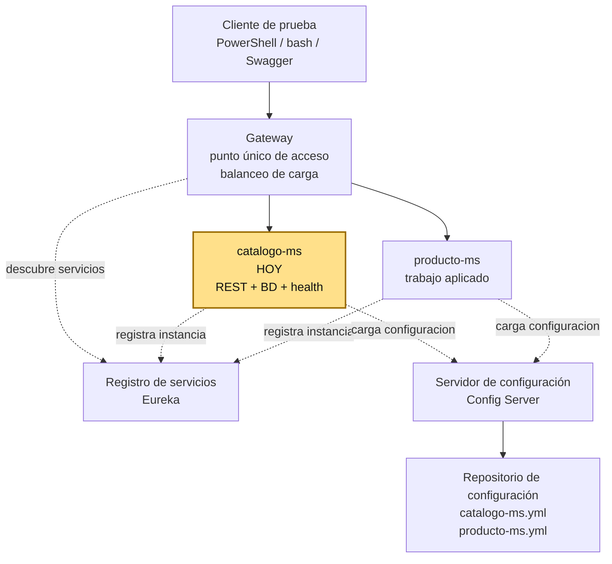
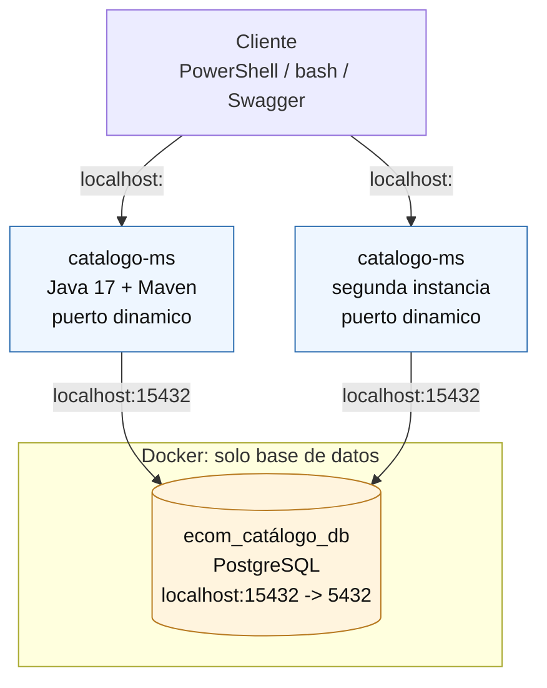
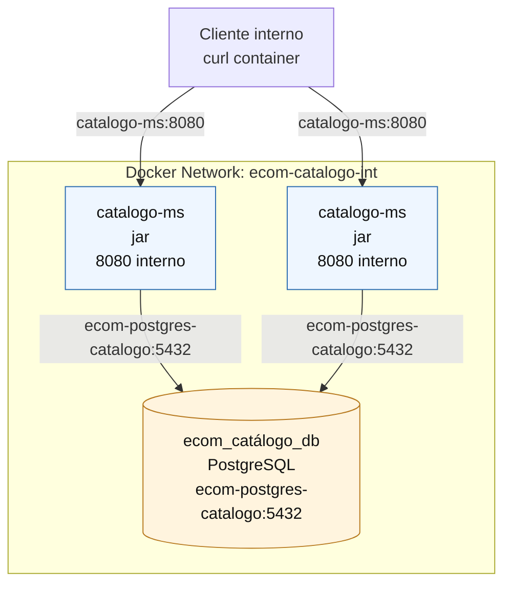

# S1 - Construcción de un servicio base para un sistema distribuido

## 1. Introducción

Tiempo: 20 min.

### 1.1 Propósito

Construir el primer servicio de negocio del sistema y dejarlo preparado para crecer hacia una arquitectura distribuida.

### 1.2 Resultado de aprendizaje

El estudiante implementa un microservicio stateless con API REST, persistencia, validación, documentación de endpoints, health check y ejecución reproducible en desarrollo y producción.

### 1.3 Producto de sesión

`catalogo-ms` funcional con CRUD de categorías, PostgreSQL en Docker, Swagger, Actuator, README operativo y pruebas por shell.

### 1.4 Motivacion de la sesión

#### 1.4.1 Caso: plataforma de comercio electrónico

Una empresa desarrolla un sistema de comercio electrónico. Inicialmente, todo el sistema fue construido como una sola aplicación monolitica.

Con el crecimiento del negocio comienzan a aparecer problemas:

- El sistema tarda más en desplegarse.
- Errores en un módulo afectan a todo el sistema.
- Es difícil escalar partes especificas del sistema.
- Los equipos de desarrollo trabajan sobre el mismo código.

El equipo de ingenieria decide redisenar la arquitectura del sistema utilizando microservicios.

Preguntas para los estudiantes:

1. Qué problemas tiene la arquitectura monolitica en este caso?
2. Por qué una empresa migraría a microservicios?
3. Qué ventajas ofrece dividir el sistema en servicios?

En esta sesión se inicia ese redisenio construyendo el primer componente del sistema ecom: `catalogo-ms`.

### 1.5 Ubicación en el curso

- Unidad: U1 - Sistema distribuido base orientado a producción.
- Producto de unidad: sistema distribuido base funcional, configurable y preparado para múltiples instancias, ejecutable en desarrollo y producción local en paralelo.
- Avance del producto en esta sesión: primer microservicio REST funcional, persistente, observable y ejecutable fuera del IDE.

Roadmap para elaborar el producto de la unidad:



Hoy se construye el primer componente real de la U1: `catalogo-ms`. En las siguientes sesiones se agregan configuración centralizada, registro de servicios, múltiples instancias, Gateway y balanceo. La evaluación U1 valida el sistema base integrado construido con esos componentes.

## 2. Explica

Tiempo: 15 min.

### 2.1 Conceptos clave

Un microservicio debe tener responsabilidad clara, persistencia propia, configuración por ambiente y capacidad de ejecutarse de forma independiente.

Ejemplo: `catalogo-ms` se encarga de gestionar categorías y su propia base de datos. No debería guardar productos, ordenes ni pagos. Si más adelante `producto-ms` necesita saber a que categoría pertenece un producto, consulta a `catalogo-ms` por red en lugar de leer directamente su base de datos.

### 2.2 Arquitectura del producto en `ecom`

#### 2.2.1 DEV: aplicación fuera de Docker



#### 2.2.2 PROD local: aplicación dentro de Docker



Regla práctica:

- Si la aplicación corre fuera de Docker, usa `localhost` con el puerto expuesto por Docker.
- Si la aplicación corre dentro de Docker, usa el nombre del servicio y el puerto interno.

#### 2.2.3 Flujo de trabajo

1. Preparar ambiente.
2. Crear proyecto Spring Boot y levantar PostgreSQL DEV.
3. Construir el CRUD de `Categoria`.
4. Ejecutar y probar en DEV.
5. Preparar archivos de PROD local.
6. Ejecutar y probar en Docker.
7. Registrar evidencias y defender el resultado.

### 2.3 Observabilidad y diagnóstico

La observabilidad inicia desde S1 como hábito transversal. En esta sesión todavía no hay stack completo de métricas y paneles, pero el estudiante ya debe revisar señales básicas del servicio y usar los errores como insumo de diagnóstico.

#### 2.3.1 Señales básicas a revisar

- Logs de arranque.
- Puerto dinamico asignado.
- Estado de `/actuator/health`.
- Métricas de `/actuator/metrics`.
- Conexión a PostgreSQL.
- Migraciones Flyway ejecutadas.
- Errores de validación HTTP 400.
- Logs de contenedores con `docker compose logs`.

#### 2.3.2 Errores frecuentes y diagnóstico

| Problema | Causa probable | Solución |
|---|---|---|
| No conecta a BD | PostgreSQL apagado o puerto incorrecto | Revisar compose y variables |
| Swagger no abre | Puerto dinamico no identificado | Revisar consola o Eureka cuando aplique |
| Validación no responde | Falta `@Valid` o anotaciones | Revisar controlador y DTO |
| PROD local no responde desde host | El microservicio no publica puerto host | Probar desde red Docker o esperar Gateway |
| Escalado consume demasiados recursos | Muchas instancias locales | Usar máximo dos instancias |

## 3. Aplica: actividad práctica guiada

En el laboratorio, el docente guía la construcción de `catalogo-ms` y los estudiantes verifican el resultado con comandos de consola.

Tiempo: 3h.

En `ecom`, el docente guía `catalogo-ms` y el estudiante replica el patrón en `producto-ms` como trabajo aplicado. La versión actual usa monorepo, nombres con sufijo `-ms`, PostgreSQL y puertos dinámicos para los microservicios.

- Crear o revisar el microservicio base.
- Implementar entidad, repositorio, servicio y controlador.
- Levantar PostgreSQL DEV y probar endpoints.
- Revisar Swagger, health y README.
- Cerrar con una ejecución breve en producción local con Docker.

### 3.1 Preparar ambiente local: Java 17, Maven, Docker y VS Code

**Producto del paso:** ambiente local con Java 17, Maven, Docker, Docker Compose y VS Code verificados, listo para crear y ejecutar el microservicio.

Antes de crear el microservicio, el estudiante debe preparar el entorno DEV. En esta sesión Java y Maven se ejecutan en el host; PostgreSQL no se instala en el host, se levanta con Docker desde el paso 3.2.

**Herramientas necesarias**

- Java 17.
- Maven 3.x.
- Docker Desktop.
- VS Code.
- Extension Pack for Java.
- Spring Boot Extension Pack.

Puedes usar otro IDE si ya lo dominas, pero en este curso se trabajara con VS Code para mantener una guía común. Aún usando IDE, la ejecución recomendada del microservicio será desde la consola de comandos, al estilo de un servidor Linux.

#### 3.1.1 Instalar gestor de paquetes en Windows o macOS, si no existe

Si trabajas en Windows y no tienes Chocolatey, abre PowerShell como administrador y ejecuta:

```powershell
Set-ExecutionPolicy Bypass -Scope Process -Force; [System.Net.ServicePointManager]::SecurityProtocol = [System.Net.ServicePointManager]::SecurityProtocol -bor 3072; iex ((New-Object System.Net.WebClient).DownloadString('https://community.chocolatey.org/install.ps1'))
```

Luego cierra y vuelve a abrir PowerShell.

Si no vas a usar Chocolatey para instalar Java en Windows, también puedes descargar Java 17 directamente desde https://adoptium.net.

Si trabajas en macOS y no tienes Homebrew, abre Terminal y ejecuta:

```bash
/bin/bash -c "$(curl -fsSL https://raw.githubusercontent.com/Homebrew/install/HEAD/install.sh)"
```

Luego cierra y vuelve a abrir Terminal.

#### 3.1.2 Instalar o verificar Java 17

En Windows con Chocolatey:

```powershell
choco install temurin17 -y
```

En macOS con Homebrew:

```bash
brew install --cask temurin@17
```

En Linux Debian/Ubuntu:

```bash
sudo apt update
sudo apt install -y openjdk-17-jdk
```

Verificar instalación:

PowerShell / bash macOS/Linux:

```bash
java -version
```

Resultado esperado:

```text
versión 17
```

#### 3.1.3 Instalar o verificar Maven 3.x

En Windows con Chocolatey:

```powershell
choco install maven -y
```

En macOS con Homebrew:

```bash
brew install maven
```

En Linux Debian/Ubuntu:

```bash
sudo apt update
sudo apt install -y maven
```

Verificar instalación:

PowerShell / bash macOS/Linux:

```bash
mvn -version
```

Resultado esperado:

```text
Apache Maven
Java versión: 17
```

Uso esperado de Maven: ubicarse en la carpeta donde esta el `pom.xml` del microservicio y ejecutar:

```bash
mvn spring-boot:run
```

#### 3.1.4 Instalar o verificar Docker Desktop y Docker Compose

Opcional recomendado: antes de iniciar el laboratorio, crea una cuenta gratuita en Docker Hub:

```text
https://hub.docker.com/signup
```

Docker funciona sin iniciar sesión, pero Docker Hub puede aplicar límites de descarga de imagenes. En equipos de laboratorio o redes compartidas, iniciar sesión ayuda a evitar bloqueos durante la descarga de imagenes como PostgreSQL.

PowerShell / bash macOS/Linux:

```bash
docker login
```

En Windows, Docker Compose se instala junto con Docker Desktop:

```text
https://www.docker.com/products/docker-desktop
```

En macOS, Docker Compose también viene incluido con Docker Desktop:

```text
https://www.docker.com/products/docker-desktop
```

En Linux puedes usar Docker Engine con el plugin Compose siguiendo la documentación oficial de Docker:

```text
https://docs.docker.com/engine/install/
https://docs.docker.com/compose/install/linux/
```

Verificar Docker:

PowerShell / bash macOS/Linux:

```bash
docker version
docker compose version
docker ps
```

Resultado esperado:

```text
Docker versión
Docker Compose versión
```

#### 3.1.5 Abrir el proyecto en VS Code

Ubicate en la raiz del monorepo `ecom`, no dentro de un microservicio específico. VS Code soporta trabajar con múltiples proyectos/carpetas dentro del mismo workspace; abrir la raiz evita tener una ventana distinta por cada microservicio.

PowerShell / bash macOS/Linux:

```bash
cd c:/262/262dist/pagatu/ms1/ecom
code .
```

Desde VS Code, confirmar que se reconoce el proyecto Java y que las extensiones de Spring Boot están disponibles.

**Evidencia de cierre del paso 3.1**

- Salida de `java -version`.
- Salida de `mvn -version`.
- Salida de `docker version`.
- Salida de `docker compose version`.
- VS Code abierto en la raiz del repositorio `ecom`.

### 3.2 Crear el proyecto Spring Boot desde VS Code con dependencias base

**Producto del paso:** proyecto Spring Boot creado en `services/catalogo-ms`, con `artifactId` `ecom-catalogo-ms`, paquete `com.upeu.catalogo`, dependencias base instaladas, PostgreSQL DEV levantado en Docker y un endpoint web simple respondiendo desde el navegador o shell.

En este paso no basta con crear el proyecto. Como se agregan `Spring Data JPA`, `PostgreSQL Driver` y `Flyway`, Spring Boot intentará configurar una conexión a base de datos al arrancar. Por eso, si ejecutas el microservicio sin configurar y levantar PostgreSQL, el arranque fallará.

Ese fallo es útil para aprender: un microservicio con persistencia necesita una dependencia de infraestructura disponible. En el curso no usaremos H2 para ocultar el problema ni desactivaremos la conexión a BD; levantaremos PostgreSQL con Docker desde el inicio.

#### 3.2.1 Crear el proyecto con Spring Initializr desde VS Code

Desde la raiz del monorepo `ecom`, abre VS Code y ejecuta el comando:

```text
Spring Initializr: Create a Maven Project
```

Usa la siguiente configuración:

| Campo | Valor |
|---|---|
| Project | Maven Project |
| Spring Boot | 3.5.x |
| Language | Java |
| Java | 17 |
| Group Id | `com.upeu` |
| Artifact Id | `ecom-catalogo-ms` |
| Package name | `com.upeu.catalogo` |
| Packaging | Jar |
| Ubicación | `services/catalogo-ms` |

Dependencias a seleccionar:

| Grupo | Dependencias | Propósito |
|---|---|---|
| API REST base | Spring Web, Validation | Exponer endpoints HTTP y validar entradas |
| Productividad | Lombok, Spring Boot DevTools | Reducir código repetitivo y facilitar ejecución en desarrollo |
| Documentación y operación | SpringDoc OpenAPI WebMvc UI, Spring Boot Actuator | Documentar la API con Swagger y verificar health |
| Persistencia | Spring Data JPA, PostgreSQL Driver, Flyway | Acceso a datos, conexión a PostgreSQL y migraciones de BD |

Nota: SpringDoc/Swagger documenta los endpoints del microservicio; no es infraestructura distribuida. La infraestructura distribuida inicia desde S2 con configuración centralizada.

Nota: el directorio del microservicio en el monorepo es `services/catalogo-ms`, pero el `artifactId` Maven usado por el proyecto actual es `ecom-catalogo-ms`.

#### 3.2.2 Revisar dependencias PostgreSQL y Flyway

Abre `services/catalogo-ms/pom.xml` y verifica que existan las dependencias de persistencia para PostgreSQL:

```xml
<dependency>
    <groupId>org.flywaydb</groupId>
    <artifactId>flyway-core</artifactId>
</dependency>
<dependency>
    <groupId>org.flywaydb</groupId>
    <artifactId>flyway-database-postgresql</artifactId>
</dependency>
<dependency>
    <groupId>org.postgresql</groupId>
    <artifactId>postgresql</artifactId>
    <scope>runtime</scope>
</dependency>
```

Si vienes de material anterior con MySQL, reemplaza la idea de `flyway-mysql` y `mysql-connector` por PostgreSQL.

#### 3.2.3 Ejecutar una primera vez y reconocer el fallo esperado

Ubicate en la carpeta del microservicio:

PowerShell / bash macOS/Linux:

```bash
cd services/catalogo-ms
mvn spring-boot:run
```

Si todavía no existe configuración de base de datos, el error esperado será parecido a:

```text
APPLICATION FAILED TO START
Failed to configure a DataSource: 'url' attribute is not specified and no embedded datasource could be configured.
Reason: Failed to determine a suitable driver class
```

No se corrige quitando JPA ni usando H2. Se corrige declarando PostgreSQL DEV y levantando la base de datos con Docker.

#### 3.2.4 Crear `compose-dev.yml` para PostgreSQL DEV

En `services/catalogo-ms`, crea el archivo `compose-dev.yml`:

```yaml
name: ecom-catalogo-dev

services:
  postgres-catalogo-dev:
    image: postgres:16-alpine
    container_name: ecom-postgres-catalogo-dev
    restart: unless-stopped
    environment:
      POSTGRES_DB: ecom_catalogo_db
      POSTGRES_USER: ecom
      POSTGRES_PASSWORD: ecom
    ports:
      - "15432:5432"
    volumes:
      - ecom_catalogo_dev_data:/var/lib/postgresql/data

volumes:
  ecom_catalogo_dev_data:
```

Levanta la base de datos:

PowerShell / bash macOS/Linux:

```bash
docker compose -f compose-dev.yml up -d
docker ps
```

#### 3.2.5 Configurar `application.yml` y `application-dev.yml`

En S1 la aplicación `catalogo-ms` se ejecuta en DEV con Maven desde el host. Solo PostgreSQL se ejecuta en Docker. Por eso la configuración debe apuntar a `localhost:15432`, que es el puerto publicado por el contenedor de base de datos.

En `src/main/resources`, crea o ajusta `application.yml` como configuración base:

```yaml
spring:
  application:
    name: catalogo-ms
  profiles:
    active: dev
```

Luego crea `application-dev.yml` para la configuración de desarrollo:

```yaml
server:
  port: 0

spring:
  datasource:
    url: jdbc:postgresql://localhost:15432/ecom_catalogo_db
    username: ecom
    password: ecom
    driver-class-name: org.postgresql.Driver
  flyway:
    enabled: true
    locations: classpath:db/migration
  jpa:
    hibernate:
      ddl-auto: validate
    show-sql: true
    properties:
      hibernate:
        format_sql: true
  devtools:
    restart:
      enabled: true
    livereload:
      enabled: true

springdoc:
  swagger-ui:
    path: /swagger-ui.html

logging:
  level:
    com.upeu.catalogo: DEBUG

management:
  endpoints:
    web:
      exposure:
        include: health,info,metrics
  endpoint:
    health:
      show-details: always
```

Con `server.port: 0`, Spring Boot asigna un puerto libre automáticamente. Esto permite levantar varias instancias del mismo microservicio en paralelo sin cambiar el archivo de configuración.

En DEV, Flyway queda activo y ejecuta automáticamente `V1__create_categorias_table.sql` al arrancar la aplicación. JPA/Hibernate no crea tablas; solo valida que la entidad coincida con la estructura de la base de datos mediante `ddl-auto: validate`.

En S2 esta configuración se moverá progresivamente al Config Server. En S1 se mantiene local para que el alumno entienda primero que necesita el microservicio para arrancar.

#### 3.2.6 Crear un endpoint temporal de saludo

Antes del CRUD, crea un controlador mínimo para comprobar que la aplicación web responde.

Archivo: `src/main/java/com/upeu/catalogo/controller/SaludoController.java`

```java
package com.upeu.catalogo.controller;

import org.springframework.web.bind.annotation.GetMapping;
import org.springframework.web.bind.annotation.RestController;

@RestController
public class SaludoController {

    @GetMapping("/saludo")
    public String saludo() {
        return "catalogo-ms activo";
    }
}
```

Este endpoint es temporal para validar el arranque web. Luego el foco pasara al CRUD de categorías.

#### 3.2.7 Ejecutar y comprobar que ya no falla

Antes de ejecutar la aplicación, comprueba desde la consola que PostgreSQL DEV está listo y que la base de datos existe.

PowerShell / bash macOS/Linux:

```bash
docker exec -it ecom-postgres-catalogo-dev psql -U ecom -d ecom_catalogo_db -c "SELECT current_database();"
docker exec -it ecom-postgres-catalogo-dev psql -U ecom -d ecom_catalogo_db -c "\dt"
```

Resultado esperado:

```text
current_database
------------------
ecom_catálogo_db
```

Si `\dt` muestra `Did not find any relations`, esta bien en este momento: aún no se ha creado la tabla `categorias`.

Con PostgreSQL DEV levantado y verificado, ejecuta la aplicación:

PowerShell / bash macOS/Linux:

```bash
mvn spring-boot:run
```

Prueba el endpoint:

PowerShell:

```powershell
Invoke-RestMethod `
  -Method Get `
  -Uri "http://localhost:<puerto-asignado>/saludo"
```

bash macOS/Linux:

```bash
curl http://localhost:<puerto-asignado>/saludo
```

Resultado esperado:

```text
catálogo-ms activo
```

También puedes revisar Swagger usando el puerto que aparezca en la consola de arranque:

```text
http://localhost:<puerto-asignado>/swagger-ui/index.html
```

**Evidencia de cierre del paso 3.2**

- Proyecto creado en `services/catalogo-ms`.
- `pom.xml` con dependencias base y persistencia PostgreSQL.
- PostgreSQL DEV ejecutando en Docker.
- `application.yml` con perfil `dev` activo.
- `application-dev.yml` con puerto dinamico y conexión a PostgreSQL DEV.
- Endpoint `/saludo` respondiendo.

### 3.3 Construir el CRUD de `Categoria` con una base de apoyo

**Producto del paso:** CRUD de `Categoria` incorporado en `catalogo-ms`, incluyendo entidad, capas de aplicación, validaciones y migración de base de datos.

En esta sesión se trabajara con la entidad `Categoria` como primer recurso del microservicio `catalogo-ms`. La entidad representa la tabla `categorias` y será la base para construir el CRUD.

#### 3.3.1 Revisar la entidad principal

Entidad de referencia:

```java
@Entity
@Table(name = "categorias")
@Getter
@Setter
@Builder
@NoArgsConstructor
@AllArgsConstructor
public class Categoria {

    @Id
    @GeneratedValue(strategy = GenerationType.IDENTITY)
    private Long id;

    @Column(name = "nombre", nullable = false, length = 100)
    private String nombre;

    @Column(name = "descripcion", length = 255)
    private String descripcion;
}
```

Para avanzar sin consumir demasiado tiempo escribiendo código repetitivo, se usará una repo base ya preparada. Desde una carpeta temporal fuera del monorepo principal, clona la versión base:

#### 3.3.2 Clonar la repo base

PowerShell / bash macOS/Linux:

```bash
git clone --branch vs01-arquitectura-base https://github.com/261dist/catalogo.git
```

#### 3.3.3 Copiar carpetas del CRUD

Copia desde la repo base hacia `services/catalogo-ms/src/main/java/com/upeu/catalogo` las carpetas del CRUD. Si ya existen, reemplazalas:

```text
config
controller
dto
entity
exception
filter
mapper
repository
service
```

Copia también la carpeta de migraciones. En esta sesión Flyway la usa tanto en DEV como en PROD local:

```text
src/main/resources/db
```

Y copia el archivo de configuración de logs:

```text
src/main/resources/logback-spring.xml
```

No copies `CatalogoApplication.java` si ya existe en tu proyecto. Ese archivo es la clase principal de arranque y debe quedar una sola versión.

#### 3.3.4 Revisar estructura resultante

Después de copiar, revisa que la estructura de `catalogo-ms` quede similar a:

```text
src/main/java/com/upeu/catalogo
  config/
  controller/
  dto/
  entity/
  exception/
  filter/
  mapper/
  repository/
  service/
  CatalogoApplication.java
src/main/resources/db/migration
  V1__create_categorías_table.sql
src/main/resources
  logback-spring.xml
```

#### 3.3.5 Revisar cada capa

Revisa cada carpeta copiada antes de ejecutar:

```text
entity      -> modelo persistente Categoría
repository  -> acceso a datos con JPA
service     -> lógica de aplicación
controller  -> endpoints REST
dto         -> datos de entrada y salida
mapper      -> conversion entre entidad y DTO
exception   -> manejo de errores
filter      -> filtros HTTP cuando aplique
config      -> configuraciones locales del servicio
```

#### 3.3.6 Revisar logs y trazabilidad interna

Revisa `filter/CorrelationIdFilter.java`. Este filtro agrega un identificador de trazabilidad a cada request usando el header `X-Trace-ID`. Si el cliente no lo envia, el filtro genera un UUID.

En S1 la trazabilidad es interna al microservicio:

```text
Cliente shell / Swagger -> Controller -> Service -> Repository -> BD
```

Todos los logs producidos durante esa petición pueden compartir el mismo `traceId`.

Revisa también `src/main/resources/logback-spring.xml`. Este archivo define el formato de logs e incluye el `traceId` en cada línea:

```text
[%X{traceId}]
```

También configura salida por consola y archivo en:

```text
logs/catalogo.log
```

Más adelante, cuando se agreguen Gateway, Feign o frontend, el mismo header `X-Trace-ID` podrá propagarse entre componentes para trazabilidad distribuida.

#### 3.3.7 Revisar validaciones

Verifica que los DTOs tengan anotaciones de validación y que el controlador use `@Valid` en los métodos que reciben `@RequestBody`:

```java
@NotBlank
@Size(max = 100)
private String nombre;
```

La validación evita que el microservicio acepte datos incompletos antes de llegar a la base de datos.

#### 3.3.8 Revisar migración Flyway

Revisa también la migración copiada en `src/main/resources/db/migration`:

```text
V1__create_categorías_table.sql
```

Contenido esperado:

```sql
CREATE TABLE IF NOT EXISTS categorias (
    id BIGINT GENERATED BY DEFAULT AS IDENTITY,
    nombre VARCHAR(100) NOT NULL,
    descripcion VARCHAR(255),
    PRIMARY KEY (id)
);
```

En DEV y PROD local, Flyway ejecuta esta migración automáticamente al arrancar la aplicación. Luego Hibernate valida que la entidad `Categoria` coincida con la tabla mediante `ddl-auto: validate`.

#### 3.3.9 Preguntas de verificación antes de ejecutar

Antes de ejecutar, la lectura del CRUD debe responder:

1. Qué clase representa la tabla `categorias`?
2. Qué archivo recibe la petición HTTP?
3. Qué archivo concentra la lógica de aplicación?
4. Qué archivo conversa con JPA?
5. Qué DTO se usa para recibir datos desde la API?
6. Qué excepción se devuelve cuando no existe una categoría?
7. Para qué sirve `CorrelationIdFilter`?
8. Cómo aparece el `traceId` en los logs?

### 3.4 Ejecutar y probar el microservicio en DEV

**Producto del paso:** microservicio ejecutando en desarrollo fuera del IDE, tabla `categorias` creada por Flyway, Swagger disponible, health activo y CRUD verificado por shell.

#### 3.4.1 Verificar PostgreSQL DEV

Verifica que PostgreSQL DEV siga activo:

PowerShell / bash macOS/Linux:

```bash
docker ps
```

#### 3.4.2 Ejecutar con Maven

Ejecuta el microservicio:

PowerShell / bash macOS/Linux:

```bash
cd services/catalogo-ms
mvn spring-boot:run
```

En la consola identifica el puerto asignado por Spring Boot. Debes ver una línea similar a:

```text
Tomcat started on port XXXXX
```

#### 3.4.3 Verificar tabla creada por Flyway

Luego verifica que Flyway haya creado la tabla en DEV:

PowerShell / bash macOS/Linux:

```bash
docker exec -it ecom-postgres-catalogo-dev psql -U ecom -d ecom_catalogo_db -c "\dt"
docker exec -it ecom-postgres-catalogo-dev psql -U ecom -d ecom_catalogo_db -c "\d categorias"
```

#### 3.4.4 Revisar Swagger

Abre Swagger usando el puerto que aparece en la consola:

```text
http://localhost:<puerto-asignado>/swagger-ui/index.html
```

Verifica que aparezcan las operaciones del controlador de categorías.

#### 3.4.5 Verificar health y metrics

Verifica `/actuator/health`:

PowerShell:

```powershell
Invoke-RestMethod `
  -Method Get `
  -Uri "http://localhost:<puerto-asignado>/actuator/health"
```

bash macOS/Linux:

```bash
curl http://localhost:<puerto-asignado>/actuator/health
```

Verifica `/actuator/metrics`. Este endpoint solo requiere `spring-boot-starter-actuator`; no necesita una libreria adicional.

PowerShell:

```powershell
Invoke-RestMethod `
  -Method Get `
  -Uri "http://localhost:<puerto-asignado>/actuator/metrics"
```

bash macOS/Linux:

```bash
curl http://localhost:<puerto-asignado>/actuator/metrics
```

También puedes consultar una métrica específica:

PowerShell:

```powershell
Invoke-RestMethod `
  -Method Get `
  -Uri "http://localhost:<puerto-asignado>/actuator/metrics/jvm.memory.used"
```

bash macOS/Linux:

```bash
curl http://localhost:<puerto-asignado>/actuator/metrics/jvm.memory.used
```

Nota: para exponer `/actuator/prometheus` si se requiere `micrometer-registry-prometheus`.

#### 3.4.6 Probar CRUD por shell

Prueba el CRUD de categorías por shell.

Pendiente de desarrollo.

#### 3.4.7 Ejecutar una segunda instancia en DEV

Para cerrar el paso, ejecuta una segunda instancia del microservicio en otra terminal. Como `application-dev.yml` usa `server.port: 0`, Spring Boot asignara otro puerto libre automáticamente.

PowerShell / bash macOS/Linux:

```bash
cd services/catalogo-ms
mvn spring-boot:run
```

Verifica en cada terminal que los puertos sean diferentes. Esta prueba demuestra que el microservicio puede ejecutarse en múltiples instancias en DEV sin cambiar la configuración.

### 3.5 Configurar producción local con Docker

**Producto del paso:** archivos de producción local preparados: `Dockerfile`, `.env`, `.env.example`, `compose.yml` y `application-prod.yml`.

En DEV la aplicación se ejecuta con Maven desde el host y solo PostgreSQL corre en Docker. En PROD local, la aplicación también se ejecutará como contenedor. Por eso se agregan archivos separados para construir la imagen, pasar variables de entorno y conectar el contenedor de la aplicación con su PostgreSQL dockerizado.

Agrega o revisa estos archivos en `services/catalogo-ms`:

```text
.env
.env.example
Dockerfile
compose.yml
```

Y este archivo en `services/catalogo-ms/src/main/resources`:

```text
application-prod.yml
```

#### 3.5.1 Crear `Dockerfile`

El `Dockerfile` construye el JAR con Maven y luego ejecuta la aplicación con Java 17:

```dockerfile
FROM maven:3.9.9-eclipse-temurin-17 AS build
WORKDIR /app

COPY pom.xml .
RUN mvn -q -DskipTests dependency:go-offline

COPY src ./src
RUN mvn -q clean package -DskipTests

FROM eclipse-temurin:17-jre
WORKDIR /app

COPY --from=build /app/target/*.jar app.jar

EXPOSE 8080

ENTRYPOINT ["java", "-jar", "app.jar"]
```

#### 3.5.2 Crear `.env` y `.env.example`

`.env` contiene variables para producción local. `.env.example` debe tener la misma estructura para que otro estudiante pueda reproducir el entorno sin adivinar nombres.

```env
SPRING_PROFILES_ACTIVE=prod

DB_NAME=ecom_catalogo_db
DB_USER=ecom
DB_PASS=ecom
```

En S2 se agregará la URL del Config Server. En S1 el objetivo es que el microservicio pueda ejecutar en producción local con configuración propia.

#### 3.5.3 Crear `application-prod.yml`

`application-prod.yml` define cómo se comporta la aplicación dentro de Docker. La base de datos no se busca en `localhost`, sino por el nombre del servicio PostgreSQL declarado en `compose.yml`.

```yaml
server:
  port: 8080

spring:
  datasource:
    url: jdbc:postgresql://${DB_HOST}:${DB_PORT}/${DB_NAME}
    username: ${DB_USER}
    password: ${DB_PASS}
    driver-class-name: org.postgresql.Driver
  flyway:
    enabled: true
    locations: classpath:db/migration
  jpa:
    hibernate:
      ddl-auto: validate
    show-sql: false
    properties:
      hibernate:
        format_sql: false

springdoc:
  swagger-ui:
    enabled: false
  api-docs:
    enabled: false

management:
  endpoints:
    web:
      exposure:
        include: health,info
  endpoint:
    health:
      show-details: never
```

La regla es la misma para DEV y PROD local: Flyway crea la estructura y JPA solo valida. Si vienes del material anterior con MySQL, el patrón es el mismo, pero en `ecom` se adapta a PostgreSQL:

```text
DEV  -> flyway.enabled=true + ddl-auto=validate
PROD -> flyway.enabled=true + ddl-auto=validate
```

#### 3.5.4 Crear `compose.yml`

`compose.yml` levanta PostgreSQL y el microservicio en contenedores. La base de datos queda en una red interna del microservicio y la aplicación queda preparada para conectarse después a una red compartida del sistema.

```yaml
name: ecom-catalogo-prod

services:
  postgres-catalogo:
    image: postgres:16-alpine
    container_name: ecom-postgres-catalogo
    restart: unless-stopped
    environment:
      POSTGRES_DB: ${DB_NAME}
      POSTGRES_USER: ${DB_USER}
      POSTGRES_PASSWORD: ${DB_PASS}
    healthcheck:
      test: ["CMD-SHELL", "pg_isready -U ${DB_USER} -d ${DB_NAME}"]
      interval: 10s
      timeout: 5s
      retries: 10
      start_period: 20s
    volumes:
      - ecom_catalogo_data:/var/lib/postgresql/data
    ports:
      - "25432:5432"
    networks:
      - ecom-catalogo-int

  catalogo-ms:
    build: .
    restart: unless-stopped
    depends_on:
      postgres-catalogo:
        condition: service_healthy
    environment:
      SPRING_PROFILES_ACTIVE: ${SPRING_PROFILES_ACTIVE}
      DB_HOST: ecom-postgres-catalogo
      DB_PORT: 5432
      DB_NAME: ${DB_NAME}
      DB_USER: ${DB_USER}
      DB_PASS: ${DB_PASS}
    volumes:
      - ./logs:/app/logs
    networks:
      - ecom-catalogo-int

volumes:
  ecom_catalogo_data:

networks:
  ecom-catalogo-int:
    name: ecom-catalogo-int
```

En S1 basta con la red interna del microservicio. Más adelante, cuando aparezcan Gateway, Eureka y Config Server, la aplicación se conectara también a la red compartida del sistema.

### 3.6 Probar producción local con Docker

**Producto del paso:** microservicio ejecutando en producción local con Docker, PostgreSQL PROD disponible y escalado controlado a dos instancias.

#### 3.6.1 Levantar producción local

PowerShell / bash macOS/Linux:

```bash
cd services/catalogo-ms
docker compose up -d --build --scale catalogo-ms=2
docker compose ps
```

#### 3.6.2 Verificar la base de datos PROD

PowerShell / bash macOS/Linux:

```bash
docker exec -it ecom-postgres-catalogo psql -U ecom -d ecom_catalogo_db -c "\dt"
docker exec -it ecom-postgres-catalogo psql -U ecom -d ecom_catalogo_db -c "\d categorias"
```

#### 3.6.3 Verificar health desde la red Docker

En S1 el microservicio en PROD local no publica puerto host directo. Se valida desde la red Docker interna; en sesiones posteriores el acceso externo se hará por Gateway.

PowerShell / bash macOS/Linux:

```bash
docker run --rm --network ecom-catalogo-int curlimages/curl:8.10.1 -s http://catalogo-ms:8080/actuator/health
```

Resultado esperado:

```json
{"status":"UP"}
```

#### 3.6.4 Revisar logs y bajar el entorno

La producción local se levanto con dos instancias usando `--scale catalogo-ms=2`. No uses más de dos en laboratorio porque cada instancia consume CPU y memoria.

PowerShell / bash macOS/Linux:

```bash
docker compose ps
```

Revisa logs de ambas instancias:

```bash
docker compose logs --tail=80 catalogo-ms
```

Al terminar la evidencia, baja el entorno para liberar CPU, memoria, red y contenedores:

```bash
docker compose down
```

### 3.7 Ruta alternativa: clonar y ejecutar a partir del tag final de la sesión

Esta sección sirve si quieres partir del tag final de la sesión y solo levantar, probar y revisar evidencias sin repetir toda la construcción paso a paso.

| Necesidad | Referencia |
|---|---|
| Levantar y probar en DEV | [Ver paso 3.4](#34-ejecutar-y-probar-el-microservicio-en-dev) |
| Revisar Swagger | [Ver paso 3.4.4](#344-revisar-swagger) |
| Revisar health y metrics | [Ver paso 3.4.5](#345-verificar-health-y-metrics) |
| Probar CRUD por shell | [Ver paso 3.4.6](#346-probar-crud-por-shell) |
| Levantar y escalar PROD local | [Ver paso 3.6](#36-probar-produccion-local-con-docker) |

Comandos mínimos DEV:

PowerShell / bash macOS/Linux:

```bash
cd services/catalogo-ms
docker compose -f compose-dev.yml up -d
mvn spring-boot:run
```

Comandos mínimos PROD local:

```bash
cd services/catalogo-ms
docker compose up -d --build --scale catalogo-ms=2
docker compose ps
```

### 3.7.1 Archivos clave por modo de ejecución

DEV:

| Archivo | Propósito |
|---|---|
| `services/catalogo-ms/compose-dev.yml` | PostgreSQL DEV |
| `services/catalogo-ms/src/main/resources/application.yml` | Configuración base y perfil activo |
| `services/catalogo-ms/src/main/resources/application-dev.yml` | Configuración DEV con puerto dinamico y BD DEV |

PROD local:

| Archivo | Propósito |
|---|---|
| `services/catalogo-ms/Dockerfile` | Imagen de aplicación |
| `services/catalogo-ms/compose.yml` | Producción local con Docker |
| `services/catalogo-ms/.env.example` | Variables esperadas para PROD local |
| `services/catalogo-ms/.env` | Variables locales de ejecución PROD |
| `services/catalogo-ms/src/main/resources/application-prod.yml` | Configuración PROD local |

Comunes:

| Archivo | Propósito |
|---|---|
| `services/catalogo-ms/pom.xml` | Dependencias del microservicio |
| `services/catalogo-ms/src/main/java/...` | Código del servicio |
| `services/catalogo-ms/src/main/resources/db/migration` | Migraciones Flyway |
| `services/catalogo-ms/README.md` | Operación y evidencias |

### 3.7.2 Verificación rápida de base de datos

DEV:

```bash
docker exec -it ecom-postgres-catalogo-dev psql -U ecom -d ecom_catalogo_db
```

Dentro de `psql`:

```sql
\dt
\d categorias
SELECT * FROM categorias;
\q
```

PROD local:

```bash
docker exec -it ecom-postgres-catalogo psql -U ecom -d ecom_catalogo_db -c "\dt"
docker exec -it ecom-postgres-catalogo psql -U ecom -d ecom_catalogo_db -c "SELECT * FROM categorias;"
```

## 4. Crea: actividad autónoma

Fuera del aula, cada estudiante consolida el aprendizaje replicando el patrón y preparando una evidencia individual.

Tiempo: 4h fuera del aula.

Esta actividad autónoma se desarrolla sobre el proyecto de fin de curso del equipo. El producto de la unidad se construye por acumulacion de los avances de cada sesión; por eso, la evidencia de esta sesión debe incorporarse a la documentación del proyecto y quedar trazable en GitHub.

### 4.1 Plantilla de evidencia individual

Entrega un PDF con el siguiente nombre:

El PDF de esta sesión debe generarse como impresion o exportacion de la sección correspondiente en MkDocs o una herramienta equivalente. No se acepta un PDF armado manualmente fuera de la documentación del proyecto.

```text
S01_Equipo##_ApellidoNombre.pdf
```

Ejemplo:

```text
S01_Equipo03_QuispeAna.pdf
```

El PDF debe usar esta estructura. La primera sección define el trabajo autónomo; completa las demas con tus evidencias.

#### 4.1.1 Datos del estudiante

- Nombre:
- Equipo:
- Sesión: S01 - Construcción de un servicio base para un sistema distribuido
- Rol o aporte realizado:
- Link de GitHub:

#### 4.1.2 Trabajo autónomo realizado

Completa y evidencia estas tareas:

1. Replicar el patrón de `catalogo-ms` en otro servicio del dominio, por ejemplo `producto-ms`.
2. Ejecutar el microservicio en DEV con Maven.
3. Probar el CRUD por PowerShell o bash.
4. Verificar Swagger, `/actuator/health` y `/actuator/metrics` en DEV.
5. Revisar la base de datos con comandos `psql`.
6. Ejecutar una prueba breve en PROD local con Docker.
7. Explicar la diferencia entre DEV Maven y PROD Docker.

#### 4.1.3 Evidencia técnica

Incluye capturas o salidas de consola con una breve explicación debajo de cada una:

- Ejecución con `mvn spring-boot:run`.
- Prueba CRUD por shell.
- Swagger o lista de endpoints disponible.
- Respuesta de `/actuator/health`.
- Respuesta de `/actuator/metrics`.
- Consulta de tabla y registros con `psql`.
- Ejecución en PROD local con Docker.
- Evidencia de máximo dos instancias, si corresponde.

#### 4.1.4 Error o hallazgo

Describe al menos un error, diferencia o hallazgo técnico:

- Que ocurrió.
- Como lo diagnosticaste.
- Como lo corregiste o que aprendiste.

#### 4.1.5 Reflexión técnica breve

Responde en 5 a 8 líneas:

```text
Por qué un microservicio debe poder ejecutarse en DEV y PROD local de forma reproducible?
```

### 4.2 Criterios mínimos de aceptación

La evidencia individual se considera completa si:

- El archivo respeta el nombre `S01_Equipo##_ApellidoNombre.pdf`.
- Incluye evidencias técnicas legibles.
- Muestra el microservicio funcionando en DEV.
- Muestra prueba de CRUD y base de datos.
- Muestra una ejecución breve en PROD local.
- Explica un aporte individual verificable.
- No contiene solo pantallazos: cada evidencia tiene una descripción breve.

## 5. Cierre evaluativo

Tiempo: 20 min.

Esta sección conecta el resultado de aprendizaje de la sesión con el producto que debe evidenciar cada estudiante.

### 5.1 Resultados esperados

Al finalizar la sesión, el estudiante debe demostrar que:

- El microservicio ejecuta en DEV con Maven.
- El microservicio ejecuta en PROD local con Docker.
- PostgreSQL funciona en DEV y PROD local.
- El CRUD de `Categoria` responde por shell.
- Swagger y `/actuator/health` funcionan en DEV.
- Flyway crea la tabla `categorias`.
- El microservicio puede levantar múltiples instancias, máximo dos en laboratorio.
- Puede explicar la diferencia entre DEV Maven y PROD Docker.

### 5.2 Evidencia del producto de sesión

Cada estudiante entrega un PDF individual siguiendo la plantilla de la sección 4.1.

Nombre del archivo:

```text
S01_Equipo##_ApellidoNombre.pdf
```

La evidencia debe demostrar:

- Producto de sesión construido.
- Aporte individual verificable.
- Pruebas técnicas realizadas.
- Reflexión técnica breve.

La revisión se realiza con los criterios mínimos de aceptación de la sección 4.2 y la rúbrica de la sección 5.4.

Comparación mínima que debe defender:

| Aspecto | DEV Maven | PROD Docker |
|---|---|---|
| Aplicación | Ejecuta en host con `mvn spring-boot:run` | Ejecuta dentro de contenedor |
| Base de datos | PostgreSQL en Docker DEV | PostgreSQL en Docker PROD |
| Puerto del microservicio | Dinamico con `server.port: 0` | Interno `8080` dentro de Docker |
| Acceso externo | Directo al puerto asignado | Por red Docker; luego por Gateway |
| Propósito | Desarrollo, depuracion y cambios rapidos | Ejecución reproducible y cercana a producción |

### 5.3 Preguntas de defensa y reflexión

1. Por qué un microservicio debe ser stateless?
2. Qué responsabilidad tiene `catalogo-ms`?
3. Cómo se prueba el servicio sin usar Postman?
4. Qué evidencia demuestra que la BD fue usada?
5. Qué diferencia hay entre DEV Maven y PROD Docker?
6. Por qué en PROD local no se publica directamente el puerto del microservicio?
7. Qué parte implementaste o replicaste individualmente?

### 5.4 Rúbrica de evaluación

| Dimensión | Peso | 3 - Logro destacado | 2 - Logro | 1 - Proceso | 0 - Inicio | Puntuación obtenida |
|---|---:|---|---|---|---|---:|
| 1. Microservicio funcional | 2 | Evidencia microservicio ejecutando, CRUD funcionando, health/metrics y Swagger en DEV. | Evidencia microservicio ejecutando y al menos una prueba funcional. | Evidencia arranque parcial o sin pruebas suficientes. | No evidencia el microservicio funcionando. | |
| 2. Persistencia y base de datos | 2 | Evidencia PostgreSQL DEV/PROD, Flyway y registros consultados con `psql`. | Evidencia tabla `categorias` y consultas básicas con `psql`. | Evidencia parcial de conexión a BD. | No evidencia uso de PostgreSQL ni tabla creada. | |
| 3. Ejecución DEV y PROD local | 2 | Explica y evidencia DEV Maven, PROD Docker y escalado máximo a dos instancias. | Evidencia DEV con Maven y PROD local con Docker. | Muestra solo DEV o solo PROD local. | No diferencia DEV y PROD local. | |
| 4. Aporte individual verificable | 2 | Aporte claro, verificable y conectado al producto del equipo. | Aporte claro con archivo, comando o prueba realizada. | Aporte mencionado de forma general. | No se identifica aporte individual. | |
| 5. Diagnóstico de error o hallazgo | 1 | Analiza error/hallazgo, causa, solución y aprendizaje técnico. | Explica causa probable y solución parcial. | Menciona un problema sin explicarlo. | No presenta error ni hallazgo. | |
| 6. Reflexión técnica y orden | 1 | Reflexión técnica precisa, PDF ordenado, capturas legibles y explicaciones breves. | Reflexión clara y evidencias entendibles. | Reflexión superficial o evidencias poco legibles. | PDF desordenado o sin reflexión. | |

Puntuación acumulada = suma de (`Peso` * `Puntuacion obtenida`) = ____.

Nota final = (`Puntuacion acumulada` / 30) * 20 = ____.

Para usar la rúbrica con IA, solicita:

```text
Evalúa el PDF usando la rúbrica de la sesión.
Para cada dimensión selecciona la puntuación obtenida usando la escala Inicio=0, Proceso=1, Logro=2, Logro destacado=3.
Justifica brevemente cada puntuación.
Calcula la puntuación acumulada con la fórmula: suma de (Peso * Puntuación obtenida).
Calcula la nota final sobre 20 con la fórmula: (Puntuación acumulada / 30) * 20.
Indica 2 fortalezas y 2 recomendaciones.
```
