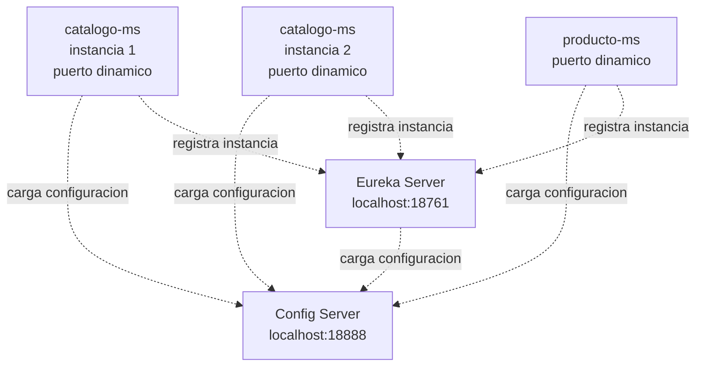

# S3 - Registro, descubrimiento y ejecucion concurrente de servicios

## 1. Introduccion

Tiempo: 20 min.

### 1.1 Proposito

Incorporar registro y descubrimiento de servicios para que los microservicios puedan encontrarse por nombre logico y ejecutarse en multiples instancias.

### 1.2 Resultado de aprendizaje

El estudiante implementa un servidor de descubrimiento, registra microservicios con puertos dinamicos y verifica multiples instancias activas.

### 1.3 Producto de sesion

Eureka Server operativo en `infra/eureka`, con `catalogo-ms` y `producto-ms` registrados desde configuracion centralizada.

### 1.4 Motivacion de la sesion

Cuando un sistema crece, los servicios ya no deben depender de puertos fijos. Un microservicio puede tener varias instancias, reiniciarse o cambiar de ubicacion. El reto es que los demas componentes lo encuentren sin conocer su host y puerto exactos.

Preguntas para los estudiantes:

1. Que problema aparece cuando cada servicio tiene un puerto fijo?
2. Como se ubica un servicio si existen varias instancias?
3. Que evidencia demuestra que un servicio esta registrado dinamicamente?

### 1.5 Ubicacion en el curso

- Unidad: U1 - Sistema distribuido base orientado a produccion.
- Producto de unidad: sistema distribuido base funcional, configurable y preparado para multiples instancias.
- Avance del producto en esta sesion: registro dinamico de servicios y ejecucion concurrente.

## 2. Explica

Tiempo: 15 min.

### 2.1 Conceptos clave

- **Registro de servicios**: componente donde los microservicios anuncian su existencia.
- **Descubrimiento de servicios**: capacidad de encontrar instancias por nombre logico.
- **Puerto dinamico**: puerto asignado automaticamente para permitir multiples instancias.
- **Heartbeat**: senal periodica que indica que una instancia sigue viva.

### 2.2 Arquitectura del producto en `ecom`



### 2.3 Observabilidad y diagnostico

Senales a revisar:

- Health de Config Server.
- Health y dashboard de Eureka.
- Logs de registro de clientes.
- Instancias con nombres `*-ms`.
- Puertos dinamicos distintos para un mismo servicio.

Errores frecuentes:

| Problema | Causa probable | Solucion |
|---|---|---|
| Servicio no aparece en Eureka | Eureka apagado o URL incorrecta | Revisar Config Server y `eureka.client.service-url` |
| Solo aparece una instancia | No se levanto una segunda terminal | Ejecutar otra instancia con Maven |
| Nombre incorrecto | `spring.application.name` mal definido | Revisar archivo `*-ms-dev.yml` |

## 3. Aplica: actividad practica guiada

Tiempo: 3h.

En el laboratorio, el docente guia la incorporacion de Eureka y el registro de microservicios. Los estudiantes verifican multiples instancias desde consola y dashboard.

### 3.1 Crear o revisar `infra/eureka`

**Producto del paso:** proyecto Eureka Server creado dentro de `infra/eureka`.

Dependencia principal:

```text
Eureka Server
```

### 3.2 Habilitar Eureka Server

Agregar `@EnableEurekaServer` en la clase principal del proyecto.

### 3.3 Configurar Eureka desde Config Server

Crear o revisar:

```text
infra/config/config-repo/eureka-dev.yml
infra/config/config-repo/eureka-prod.yml
```

### 3.4 Agregar Eureka Client a microservicios

Agregar en los microservicios:

```text
Eureka Discovery Client
```

Revisar que `spring.application.name` coincida con el nombre esperado en Eureka.

### 3.5 Levantar en DEV

PowerShell / bash macOS/Linux:

```bash
cd infra/config
mvn spring-boot:run
```

En otra terminal:

```bash
cd infra/eureka
mvn spring-boot:run
```

En otra terminal:

```bash
cd services/catalogo-ms
docker compose -f compose-dev.yml up -d
mvn spring-boot:run
```

### 3.6 Levantar una segunda instancia

PowerShell / bash macOS/Linux:

```bash
cd services/catalogo-ms
mvn spring-boot:run
```

### 3.7 Verificar registro

Revisar:

```text
http://localhost:18761
```

Resultado esperado:

- Eureka muestra `CATALOGO-MS`.
- Hay mas de una instancia si se levantaron dos terminales.
- Cada instancia tiene puerto dinamico diferente.

### 3.8 Ruta alternativa: clonar y ejecutar a partir del tag final de la sesion

PowerShell / bash macOS/Linux:

```bash
git clone --branch vs03-registro-descubrimiento https://github.com/261dist/ecom.git ecom-s03
cd ecom-s03
```

## 4. Crea: actividad autonoma

Tiempo: 4h fuera del aula.

### 4.1 Plantilla de evidencia individual

Entrega un PDF con el siguiente nombre:

```text
S03_Equipo##_ApellidoNombre.pdf
```

#### 4.1.1 Datos del estudiante

- Nombre:
- Equipo:
- Sesion: S03 - Registro, descubrimiento y ejecucion concurrente de servicios
- Rol o aporte realizado:
- Link de GitHub:

#### 4.1.2 Trabajo autonomo realizado

1. Registrar otro microservicio en Eureka.
2. Ejecutar al menos dos instancias de un servicio.
3. Verificar dashboard de Eureka.
4. Explicar nombre logico vs puerto fisico.
5. Documentar errores encontrados y solucion.

#### 4.1.3 Evidencia tecnica

- Config Server activo.
- Eureka activo.
- Servicio registrado.
- Multiples instancias visibles.
- Logs de registro o heartbeat.

#### 4.1.4 Error o hallazgo

Describe un problema de registro, nombre de servicio, URL de Eureka o puerto dinamico.

#### 4.1.5 Reflexion tecnica breve

Explica por que el descubrimiento de servicios es necesario antes de usar Gateway y balanceo de carga.

### 4.2 Criterios minimos de aceptacion

- PDF con nombre correcto.
- Evidencia de Eureka activo.
- Evidencia de al menos un microservicio registrado.
- Evidencia de multiples instancias o explicacion de por que no se logro.
- Aporte individual verificable.

## 5. Cierre evaluativo

Tiempo: 20 min.

### 5.1 Resultados esperados

- Eureka ejecuta en DEV.
- Microservicios se registran con nombre logico.
- Se evidencia mas de una instancia.
- El estudiante explica registro, descubrimiento y puerto dinamico.

### 5.2 Evidencia del producto de sesion

Cada estudiante entrega un PDF individual siguiendo la plantilla de la seccion 4.1.

Nombre del archivo:

```text
S03_Equipo##_ApellidoNombre.pdf
```

La revision se realiza con los criterios minimos de aceptacion y la rubrica de la seccion 5.4.

### 5.3 Preguntas de defensa y reflexion

1. Por que un microservicio usa puerto dinamico?
2. Que ventaja tiene registrar por nombre logico?
3. Como demuestras que hay dos instancias?
4. Que pasa si Eureka no esta disponible al arrancar?
5. Que diferencia hay entre Config Server y Eureka?

### 5.4 Rubrica de evaluacion

| Dimension | Peso | 3 - Logro destacado | 2 - Logro | 1 - Proceso | 0 - Inicio | Puntuacion obtenida |
|---|---:|---|---|---|---|---:|
| 1. Eureka operativo | 2 | Evidencia Eureka activo en DEV/PROD local y dashboard funcional. | Evidencia Eureka activo en DEV. | Evidencia parcial o sin health/dashboard claro. | No evidencia Eureka funcionando. | |
| 2. Registro de servicios | 2 | Registra varios microservicios con nombres correctos. | Registra al menos un microservicio correctamente. | Registro parcial o con nombres confusos. | No evidencia registro. | |
| 3. Multiples instancias | 2 | Evidencia dos o mas instancias con puertos dinamicos. | Evidencia multiples instancias parcialmente. | Explica escalado pero no lo evidencia claramente. | No evidencia ni explica multiples instancias. | |
| 4. Diagnostico tecnico | 2 | Analiza errores de registro, URL o nombre logico con solucion. | Explica un error y su causa probable. | Menciona un problema sin analisis. | No presenta diagnostico. | |
| 5. Aporte individual | 1 | Aporte claro, verificable y conectado al producto. | Aporte identificable. | Aporte general. | No se identifica aporte. | |
| 6. Orden y reflexion | 1 | PDF ordenado, evidencias legibles y reflexion tecnica clara. | Evidencias entendibles y reflexion suficiente. | Evidencias poco claras o reflexion superficial. | PDF desordenado o sin reflexion. | |

Puntuacion acumulada = suma de (`Peso` * `Puntuacion obtenida`) = ____.

Nota final = (`Puntuacion acumulada` / 30) * 20 = ____.

Para usar la rubrica con IA, solicita:

```text
Evalua el PDF usando la rubrica de la sesion.
Para cada dimension selecciona la puntuacion obtenida usando la escala Inicio=0, Proceso=1, Logro=2, Logro destacado=3.
Justifica brevemente cada puntuacion.
Calcula la puntuacion acumulada con la formula: suma de (Peso * Puntuacion obtenida).
Calcula la nota final sobre 20 con la formula: (Puntuacion acumulada / 30) * 20.
Indica 2 fortalezas y 2 recomendaciones.
```
