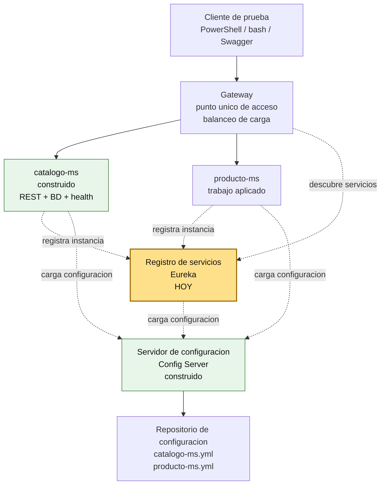
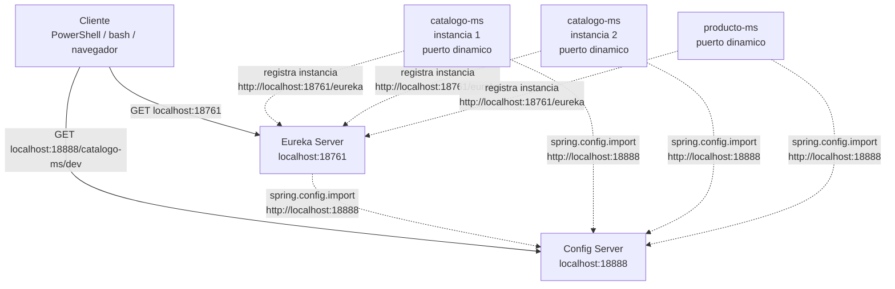
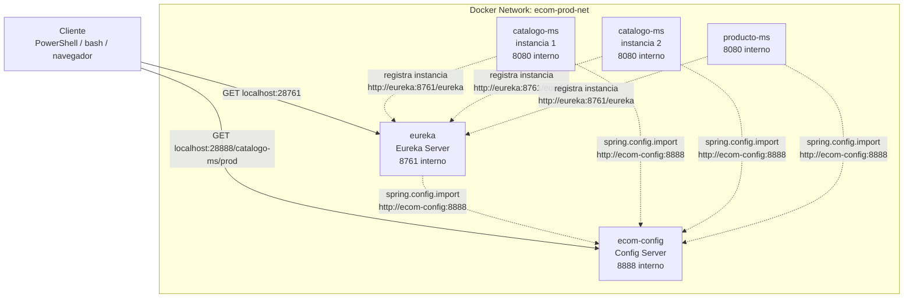

# S3 - Registro, descubrimiento y ejecucion concurrente de servicios

## 1. Introduccion

Tiempo: 20 min.

### 1.1 Proposito

Incorporar registro y descubrimiento de servicios para que los microservicios puedan encontrarse por nombre logico y ejecutarse en multiples instancias.

### 1.2 Resultado de aprendizaje

El estudiante implementa un servidor de descubrimiento, registra microservicios con puertos dinamicos y verifica multiples instancias activas.

### 1.3 Producto de sesion

Eureka Server operativo en `infra/eureka`, con `catalogo-ms` y `producto-ms` registrados desde configuracion centralizada.

### 1.4 Motivacion de la sesion

Cuando un sistema crece, los servicios ya no deben depender de puertos fijos. Un microservicio puede tener varias instancias, reiniciarse o cambiar de ubicacion. El reto es que los demas componentes lo encuentren sin conocer su host y puerto exactos.

Preguntas para los estudiantes:

1. Que problema aparece cuando cada servicio tiene un puerto fijo?
2. Como se ubica un servicio si existen varias instancias?
3. Que evidencia demuestra que un servicio esta registrado dinamicamente?

### 1.5 Ubicacion en el curso

- Unidad: U1 - Sistema distribuido base orientado a produccion.
- Producto de unidad: sistema distribuido base funcional, configurable y preparado para multiples instancias.
- Avance del producto en esta sesion: registro dinamico de servicios y ejecucion concurrente.

Roadmap para elaborar el producto de la unidad:



## 2. Explica

Tiempo: 15 min.

### 2.1 Conceptos clave

- **Registro de servicios**: componente donde los microservicios anuncian su existencia.
- **Descubrimiento de servicios**: capacidad de encontrar instancias por nombre logico.
- **Puerto dinamico**: puerto asignado automaticamente para permitir multiples instancias.
- **Heartbeat**: senal periodica que indica que una instancia sigue viva.

### 2.2 Arquitectura del producto en `ecom`

#### 2.2.1 Registro y descubrimiento en DEV



En DEV, los componentes principales corren con Maven en el host:

```text
Config Server: http://localhost:18888
Eureka Server: http://localhost:18761
Microservicios: puerto dinamico
```

Los microservicios cargan configuracion desde Config Server y luego se registran en Eureka. Como usan puerto dinamico, se pueden levantar varias instancias del mismo servicio en terminales distintas.

#### 2.2.2 Registro y descubrimiento en PROD local



En PROD local, `infra/compose.yml` levanta Config Server y Eureka dentro de Docker:

```text
Config Server desde host: http://localhost:28888
Eureka desde host: http://localhost:28761
Config Server interno: http://ecom-config:8888
Eureka interno: http://eureka:8761/eureka
Microservicios: 8080 interno, sin puerto host fijo
```

La regla de arranque se mantiene:

```text
1. Levantar infraestructura: infra -> config + eureka
2. Levantar microservicios: services/* -> BD + app
```

#### 2.2.3 Estado nuevo de URLs en S3

| Ambiente | Componente | URL o nombre |
|---|---|---|
| DEV | Config Server | `http://localhost:18888` |
| DEV | Eureka Server | `http://localhost:18761` |
| DEV | Config de catalogo | `http://localhost:18888/catalogo-ms/dev` |
| DEV | `catalogo-ms` | `http://localhost:<puerto-dinamico>` |
| PROD local | Config Server desde host | `http://localhost:28888` |
| PROD local | Eureka desde host | `http://localhost:28761` |
| PROD local | Config Server desde contenedores | `http://ecom-config:8888` |
| PROD local | Eureka desde contenedores | `http://eureka:8761/eureka` |
| PROD local | `catalogo-ms` dentro de Docker | `http://catalogo-ms:8080` |

### 2.3 Observabilidad y diagnostico

Senales a revisar:

- Health de Config Server.
- Health y dashboard de Eureka.
- Logs de registro de clientes.
- Instancias con nombres `*-ms`.
- Puertos dinamicos distintos para un mismo servicio.

Errores frecuentes:

| Problema | Causa probable | Solucion |
|---|---|---|
| Servicio no aparece en Eureka | Eureka apagado o URL incorrecta | Revisar Config Server y `eureka.client.service-url` |
| Solo aparece una instancia | No se levanto una segunda terminal | Ejecutar otra instancia con Maven |
| Nombre incorrecto | `spring.application.name` mal definido | Revisar archivo `*-ms-dev.yml` |

## 3. Aplica: actividad practica guiada

Tiempo: 3h.

En el laboratorio, el docente guia la incorporacion de Eureka y el registro de microservicios. Los estudiantes verifican multiples instancias desde consola y dashboard.

La ruta principal de la sesion es construir desde cero. Si el estudiante necesita avanzar mas rapido, puede usar la ruta alternativa del paso 3.17 para clonar el tag final y ejecutar las pruebas.

- Crear el proyecto `ecom-eureka`.
- Habilitar Eureka Server.
- Externalizar configuracion con Config Server.
- Conectar microservicios como clientes Eureka.
- Levantar multiples instancias en DEV.
- Probar registro en PROD local.

### 3.1 Crear la base de infraestructura para Eureka

**Producto del paso:** proyecto Eureka Server creado dentro de `infra/eureka`.

En el monorepo `ecom`, Eureka vive en:

```text
infra/eureka
```

Si partes desde cero, crea la carpeta dentro de `infra` y genera el proyecto Spring Boot desde VS Code.

### 3.2 Crear proyecto Eureka Server desde VS Code

**Producto del paso:** proyecto Spring Boot `ecom-eureka` creado dentro de `infra/eureka`.

Configuracion sugerida en Spring Initializr:

| Campo | Valor |
|---|---|
| Project | Maven Project |
| Spring Boot | 3.5.x |
| Language | Java |
| Java | 17 |
| Group Id | `com.upeu` |
| Artifact Id | `ecom-eureka` |
| Package name | `com.upeu.eureka` |
| Packaging | Jar |
| Ubicacion | `infra/eureka` |

Dependencias:

| Grupo | Dependencias | Proposito |
|---|---|---|
| Spring Cloud | Eureka Server | Registro y descubrimiento de servicios |
| Spring Cloud | Config Client | Leer configuracion desde Config Server |
| Operacion | Spring Boot Actuator | Health y diagnostico |
| Productividad | Spring Boot DevTools | Facilitar ejecucion en desarrollo |

### 3.3 Habilitar Eureka Server

Agregar `@EnableEurekaServer` en la clase principal del proyecto.

```java
package com.upeu.eureka;

import org.springframework.boot.SpringApplication;
import org.springframework.boot.autoconfigure.SpringBootApplication;
import org.springframework.cloud.netflix.eureka.server.EnableEurekaServer;

@SpringBootApplication
@EnableEurekaServer
public class EurekaApplication {
    public static void main(String[] args) {
        SpringApplication.run(EurekaApplication.class, args);
    }
}
```

### 3.4 Configurar `application.yml` base de Eureka

**Producto del paso:** Eureka preparado para leer configuracion externa.

En `infra/eureka/src/main/resources/application.yml`:

```yaml
server:
  port: 18761

spring:
  application:
    name: eureka
  profiles:
    active: dev
  config:
    import: "optional:configserver:${CONFIG_SERVER_URL:http://localhost:18888}"
```

### 3.5 Crear configuracion de Eureka en `config-repo`

Crea el archivo DEV:

```text
infra/config/config-repo/eureka-dev.yml
```

Pega este contenido:

```yaml
spring:
  application:
    name: eureka

eureka:
  client:
    register-with-eureka: false
    fetch-registry: false

management:
  endpoints:
    web:
      exposure:
        include: health,info,metrics
  endpoint:
    health:
      show-details: always
```

Crea el archivo PROD:

```text
infra/config/config-repo/eureka-prod.yml
```

Pega este contenido:

```yaml
spring:
  application:
    name: eureka

eureka:
  client:
    register-with-eureka: false
    fetch-registry: false

management:
  endpoints:
    web:
      exposure:
        include: health,info,metrics
  endpoint:
    health:
      show-details: never
```

### 3.6 Probar configuracion de Eureka desde Config Server

Con Config Server ejecutando:

PowerShell:

```powershell
Invoke-RestMethod -Method Get -Uri "http://localhost:18888/eureka/dev"
Invoke-RestMethod -Method Get -Uri "http://localhost:18888/eureka/prod"
```

bash macOS/Linux:

```bash
curl http://localhost:18888/eureka/dev
curl http://localhost:18888/eureka/prod
```

Resultado esperado:

- La respuesta indica `name: eureka`.
- El perfil consultado aparece como `dev` o `prod`.
- En `propertySources` aparece `eureka-dev.yml` o `eureka-prod.yml`.

### 3.7 Levantar Eureka en DEV

PowerShell / bash macOS/Linux:

```bash
cd infra/config
mvn spring-boot:run
```

En otra terminal:

```bash
cd infra/eureka
mvn spring-boot:run
```

Verifica con PowerShell:

```powershell
Invoke-RestMethod -Method Get -Uri "http://localhost:18761/actuator/health"
```

Verifica con bash macOS/Linux:

```bash
curl http://localhost:18761/actuator/health
```

Tambien abre:

```text
http://localhost:18761
```

### 3.8 Agregar Eureka Client a microservicios

Producto del paso: `catalogo-ms` y `producto-ms` preparados para registrarse en Eureka.

En el `pom.xml` de cada microservicio agrega la dependencia:

```xml
<dependency>
    <groupId>org.springframework.cloud</groupId>
    <artifactId>spring-cloud-starter-netflix-eureka-client</artifactId>
</dependency>
```

Si el microservicio aun no tiene Spring Cloud, agrega tambien la version:

```xml
<properties>
    <java.version>17</java.version>
    <spring-cloud.version>2025.0.2</spring-cloud.version>
</properties>
```

Y el BOM:

```xml
<dependencyManagement>
    <dependencies>
        <dependency>
            <groupId>org.springframework.cloud</groupId>
            <artifactId>spring-cloud-dependencies</artifactId>
            <version>${spring-cloud.version}</version>
            <type>pom</type>
            <scope>import</scope>
        </dependency>
    </dependencies>
</dependencyManagement>
```

El nombre del servicio debe coincidir con el archivo de Config Server y con lo que se vera en Eureka:

```yaml
spring:
  application:
    name: catalogo-ms
```

### 3.9 Configurar clientes Eureka desde Config Server

Producto del paso: microservicios conectados a Eureka desde configuracion externa.

En `catalogo-ms-dev.yml` y `producto-ms-dev.yml`, agrega:

```yaml
eureka:
  instance:
    hostname: localhost
    prefer-ip-address: false
    instance-id: ${spring.application.name}:${local.server.port:${random.value}}
    metadata-map:
      instance-port: ${local.server.port:${server.port}}
  client:
    service-url:
      defaultZone: http://localhost:18761/eureka
```

En `catalogo-ms-prod.yml` y `producto-ms-prod.yml`, agrega:

```yaml
eureka:
  client:
    service-url:
      defaultZone: http://eureka:8761/eureka
```

### 3.10 Levantar `catalogo-ms` en DEV y verificar registro

PowerShell / bash macOS/Linux:

```bash
cd services/catalogo-ms
docker compose -f compose-dev.yml up -d
mvn spring-boot:run
```

Resultado esperado:

- `catalogo-ms` arranca con puerto dinamico.
- En logs aparece registro hacia Eureka.
- En `http://localhost:18761` aparece `CATALOGO-MS`.

### 3.11 Levantar una segunda instancia en DEV

PowerShell / bash macOS/Linux:

```bash
cd services/catalogo-ms
mvn spring-boot:run
```

### 3.12 Verificar multiples instancias

Abre:

```text
http://localhost:18761
```

Resultado esperado:

- Eureka muestra `CATALOGO-MS`.
- Hay mas de una instancia si se levantaron dos terminales.
- Cada instancia tiene puerto dinamico diferente.

### 3.13 Repetir el patron con `producto-ms`

**Producto del paso:** `producto-ms` registrado como cliente Eureka.

Repite:

1. Agregar dependencia Eureka Client.
2. Revisar `spring.application.name: producto-ms`.
3. Revisar configuracion `producto-ms-dev.yml`.
4. Levantar el microservicio.
5. Verificar `PRODUCTO-MS` en Eureka.

### 3.14 Respetar el orden de arranque en PROD local

En PROD local, primero se levanta infraestructura y luego microservicios:

```text
1. infra -> ecom-config + eureka
2. services/catalogo-ms -> BD + catalogo-ms
3. services/producto-ms -> BD + producto-ms
```

La red compartida es creada por `infra/compose.yml`.

### 3.15 Probar registro en PROD local

**Producto del paso:** Eureka ejecutando en Docker y microservicios registrados dentro de la red `ecom-prod-net`.

Primero levanta infraestructura:

PowerShell / bash macOS/Linux:

```bash
cd infra
docker compose up -d --build config eureka
docker compose ps
```

Verifica desde el host con PowerShell:

```powershell
Invoke-RestMethod -Method Get -Uri "http://localhost:28888/eureka/prod"
Invoke-RestMethod -Method Get -Uri "http://localhost:28761/actuator/health"
```

Verifica desde el host con bash macOS/Linux:

```bash
curl http://localhost:28888/eureka/prod
curl http://localhost:28761/actuator/health
```

Luego levanta el microservicio en PROD local:

```bash
cd ../services/catalogo-ms
docker compose up -d --build --scale catalogo-ms=2
docker compose ps
```

Verifica health interno del microservicio:

```bash
docker run --rm --network ecom-catalogo-int curlimages/curl:8.10.1 -s http://catalogo-ms:8080/actuator/health
```

Revisa el dashboard:

```text
http://localhost:28761
```

Resultado esperado:

- Eureka PROD responde en `localhost:28761`.
- `catalogo-ms` se registra en Eureka usando `http://eureka:8761/eureka`.
- Las instancias del microservicio no publican puerto host fijo.
- El acceso funcional por Gateway se trabajara en S4.

Al terminar:

```bash
docker compose down
```

Si tambien quieres apagar infraestructura:

```bash
cd ../../infra
docker compose down
```

### 3.16 Validar evidencias de cierre de la practica

Antes de pasar a la actividad autonoma, verifica:

- Config Server DEV entrega `eureka/dev`.
- Eureka DEV responde en `localhost:18761`.
- `catalogo-ms` se registra en DEV.
- Dos instancias aparecen en Eureka.
- Eureka PROD responde en `localhost:28761`.
- Un microservicio se registra en PROD local.

### 3.17 Ruta alternativa: clonar y ejecutar a partir del tag final de la sesion

PowerShell / bash macOS/Linux:

```bash
git clone --branch vs03-registro-descubrimiento https://github.com/261dist/ecom.git ecom-s03
cd ecom-s03
```

## 4. Crea: actividad autonoma

Tiempo: 4h fuera del aula.

Esta actividad autonoma se desarrolla sobre el proyecto de fin de curso del equipo. El producto de la unidad se construye por acumulacion de los avances de cada sesion; por eso, la evidencia de esta sesion debe incorporarse al MkDocs del proyecto y quedar trazable en GitHub.

### 4.1 Plantilla de evidencia individual

Entrega un PDF con el siguiente nombre:

```text
S03_Equipo##_ApellidoNombre.pdf
```

#### 4.1.1 Datos del estudiante

- Nombre:
- Equipo:
- Sesion: S03 - Registro, descubrimiento y ejecucion concurrente de servicios
- Rol o aporte realizado:
- Link de GitHub:

#### 4.1.2 Trabajo autonomo realizado

1. Registrar otro microservicio en Eureka.
2. Ejecutar al menos dos instancias de un servicio.
3. Verificar dashboard de Eureka.
4. Explicar nombre logico vs puerto fisico.
5. Documentar errores encontrados y solucion.

#### 4.1.3 Evidencia tecnica

- Config Server activo.
- Eureka activo.
- Servicio registrado.
- Multiples instancias visibles.
- Logs de registro o heartbeat.

#### 4.1.4 Error o hallazgo

Describe un problema de registro, nombre de servicio, URL de Eureka o puerto dinamico.

#### 4.1.5 Reflexion tecnica breve

Explica por que el descubrimiento de servicios es necesario antes de usar Gateway y balanceo de carga.

### 4.2 Criterios minimos de aceptacion

- PDF con nombre correcto.
- Evidencia de Eureka activo.
- Evidencia de al menos un microservicio registrado.
- Evidencia de multiples instancias o explicacion de por que no se logro.
- Aporte individual verificable.

## 5. Cierre evaluativo

Tiempo: 20 min.

### 5.1 Resultados esperados

- Eureka ejecuta en DEV.
- Microservicios se registran con nombre logico.
- Se evidencia mas de una instancia.
- El estudiante explica registro, descubrimiento y puerto dinamico.

### 5.2 Evidencia del producto de sesion

Cada estudiante entrega un PDF individual siguiendo la plantilla de la seccion 4.1.

Nombre del archivo:

```text
S03_Equipo##_ApellidoNombre.pdf
```

La revision se realiza con los criterios minimos de aceptacion y la rubrica de la seccion 5.4.

### 5.3 Preguntas de defensa y reflexion

1. Por que un microservicio usa puerto dinamico?
2. Que ventaja tiene registrar por nombre logico?
3. Como demuestras que hay dos instancias?
4. Que pasa si Eureka no esta disponible al arrancar?
5. Que diferencia hay entre Config Server y Eureka?

### 5.4 Rubrica de evaluacion

| Dimension | Peso | 3 - Logro destacado | 2 - Logro | 1 - Proceso | 0 - Inicio | Puntuacion obtenida |
|---|---:|---|---|---|---|---:|
| 1. Eureka operativo | 2 | Evidencia Eureka activo en DEV/PROD local y dashboard funcional. | Evidencia Eureka activo en DEV. | Evidencia parcial o sin health/dashboard claro. | No evidencia Eureka funcionando. | |
| 2. Registro de servicios | 2 | Registra varios microservicios con nombres correctos. | Registra al menos un microservicio correctamente. | Registro parcial o con nombres confusos. | No evidencia registro. | |
| 3. Multiples instancias | 2 | Evidencia dos o mas instancias con puertos dinamicos. | Evidencia multiples instancias parcialmente. | Explica escalado pero no lo evidencia claramente. | No evidencia ni explica multiples instancias. | |
| 4. Diagnostico tecnico | 2 | Analiza errores de registro, URL o nombre logico con solucion. | Explica un error y su causa probable. | Menciona un problema sin analisis. | No presenta diagnostico. | |
| 5. Aporte individual | 1 | Aporte claro, verificable y conectado al producto. | Aporte identificable. | Aporte general. | No se identifica aporte. | |
| 6. Orden y reflexion | 1 | PDF ordenado, evidencias legibles y reflexion tecnica clara. | Evidencias entendibles y reflexion suficiente. | Evidencias poco claras o reflexion superficial. | PDF desordenado o sin reflexion. | |

Puntuacion acumulada = suma de (`Peso` * `Puntuacion obtenida`) = ____.

Nota final = (`Puntuacion acumulada` / 30) * 20 = ____.

Para usar la rubrica con IA, solicita:

```text
Evalua el PDF usando la rubrica de la sesion.
Para cada dimension selecciona la puntuacion obtenida usando la escala Inicio=0, Proceso=1, Logro=2, Logro destacado=3.
Justifica brevemente cada puntuacion.
Calcula la puntuacion acumulada con la formula: suma de (Peso * Puntuacion obtenida).
Calcula la nota final sobre 20 con la formula: (Puntuacion acumulada / 30) * 20.
Indica 2 fortalezas y 2 recomendaciones.
```
