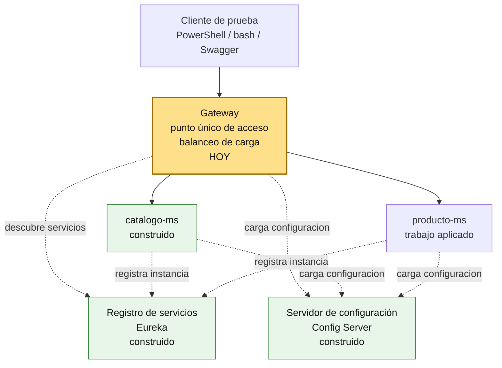
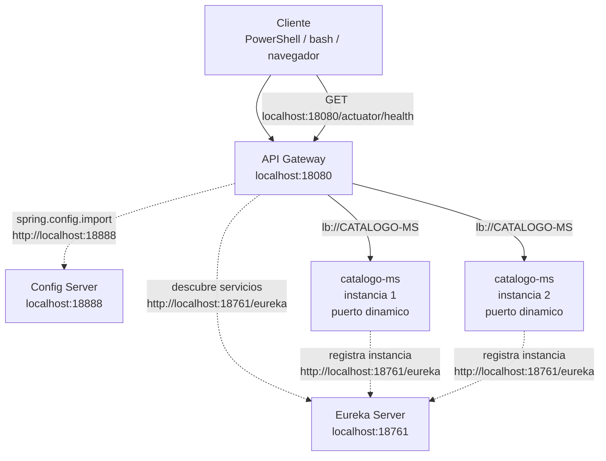
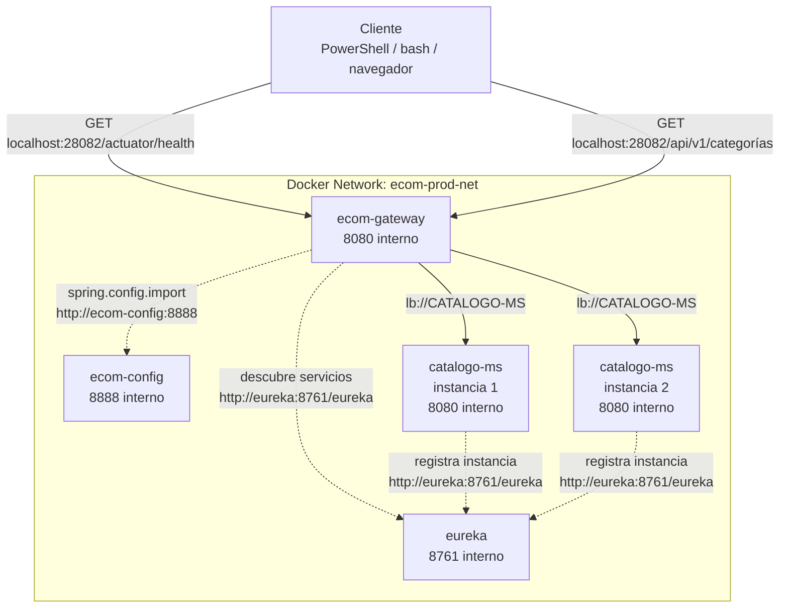

# S4 - Punto único de acceso y distribución de tráfico

## 1. Introducción

Tiempo: 20 min.

### 1.1 Propósito

Incorporar un punto único de acceso para que los clientes consuman el sistema mediante Gateway y para distribuir tráfico entre instancias disponibles.

### 1.2 Resultado de aprendizaje

El estudiante configura rutas en Gateway, consume microservicios mediante un acceso centralizado y evidencia balanceo de carga.

### 1.3 Producto de sesión

Gateway operativo en `infra/gateway`, con rutas hacia microservicios registrados en Eureka y pruebas de distribución de tráfico.

### 1.4 Motivacion de la sesión

Si un cliente conoce directamente todos los microservicios, queda acoplado a sus puertos, rutas y ubicaciones. Un Gateway permite centralizar el acceso y esconder la topología interna del sistema.

Preguntas para los estudiantes:

1. Por qué el cliente no debería conocer todos los microservicios?
2. Qué problema aparece si cada cliente llama directamente a cada microservicio?
3. Cómo se demuestra que existe balanceo de carga?

### 1.5 Ubicación en el curso

- Unidad: U1 - Sistema distribuido base orientado a producción.
- Producto de unidad: sistema distribuido base funcional, configurable y preparado para múltiples instancias.
- Avance del producto en esta sesión: acceso centralizado con rutas y balanceo de carga.

Roadmap para elaborar el producto de la unidad:



## 2. Explica

Tiempo: 15 min.

### 2.1 Conceptos clave

- **Gateway**: punto único de entrada al sistema.
- **Ruta**: regla que dirige una petición hacia un servicio.
- **Load Balancer**: selecciona una instancia disponible del servicio.
- **`lb://`**: esquema usado para resolver servicios registrados por nombre lógico.

### 2.2 Arquitectura del producto en `ecom`

#### 2.2.1 Gateway y balanceo en DEV



#### 2.2.2 Gateway y balanceo en PROD local



#### 2.2.3 Estado nuevo de URLs en S4

| Ambiente | Componente | URL o nombre |
|---|---|---|
| DEV | Gateway | `http://localhost:18080` |
| DEV | Gateway health | `http://localhost:18080/actuator/health` |
| DEV | Eureka | `http://localhost:18761` |
| PROD local | Gateway desde host | `http://localhost:28082` |
| PROD local | Gateway health | `http://localhost:28082/actuator/health` |
| PROD local | Eureka desde host | `http://localhost:28761` |
| PROD local | Gateway interno | `http://ecom-gateway:8080` |
| PROD local | Eureka interno | `http://eureka:8761/eureka` |

### 2.3 Observabilidad y diagnóstico

Señales a revisar:

- Health de Gateway.
- Eureka con servicios registrados.
- Logs de rutas.
- Respuestas repetidas desde instancias distintas.

Errores frecuentes:

| Problema | Causa probable | Solución |
|---|---|---|
| 503 | Servicio no registrado o Eureka no disponible | Revisar Eureka y registros |
| 404 | Ruta mal configurada | Revisar predicates y paths |
| No balancea | Solo existe una instancia | Levantar otra instancia |

## 3. Aplica: actividad práctica guiada

Tiempo: 3h.

En el laboratorio, el docente guía la configuración de Gateway y la prueba de rutas hacia microservicios registrados.

La ruta principal de la sesión es construir desde cero. Si el estudiante necesita avanzar más rápido, puede usar la ruta alternativa del paso 3.17 para clonar el tag final y ejecutar las pruebas.

### 3.1 Crear carpeta del Gateway

**Producto del paso:** ubicación del proyecto Gateway preparada dentro del monorepo.

En el monorepo `ecom`, Gateway vive en:

```text
infra/gateway
```

Desde la raiz del repositorio:

PowerShell / bash macOS/Linux:

```bash
mkdir infra/gateway
```

Luego abre la raiz del monorepo en VS Code:

```bash
code .
```

### 3.2 Crear proyecto Spring Boot Gateway desde VS Code

**Producto del paso:** proyecto Spring Boot `ecom-gateway` creado dentro de `infra/gateway`.

En VS Code usa Spring Initializr:

```text
Spring Initializr: Create a Maven Project
Spring Boot: 3.5.x
Language: Java 17
Group Id: com.upeu
Artifact Id: ecom-gateway
Package name: com.upeu.gateway
Packaging: Jar
Ubicación: infra/gateway
```

Dependencias para S04:

| Grupo | Dependencias | Propósito |
|---|---|---|
| Spring Cloud | Gateway | Punto único de acceso |
| Spring Cloud | Eureka Discovery Client | Resolver servicios registrados |
| Spring Cloud | Config Client | Leer rutas desde Config Server |
| Operación | Actuator | Health y diagnóstico |
| Desarrollo | DevTools | Recarga durante desarrollo |

En S07 se agregará seguridad al Gateway. En esta sesión todavía se trabaja el acceso único y el balanceo.

### 3.3 Ajustar `pom.xml`

**Producto del paso:** Gateway con Spring Cloud y dependencias necesarias para DEV.

En `infra/gateway/pom.xml`, confirma o agrega la versión de Spring Cloud:

```xml
<properties>
    <java.version>17</java.version>
    <spring-cloud.version>2025.0.2</spring-cloud.version>
</properties>
```

Agrega las dependencias principales:

```xml
<dependencies>
    <dependency>
        <groupId>org.springframework.boot</groupId>
        <artifactId>spring-boot-starter-actuator</artifactId>
    </dependency>

    <dependency>
        <groupId>org.springframework.cloud</groupId>
        <artifactId>spring-cloud-starter-config</artifactId>
    </dependency>

    <dependency>
        <groupId>org.springframework.cloud</groupId>
        <artifactId>spring-cloud-starter-gateway-server-webflux</artifactId>
    </dependency>

    <dependency>
        <groupId>org.springframework.cloud</groupId>
        <artifactId>spring-cloud-starter-netflix-eureka-client</artifactId>
    </dependency>

    <dependency>
        <groupId>org.springframework.boot</groupId>
        <artifactId>spring-boot-devtools</artifactId>
        <scope>runtime</scope>
        <optional>true</optional>
    </dependency>

    <dependency>
        <groupId>org.springframework.boot</groupId>
        <artifactId>spring-boot-starter-test</artifactId>
        <scope>test</scope>
    </dependency>
</dependencies>
```

Agrega el BOM de Spring Cloud:

```xml
<dependencyManagement>
    <dependencies>
        <dependency>
            <groupId>org.springframework.cloud</groupId>
            <artifactId>spring-cloud-dependencies</artifactId>
            <version>${spring-cloud.version}</version>
            <type>pom</type>
            <scope>import</scope>
        </dependency>
    </dependencies>
</dependencyManagement>
```

### 3.4 Configurar `application.yml` base de Gateway

**Producto del paso:** Gateway preparado para leer rutas desde Config Server.

En `infra/gateway/src/main/resources/application.yml`:

```yaml
server:
  port: 18080

spring:
  application:
    name: gateway
  profiles:
    active: dev
  config:
    import: "optional:configserver:${CONFIG_SERVER_URL:http://localhost:18888}"

management:
  endpoints:
    web:
      exposure:
        include: health,info
  endpoint:
    health:
      show-details: always

logging:
  level:
    root: INFO
```

### 3.5 Crear rutas desde Config Server

Producto del paso: archivos de configuración externa del Gateway creados en `config-repo`.

Crea el archivo DEV:

```text
infra/config/config-repo/gateway-dev.yml
```

Pega este contenido:

```yaml
spring:
  cloud:
    gateway:
      routes:
        - id: catalogo-route
          uri: lb://catalogo-ms
          predicates:
            - Path=/api/v1/categorias/**

        - id: catalogo-instancia
          uri: lb://catalogo-ms
          predicates:
            - Path=/api/v1/catalogo/instancia

        - id: producto-route
          uri: lb://producto-ms
          predicates:
            - Path=/api/v1/productos/**

        - id: producto-instancia
          uri: lb://producto-ms
          predicates:
            - Path=/api/v1/producto/instancia

eureka:
  instance:
    hostname: localhost
    prefer-ip-address: false
    instance-id: ${spring.application.name}:${local.server.port:${server.port}}
    metadata-map:
      instance-port: ${local.server.port:${server.port}}
  client:
    service-url:
      defaultZone: http://localhost:18761/eureka

management:
  endpoints:
    web:
      exposure:
        include: health,info,metrics,prometheus
  endpoint:
    health:
      show-details: always
```

Crea el archivo PROD:

```text
infra/config/config-repo/gateway-prod.yml
```

Pega este contenido:

```yaml
spring:
  cloud:
    gateway:
      routes:
        - id: catalogo-route
          uri: lb://catalogo-ms
          predicates:
            - Path=/api/v1/categorias/**

        - id: catalogo-instancia
          uri: lb://catalogo-ms
          predicates:
            - Path=/api/v1/catalogo/instancia

        - id: producto-route
          uri: lb://producto-ms
          predicates:
            - Path=/api/v1/productos/**

        - id: producto-instancia
          uri: lb://producto-ms
          predicates:
            - Path=/api/v1/producto/instancia

eureka:
  client:
    service-url:
      defaultZone: http://eureka:8761/eureka

management:
  endpoints:
    web:
      exposure:
        include: health,info,metrics,prometheus
  endpoint:
    health:
      show-details: never
```

Las rutas apuntan a nombres lógicos registrados en Eureka. Por eso el Gateway no necesita conocer el puerto dinamico de cada instancia.

### 3.6 Levantar Config Server en DEV

Producto del paso: configuración externa disponible por HTTP.

PowerShell / bash macOS/Linux:

```bash
cd infra/config
mvn spring-boot:run
```

### 3.7 Probar configuración de Gateway desde Config Server

Producto del paso: confirmar que `gateway-dev.yml` y `gateway-prod.yml` son leidos por Config Server.

PowerShell:

```powershell
Invoke-RestMethod -Method Get -Uri "http://localhost:18888/gateway/dev"
Invoke-RestMethod -Method Get -Uri "http://localhost:18888/gateway/prod"
```

bash macOS/Linux:

```bash
curl http://localhost:18888/gateway/dev
curl http://localhost:18888/gateway/prod
```

Resultado esperado:

- La respuesta indica `name: gateway`.
- Se observan rutas hacia servicios con `lb://`.
- En DEV aparece Eureka con `localhost:18761`.
- En PROD aparece Eureka con `http://eureka:8761/eureka`.

### 3.8 Levantar Eureka en DEV

Producto del paso: registro de servicios disponible para Gateway.

En otra terminal:

```bash
cd infra/eureka
mvn spring-boot:run
```

Verifica en navegador:

```text
http://localhost:18761
```

### 3.9 Levantar Gateway en DEV

Producto del paso: Gateway ejecutando en `localhost:18080`.

En otra terminal:

```bash
cd infra/gateway
mvn spring-boot:run
```

### 3.10 Verificar Gateway en DEV

PowerShell:

```powershell
Invoke-RestMethod -Method Get -Uri "http://localhost:18080/actuator/health"
```

bash macOS/Linux:

```bash
curl http://localhost:18080/actuator/health
```

Resultado esperado: estado `UP`.

### 3.11 Levantar microservicio y segunda instancia

Producto del paso: `catalogo-ms` registrado con más de una instancia.

PowerShell / bash macOS/Linux:

```bash
cd services/catalogo-ms
docker compose -f compose-dev.yml up -d
mvn spring-boot:run
```

En otra terminal:

```bash
cd services/catalogo-ms
mvn spring-boot:run
```

### 3.12 Verificar registro en Eureka

Abre:

```text
http://localhost:18761
```

Resultado esperado:

- `CATALOGO-MS` aparece registrado.
- Hay dos instancias si se levantaron dos terminales.

### 3.13 Probar por Gateway

Producto del paso: el cliente consume `catalogo-ms` por Gateway y no por el puerto directo del microservicio.

PowerShell:

```powershell
Invoke-RestMethod -Method Get -Uri "http://localhost:18080/actuator/health"
Invoke-RestMethod -Method Get -Uri "http://localhost:18080/api/v1/categorias"
```

bash macOS/Linux:

```bash
curl http://localhost:18080/actuator/health
curl http://localhost:18080/api/v1/categorias
```

### 3.14 Evidenciar balanceo

Producto del paso: se observa distribución de tráfico entre instancias disponibles.

El endpoint de instancia debe existir en `catalogo-ms`. Si todavía no lo tienes, crea este controlador:

```text
services/catalogo-ms/src/main/java/com/upeu/catálogo/controller/GatewayInstanciasController.java
```

Pega este código:

```java
package com.upeu.catalogo.controller;

import java.net.InetAddress;
import java.net.UnknownHostException;
import java.util.Map;

import org.springframework.core.env.Environment;
import org.springframework.web.bind.annotation.GetMapping;
import org.springframework.web.bind.annotation.RequestMapping;
import org.springframework.web.bind.annotation.RestController;

import lombok.RequiredArgsConstructor;

@RestController
@RequestMapping("/api/v1/catalogo")
@RequiredArgsConstructor
public class GatewayInstanciasController {

    private final Environment environment;

    @GetMapping("/instancia")
    public Map<String, String> instancia() {
        return Map.of(
                "servicio", "catalogo-ms",
                "instancia", environment.getProperty("local.server.port", "N/A"),
                "serverPort", environment.getProperty("server.port", "N/A"),
                "host", hostName());
    }

    private String hostName() {
        try {
            return InetAddress.getLocalHost().getHostName();
        } catch (UnknownHostException e) {
            return "unknown";
        }
    }
}
```

Ejecuta varias veces por Gateway:

PowerShell:

```powershell
1..10 | ForEach-Object {
  Invoke-RestMethod -Method Get -Uri "http://localhost:18080/api/v1/catalogo/instancia"
}
```

bash macOS/Linux:

```bash
for i in {1..10}; do
  curl http://localhost:18080/api/v1/catalogo/instancia
  echo
done
```

Resultado esperado:

- Gateway responde.
- Eureka muestra instancias disponibles.
- Las respuestas repetidas alternan entre instancias o muestran puertos distintos.

### 3.15 Probar error esperado

Producto del paso: estudiante diferencia una falla de ruta y una falla de disponibilidad.

Deten una instancia o cambia temporalmente una ruta para observar:

- `503` cuando no hay servicio disponible.
- `404` cuando la ruta no coincide.

Luego restaura la configuración.

### 3.16 Preparar, levantar y probar PROD local

En este paso se cierra la sesión mostrando que el Gateway también funciona en producción local con Docker. Primero se prepara soporte Docker, luego se levanta infraestructura y finalmente se prueba el acceso por Gateway.

#### 3.16.1 Crear soporte Docker para Gateway

Producto del paso: Gateway preparado para ejecutarse dentro de Docker junto con `config` y `eureka`.

Crea `infra/gateway/Dockerfile`:

```dockerfile
FROM maven:3.9.9-eclipse-temurin-17 AS build
WORKDIR /app

COPY pom.xml .
RUN mvn -q -DskipTests dependency:go-offline

COPY src ./src
RUN mvn -q clean package -DskipTests

FROM eclipse-temurin:17-jre
WORKDIR /app

RUN apt-get update && apt-get install -y curl && rm -rf /var/lib/apt/lists/*

COPY --from=build /app/target/*.jar app.jar

EXPOSE 8080

ENTRYPOINT ["java", "-jar", "app.jar"]
```

En `infra/compose.yml`, agrega el servicio `gateway`:

```yaml
  gateway:
    build:
      context: ./gateway
      dockerfile: Dockerfile
    container_name: ecom-gateway
    restart: unless-stopped
    ports:
      - "28082:8080"
    environment:
      SERVER_PORT: 8080
      SPRING_PROFILES_ACTIVE: prod
      CONFIG_SERVER_URL: http://ecom-config:8888
    depends_on:
      config:
        condition: service_healthy
      eureka:
        condition: service_healthy
    networks:
      - ecom-prod-net
```

#### 3.16.2 Levantar Gateway en PROD local

En PROD local, primero se levanta infraestructura:

```text
infra -> ecom-config + eureka + ecom-gateway
```

Luego se levantan microservicios:

```text
services/catalogo-ms -> BD + catálogo-ms
```

PowerShell / bash macOS/Linux:

```bash
cd infra
docker compose up -d --build config eureka gateway
docker compose ps
```

Verifica con PowerShell:

```powershell
Invoke-RestMethod -Method Get -Uri "http://localhost:28082/actuator/health"
Invoke-RestMethod -Method Get -Uri "http://localhost:28761/actuator/health"
```

Verifica con bash macOS/Linux:

```bash
curl http://localhost:28082/actuator/health
curl http://localhost:28761/actuator/health
```

#### 3.16.3 Levantar microservicio en PROD local y probar Gateway

Producto del paso: acceso funcional a `catalogo-ms` por Gateway PROD.

PowerShell / bash macOS/Linux:

```bash
cd ../services/catalogo-ms
docker compose up -d --build --scale catalogo-ms=2
```

Prueba desde el host por Gateway con PowerShell:

```powershell
Invoke-RestMethod -Method Get -Uri "http://localhost:28082/api/v1/categorias"
```

Prueba desde el host por Gateway con bash macOS/Linux:

```bash
curl http://localhost:28082/api/v1/categorias
```

Resultado esperado:

- Gateway PROD responde por `localhost:28082`.
- Microservicios no exponen puerto host fijo.
- El acceso funcional pasa por Gateway.

#### 3.16.4 Validar evidencias de cierre de la práctica

Antes de pasar a la actividad autónoma, verifica:

- Gateway DEV health.
- Ruta DEV por Gateway.
- Eureka con múltiples instancias.
- Gateway PROD health.
- Ruta PROD por Gateway.
- Diagnóstico de 404 o 503 explicado.

### 3.17 Ruta alternativa: clonar y ejecutar a partir del tag final de la sesión

PowerShell / bash macOS/Linux:

```bash
git clone --branch vs04-gateway-load-balancer https://github.com/261dist/ecom.git ecom-s04
cd ecom-s04
```

## 4. Crea: actividad autónoma

Tiempo: 4h fuera del aula.

Esta actividad autónoma se desarrolla sobre el proyecto de fin de curso del equipo. El producto de la unidad se construye por acumulacion de los avances de cada sesión; por eso, la evidencia de esta sesión debe incorporarse a la documentación del proyecto y quedar trazable en GitHub.

### 4.1 Plantilla de evidencia individual

Entrega un PDF con el siguiente nombre:

El PDF de esta sesión debe generarse como impresion o exportacion de la sección correspondiente en MkDocs o una herramienta equivalente. No se acepta un PDF armado manualmente fuera de la documentación del proyecto.

```text
S04_Equipo##_ApellidoNombre.pdf
```

#### 4.1.1 Datos del estudiante

- Nombre:
- Equipo:
- Sesión: S04 - Punto único de acceso y distribución de tráfico
- Rol o aporte realizado:
- Link de GitHub:

#### 4.1.2 Trabajo autónomo realizado

1. Agregar o revisar una ruta en Gateway.
2. Probar un endpoint mediante Gateway.
3. Levantar múltiples instancias de un microservicio.
4. Evidenciar balanceo o explicar el diagnóstico.
5. Documentar un error frecuente y su solución.

#### 4.1.3 Evidencia técnica

- Gateway activo.
- Ruta probada por Gateway.
- Eureka con instancias.
- Balanceo evidenciado.
- Registro en base de datos si la prueba modifica datos.

#### 4.1.4 Error o hallazgo

Describe un 404, 503, error de ruta, servicio no registrado o problema de balanceo.

#### 4.1.5 Reflexión técnica breve

Explica por qué Gateway permite ocultar la topología interna del sistema.

### 4.2 Criterios mínimos de aceptación

- PDF con nombre correcto.
- Evidencia de Gateway activo.
- Ruta probada.
- Eureka con servicio registrado.
- Aporte individual verificable.

## 5. Cierre evaluativo

Tiempo: 20 min.

### 5.1 Resultados esperados

- Gateway ejecuta en DEV.
- Rutas consumen microservicios por nombre lógico.
- Se evidencia distribución de tráfico.
- El estudiante diagnostica errores 404 y 503.

### 5.2 Evidencia del producto de sesión

Cada estudiante entrega un PDF individual siguiendo la plantilla de la sección 4.1.

Nombre del archivo:

```text
S04_Equipo##_ApellidoNombre.pdf
```

### 5.3 Preguntas de defensa y reflexión

1. Por qué el cliente debe entrar por Gateway?
2. Qué significa `lb://`?
3. Cómo se relacionan Gateway y Eureka?
4. Cómo diagnosticas un 503?
5. Cómo evidencias balanceo?

### 5.4 Rúbrica de evaluación

| Dimensión | Peso | 3 - Logro destacado | 2 - Logro | 1 - Proceso | 0 - Inicio | Puntuación obtenida |
|---|---:|---|---|---|---|---:|
| 1. Gateway operativo | 2 | Evidencia Gateway activo, health y rutas funcionales. | Evidencia Gateway activo y una ruta funcional. | Evidencia parcial o sin prueba clara. | No evidencia Gateway funcionando. | |
| 2. Rutas centralizadas | 2 | Configura y explica rutas por nombre lógico. | Evidencia rutas funcionales. | Rutas incompletas o confusas. | No evidencia rutas. | |
| 3. Balanceo de carga | 2 | Evidencia distribución entre múltiples instancias. | Evidencia múltiples instancias y prueba parcial. | Explica balanceo sin evidencia suficiente. | No evidencia balanceo. | |
| 4. Diagnóstico técnico | 2 | Analiza errores de Gateway/Eureka con solución. | Explica error y causa probable. | Menciona error sin análisis. | No presenta diagnóstico. | |
| 5. Aporte individual | 1 | Aporte claro, verificable y conectado al producto. | Aporte identificable. | Aporte general. | No se identifica aporte. | |
| 6. Orden y reflexión | 1 | PDF ordenado, evidencias legibles y reflexión técnica clara. | Evidencias entendibles y reflexión suficiente. | Evidencias poco claras o reflexión superficial. | PDF desordenado o sin reflexión. | |

Puntuación acumulada = suma de (`Peso` * `Puntuacion obtenida`) = ____.

Nota final = (`Puntuacion acumulada` / 30) * 20 = ____.

Para usar la rúbrica con IA, solicita:

```text
Evalúa el PDF usando la rúbrica de la sesión.
Para cada dimensión selecciona la puntuación obtenida usando la escala Inicio=0, Proceso=1, Logro=2, Logro destacado=3.
Justifica brevemente cada puntuación.
Calcula la puntuación acumulada con la fórmula: suma de (Peso * Puntuación obtenida).
Calcula la nota final sobre 20 con la fórmula: (Puntuación acumulada / 30) * 20.
Indica 2 fortalezas y 2 recomendaciones.
```
