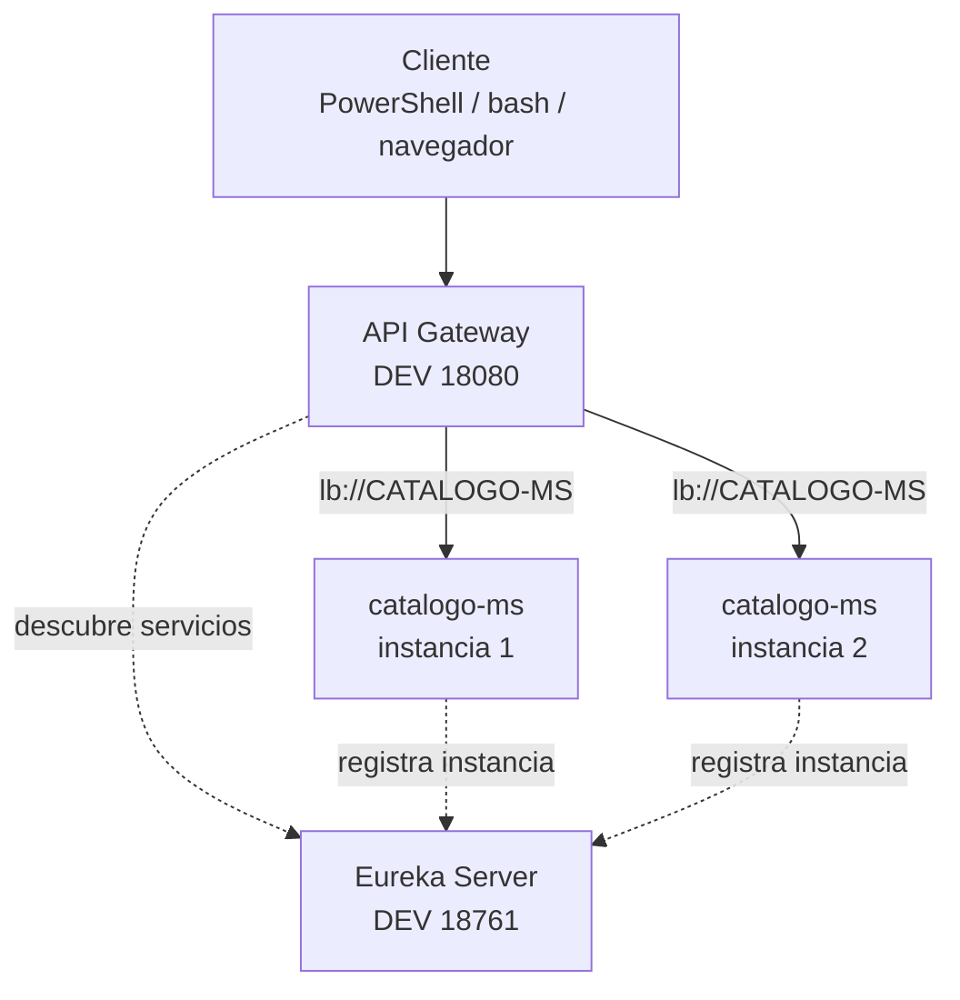

# S4 - Punto unico de acceso y distribucion de trafico

## 1. Introduccion

Tiempo: 20 min.

### 1.1 Proposito

Incorporar un punto unico de acceso para que los clientes consuman el sistema mediante Gateway y para distribuir trafico entre instancias disponibles.

### 1.2 Resultado de aprendizaje

El estudiante configura rutas en Gateway, consume microservicios mediante un acceso centralizado y evidencia balanceo de carga.

### 1.3 Producto de sesion

Gateway operativo en `infra/gateway`, con rutas hacia microservicios registrados en Eureka y pruebas de distribucion de trafico.

### 1.4 Motivacion de la sesion

Si un cliente conoce directamente todos los microservicios, queda acoplado a sus puertos, rutas y ubicaciones. Un Gateway permite centralizar el acceso y esconder la topologia interna del sistema.

Preguntas para los estudiantes:

1. Por que el cliente no deberia conocer todos los microservicios?
2. Que problema resuelve una ruta `lb://`?
3. Como se demuestra que existe balanceo de carga?

### 1.5 Ubicacion en el curso

- Unidad: U1 - Sistema distribuido base orientado a produccion.
- Producto de unidad: sistema distribuido base funcional, configurable y preparado para multiples instancias.
- Avance del producto en esta sesion: acceso centralizado con rutas y balanceo de carga.

## 2. Explica

Tiempo: 15 min.

### 2.1 Conceptos clave

- **Gateway**: punto unico de entrada al sistema.
- **Ruta**: regla que dirige una peticion hacia un servicio.
- **Load Balancer**: selecciona una instancia disponible del servicio.
- **`lb://`**: esquema usado para resolver servicios registrados por nombre logico.

### 2.2 Arquitectura del producto en `ecom`



### 2.3 Observabilidad y diagnostico

Senales a revisar:

- Health de Gateway.
- Eureka con servicios registrados.
- Logs de rutas.
- Respuestas repetidas desde instancias distintas.

Errores frecuentes:

| Problema | Causa probable | Solucion |
|---|---|---|
| 503 | Servicio no registrado o Eureka no disponible | Revisar Eureka y registros |
| 404 | Ruta mal configurada | Revisar predicates y paths |
| No balancea | Solo existe una instancia | Levantar otra instancia |

## 3. Aplica: actividad practica guiada

Tiempo: 3h.

En el laboratorio, el docente guia la configuracion de Gateway y la prueba de rutas hacia microservicios registrados.

### 3.1 Crear o revisar `infra/gateway`

**Producto del paso:** proyecto Gateway creado dentro de `infra/gateway`.

Dependencias principales:

```text
Spring Cloud Gateway
Eureka Discovery Client
Config Client
Actuator
```

### 3.2 Configurar rutas desde Config Server

Revisar:

```text
infra/config/config-repo/gateway-dev.yml
infra/config/config-repo/gateway-prod.yml
```

Las rutas deben apuntar a nombres logicos registrados en Eureka.

### 3.3 Levantar infraestructura en DEV

PowerShell / bash macOS/Linux:

```bash
cd infra/config
mvn spring-boot:run
```

En otra terminal:

```bash
cd infra/eureka
mvn spring-boot:run
```

En otra terminal:

```bash
cd infra/gateway
mvn spring-boot:run
```

### 3.4 Levantar microservicio y segunda instancia

PowerShell / bash macOS/Linux:

```bash
cd services/catalogo-ms
docker compose -f compose-dev.yml up -d
mvn spring-boot:run
```

En otra terminal:

```bash
cd services/catalogo-ms
mvn spring-boot:run
```

### 3.5 Probar por Gateway

PowerShell:

```powershell
Invoke-RestMethod -Method Get -Uri "http://localhost:18080/actuator/health"
Invoke-RestMethod -Method Get -Uri "http://localhost:18080/api/v1/categorias"
```

bash macOS/Linux:

```bash
curl http://localhost:18080/actuator/health
curl http://localhost:18080/api/v1/categorias
```

### 3.6 Evidenciar balanceo

Ejecuta varias veces un endpoint que devuelva informacion de instancia, si existe en el microservicio.

Resultado esperado:

- Gateway responde.
- Eureka muestra instancias disponibles.
- Las respuestas repetidas evidencian distribucion de trafico.

### 3.7 Ruta alternativa: clonar y ejecutar a partir del tag final de la sesion

PowerShell / bash macOS/Linux:

```bash
git clone --branch vs04-gateway-load-balancer https://github.com/261dist/ecom.git ecom-s04
cd ecom-s04
```

## 4. Crea: actividad autonoma

Tiempo: 4h fuera del aula.

### 4.1 Plantilla de evidencia individual

Entrega un PDF con el siguiente nombre:

```text
S04_Equipo##_ApellidoNombre.pdf
```

#### 4.1.1 Datos del estudiante

- Nombre:
- Equipo:
- Sesion: S04 - Punto unico de acceso y distribucion de trafico
- Rol o aporte realizado:
- Link de GitHub:

#### 4.1.2 Trabajo autonomo realizado

1. Agregar o revisar una ruta en Gateway.
2. Probar un endpoint mediante Gateway.
3. Levantar multiples instancias de un microservicio.
4. Evidenciar balanceo o explicar el diagnostico.
5. Documentar un error frecuente y su solucion.

#### 4.1.3 Evidencia tecnica

- Gateway activo.
- Ruta probada por Gateway.
- Eureka con instancias.
- Balanceo evidenciado.
- Registro en base de datos si la prueba modifica datos.

#### 4.1.4 Error o hallazgo

Describe un 404, 503, error de ruta, servicio no registrado o problema de balanceo.

#### 4.1.5 Reflexion tecnica breve

Explica por que Gateway permite ocultar la topologia interna del sistema.

### 4.2 Criterios minimos de aceptacion

- PDF con nombre correcto.
- Evidencia de Gateway activo.
- Ruta probada.
- Eureka con servicio registrado.
- Aporte individual verificable.

## 5. Cierre evaluativo

Tiempo: 20 min.

### 5.1 Resultados esperados

- Gateway ejecuta en DEV.
- Rutas consumen microservicios por nombre logico.
- Se evidencia distribucion de trafico.
- El estudiante diagnostica errores 404 y 503.

### 5.2 Evidencia del producto de sesion

Cada estudiante entrega un PDF individual siguiendo la plantilla de la seccion 4.1.

Nombre del archivo:

```text
S04_Equipo##_ApellidoNombre.pdf
```

### 5.3 Preguntas de defensa y reflexion

1. Por que el cliente debe entrar por Gateway?
2. Que significa `lb://`?
3. Como se relacionan Gateway y Eureka?
4. Como diagnosticas un 503?
5. Como evidencias balanceo?

### 5.4 Rubrica de evaluacion

| Dimension | Peso | 3 - Logro destacado | 2 - Logro | 1 - Proceso | 0 - Inicio | Puntuacion obtenida |
|---|---:|---|---|---|---|---:|
| 1. Gateway operativo | 2 | Evidencia Gateway activo, health y rutas funcionales. | Evidencia Gateway activo y una ruta funcional. | Evidencia parcial o sin prueba clara. | No evidencia Gateway funcionando. | |
| 2. Rutas centralizadas | 2 | Configura y explica rutas por nombre logico. | Evidencia rutas funcionales. | Rutas incompletas o confusas. | No evidencia rutas. | |
| 3. Balanceo de carga | 2 | Evidencia distribucion entre multiples instancias. | Evidencia multiples instancias y prueba parcial. | Explica balanceo sin evidencia suficiente. | No evidencia balanceo. | |
| 4. Diagnostico tecnico | 2 | Analiza errores de Gateway/Eureka con solucion. | Explica error y causa probable. | Menciona error sin analisis. | No presenta diagnostico. | |
| 5. Aporte individual | 1 | Aporte claro, verificable y conectado al producto. | Aporte identificable. | Aporte general. | No se identifica aporte. | |
| 6. Orden y reflexion | 1 | PDF ordenado, evidencias legibles y reflexion tecnica clara. | Evidencias entendibles y reflexion suficiente. | Evidencias poco claras o reflexion superficial. | PDF desordenado o sin reflexion. | |

Puntuacion acumulada = suma de (`Peso` * `Puntuacion obtenida`) = ____.

Nota final = (`Puntuacion acumulada` / 30) * 20 = ____.

Para usar la rubrica con IA, solicita:

```text
Evalua el PDF usando la rubrica de la sesion.
Para cada dimension selecciona la puntuacion obtenida usando la escala Inicio=0, Proceso=1, Logro=2, Logro destacado=3.
Justifica brevemente cada puntuacion.
Calcula la puntuacion acumulada con la formula: suma de (Peso * Puntuacion obtenida).
Calcula la nota final sobre 20 con la formula: (Puntuacion acumulada / 30) * 20.
Indica 2 fortalezas y 2 recomendaciones.
```
