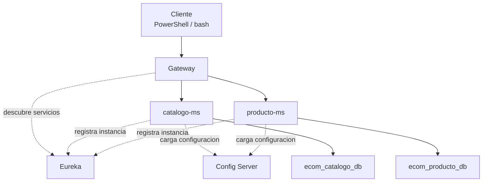

# S5 - Evaluacion U1

## 1. Introduccion

Tiempo: 20 min.

### 1.1 Proposito

Validar que el sistema distribuido base construido en la Unidad 1 funciona como un todo y que cada integrante puede sustentar su aporte.

### 1.2 Resultado de aprendizaje

El estudiante demuestra ejecucion, prueba, diagnostico y defensa tecnica de un sistema base con configuracion centralizada, registro de servicios, Gateway y multiples instancias.

### 1.3 Producto de sesion

Producto U1 integrado: Config Server, Eureka, Gateway, microservicios de negocio, bases de datos y multiples instancias.

### 1.4 Motivacion de la sesion

Un sistema distribuido no se evalua por componentes aislados. La evidencia importante es que los componentes se integran, se ejecutan en orden, responden por Gateway y pueden diagnosticarse ante fallos.

Preguntas para los estudiantes:

1. Que evidencia demuestra que el sistema funciona integrado?
2. Que parte del producto puedes defender individualmente?
3. Que revisas cuando una ruta del Gateway falla?

### 1.5 Ubicacion en el curso

- Unidad: U1 - Sistema distribuido base orientado a produccion.
- Producto de unidad: sistema distribuido base funcional, configurable y preparado para multiples instancias.
- Avance del producto en esta sesion: evaluacion integradora de la Unidad 1.

## 2. Explica

Tiempo: 15 min.

### 2.1 Conceptos clave

- **Integracion**: los componentes funcionan coordinadamente.
- **Evidencia individual**: prueba verificable del aporte de cada estudiante.
- **Diagnostico**: capacidad de ubicar fallos en Config Server, Eureka, Gateway, microservicio o BD.

### 2.2 Arquitectura del producto en `ecom`



### 2.3 Observabilidad y diagnostico

Senales obligatorias:

- Config Server entrega perfiles.
- Eureka muestra servicios registrados.
- Gateway responde health.
- CRUD responde por Gateway.
- BD contiene registros.
- Se evidencia mas de una instancia cuando corresponde.

## 3. Aplica: actividad practica guiada

Tiempo: 3h.

En esta sesion se realiza una evaluacion practica. El equipo levanta el sistema y cada integrante evidencia su aporte individual.

### 3.1 Preparar orden de arranque

Orden recomendado:

1. Config Server.
2. Eureka.
3. Gateway.
4. Bases de datos.
5. Microservicios.
6. Segunda instancia, si aplica.

### 3.2 Ejecutar pruebas base

PowerShell:

```powershell
Invoke-RestMethod -Method Get -Uri "http://localhost:18888/catalogo-ms/dev"
Invoke-WebRequest -Uri "http://localhost:18761" -UseBasicParsing
Invoke-RestMethod -Method Get -Uri "http://localhost:18080/actuator/health"
Invoke-RestMethod -Method Get -Uri "http://localhost:18080/api/v1/categorias"
```

bash macOS/Linux:

```bash
curl http://localhost:18888/catalogo-ms/dev
curl http://localhost:18761
curl http://localhost:18080/actuator/health
curl http://localhost:18080/api/v1/categorias
```

### 3.3 Validar multiples instancias

Verificar en Eureka que el servicio tiene mas de una instancia o explicar por que no se pudo levantar.

### 3.4 Inspeccionar base de datos

PowerShell / bash macOS/Linux:

```bash
docker exec -it ecom-postgres-catalogo-dev psql -U ecom -d ecom_catalogo_db -c "SELECT * FROM categorias;"
```

### 3.5 Demostracion individual

Cada integrante debe poder responder:

- Que parte implemento.
- Que archivo modifico.
- Que prueba ejecuto.
- Que error diagnostico.

## 4. Crea: actividad autonoma

Tiempo: 4h fuera del aula.

### 4.1 Plantilla de evidencia individual

La evaluacion U1 requiere tres entregables:

1. Evidencia individual en PDF.
2. Presentacion del proyecto U1 (PPT o equivalente).
3. Documentacion en MkDocs con guias reproducibles de los artefactos trabajados en las sesiones de U1.

Ademas, el repositorio GitHub debe evidenciar el aporte o participacion de cada integrante del equipo, y cada integrante debe mostrar una demo de la parte que trabajo.

Entrega el PDF con el siguiente nombre:

```text
S05_Equipo##_ApellidoNombre.pdf
```

Entrega la presentacion con el siguiente nombre:

```text
U1_Equipo##_Presentacion.pdf
```

La documentacion MkDocs debe estar en el repositorio y publicada o ejecutable localmente con `mkdocs serve`.

#### 4.1.1 Datos del estudiante

- Nombre:
- Equipo:
- Sesion: S05 - Evaluacion U1
- Rol o aporte realizado:
- Link de GitHub:
- Evidencia de participacion en GitHub:
- Parte del sistema que demostrara en vivo:

#### 4.1.2 Trabajo autonomo realizado

1. Ordenar evidencias de U1.
2. Corregir observaciones detectadas.
3. Completar README o documentacion del modulo asignado.
4. Preparar defensa individual.
5. Registrar comandos y resultados.

#### 4.1.3 Evidencia tecnica

- Config Server.
- Eureka.
- Gateway.
- CRUD por Gateway.
- BD con registros.
- Multiples instancias.
- Aporte individual.

#### 4.1.4 Presentacion del proyecto U1

La presentacion debe incluir:

- Nombre del proyecto y equipo.
- Arquitectura U1.
- Flujo de ejecucion.
- Evidencias principales.
- Aporte individual de cada integrante.
- Evidencia de participacion de cada integrante en GitHub.
- Demo asignada a cada integrante.
- Problemas encontrados y decisiones tecnicas.

#### 4.1.5 Documentacion MkDocs

La documentacion debe incluir guias para reproducir cada artefacto de sesion:

- S01: microservicio base y CRUD.
- S02: Config Server y perfiles `dev` / `prod`.
- S03: Eureka y registro de servicios.
- S04: Gateway, rutas y balanceo.
- S05: integracion y evaluacion U1.

Cada guia debe contener comandos, puertos, rutas probadas, evidencias esperadas y errores frecuentes.

#### 4.1.6 Error o hallazgo

Describe un problema de integracion y como lo diagnosticarias.

#### 4.1.7 Reflexion tecnica breve

Explica como los componentes de U1 forman un sistema distribuido base.

### 4.2 Criterios minimos de aceptacion

- PDF con nombre correcto.
- Presentacion del proyecto U1 entregada.
- Documentacion MkDocs con guias reproducibles de S01 a S05.
- Evidencia del producto U1 integrado.
- Evidencia de aporte individual.
- GitHub evidencia aporte o participacion de cada integrante.
- Cada integrante demuestra en vivo la parte que trabajo.
- Pruebas por consola.
- Diagnostico tecnico.

## 5. Cierre evaluativo

Tiempo: 20 min.

### 5.1 Resultados esperados

- Producto U1 levantado.
- Pruebas por Gateway ejecutadas.
- Servicios registrados en Eureka.
- Configuracion consultada.
- Cada integrante sustenta su aporte.
- Cada integrante demuestra la parte que trabajo.
- GitHub permite verificar la participacion de cada integrante.

### 5.2 Evidencia del producto de sesion

Cada estudiante entrega un PDF individual siguiendo la plantilla de la seccion 4.1. El equipo entrega ademas una presentacion del proyecto U1 y documentacion MkDocs con guias reproducibles de los artefactos de S01 a S05.

Nombre del archivo:

```text
S05_Equipo##_ApellidoNombre.pdf
```

### 5.3 Preguntas de defensa y reflexion

1. Cual fue tu aporte concreto en U1?
2. Como se levanta el sistema base?
3. Como se prueba sin Postman?
4. Como sabes que hay multiples instancias?
5. Que revisas si una ruta devuelve 503?

### 5.4 Rubrica de evaluacion

| Dimension | Peso | 3 - Logro destacado | 2 - Logro | 1 - Proceso | 0 - Inicio | Puntuacion obtenida |
|---|---:|---|---|---|---|---:|
| 1. Integracion del producto U1 | 2 | Evidencia sistema completo integrado y funcionando. | Evidencia componentes principales funcionando. | Evidencia parcial de componentes. | No evidencia integracion. | |
| 2. Pruebas tecnicas | 2 | Pruebas por Config, Eureka, Gateway, CRUD y BD completas. | Pruebas principales completas. | Pruebas incompletas o poco claras. | No evidencia pruebas. | |
| 3. Diagnostico | 2 | Diagnostica fallos de integracion con claridad. | Explica un problema y causa probable. | Menciona problema sin analisis. | No diagnostica. | |
| 4. Aporte individual y participacion en GitHub | 2 | Aporte verificable en GitHub, claro y conectado al producto. | Aporte identificable en GitHub. | Aporte general o poco trazable. | No se identifica aporte. | |
| 5. Defensa tecnica | 1 | Responde con precision y criterio tecnico. | Responde adecuadamente. | Responde parcialmente. | No sustenta. | |
| 6. Orden, presentacion, documentacion y demo individual | 1 | PDF ordenado, presentacion clara (PPT o equivalente), MkDocs reproducible y demo individual de la parte trabajada. | Evidencias suficientes con presentacion, documentacion y demo. | Evidencias poco claras, documentacion incompleta o demo parcial. | Evidencia insuficiente. | |

Puntuacion acumulada = suma de (`Peso` * `Puntuacion obtenida`) = ____.

Nota final = (`Puntuacion acumulada` / 30) * 20 = ____.

Para usar la rubrica con IA, solicita:

```text
Evalua el PDF, la presentacion y la documentacion MkDocs usando la rubrica de la sesion.
Para cada dimension selecciona la puntuacion obtenida usando la escala Inicio=0, Proceso=1, Logro=2, Logro destacado=3.
Justifica brevemente cada puntuacion.
Calcula la puntuacion acumulada con la formula: suma de (Peso * Puntuacion obtenida).
Calcula la nota final sobre 20 con la formula: (Puntuacion acumulada / 30) * 20.
Indica 2 fortalezas y 2 recomendaciones.
```
