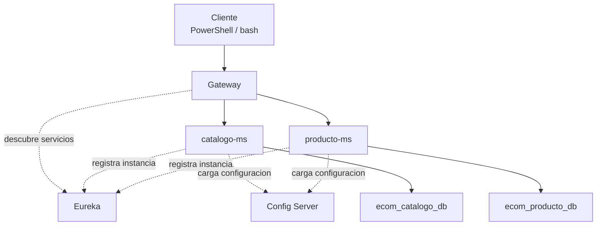

# S5 - Evaluacion U1

## 1. Instrucciones iniciales

Tiempo: 5 min.

### 1.1 Proposito

Validar que el sistema distribuido base construido en la Unidad 1 funciona como un todo y que cada integrante puede sustentar su aporte.

### 1.2 Resultado de aprendizaje

El estudiante demuestra ejecucion, prueba, diagnostico y defensa tecnica de un sistema base con configuracion centralizada, registro de servicios, Gateway y multiples instancias.

### 1.3 Producto de sesion

Producto U1 integrado: Config Server, Eureka, Gateway, microservicios de negocio, bases de datos y multiples instancias.

### 1.4 Preguntas del docente durante la sustentacion

Un sistema distribuido no se evalua por componentes aislados. La evidencia importante es que los componentes se integran, se ejecutan en orden, responden por Gateway y pueden diagnosticarse ante fallos.

Preguntas que el docente puede realizar a cada estudiante:

1. Que evidencia demuestra que el sistema funciona integrado?
2. Que parte del producto puedes defender individualmente?
3. Que revisas cuando una ruta del Gateway falla?

### 1.5 Ubicacion en el curso

- Unidad: U1 - Sistema distribuido base orientado a produccion.
- Producto de unidad: sistema distribuido base funcional, configurable y preparado para multiples instancias.
- Avance del producto en esta sesion: evaluacion integradora de la Unidad 1.

## 2. Explica

Tiempo: 10 min.

El docente presenta brevemente la arquitectura del producto de unidad, recuerda la distribucion de tiempo por equipo y pasa directamente a las exposiciones.

### 2.1 Arquitectura del producto de unidad



### 2.2 Tiempo de exposicion por equipo

Cada grupo dispone de hasta 18 minutos:

- 10 minutos de exposicion del proyecto U1.
- 5 minutos de demo tecnica.
- 3 minutos de preguntas del docente a integrantes del equipo.

## 3. Aplica: actividad practica guiada

Tiempo: 3h 45 min para la ronda de evaluacion de equipos.

En esta sesion se realiza la exposicion y evaluacion practica. Cada equipo dispone de hasta 18 minutos para presentar el producto U1, mostrar la demo y responder preguntas. La rubrica se aplica al cierre de la exposicion de cada equipo.

### 3.1 Plantilla de entrega

La evaluacion U1 requiere tres entregables:

1. Evidencia individual en PDF.
2. Presentacion del proyecto U1 (PPT o equivalente).
3. Documentacion en MkDocs con guias reproducibles de los artefactos trabajados en las sesiones de U1.

Ademas, el repositorio GitHub debe evidenciar el aporte o participacion de cada integrante del equipo, y cada integrante debe mostrar una demo de la parte que trabajo.

Entrega el PDF con el siguiente nombre:

```text
S05_Equipo##_ApellidoNombre.pdf
```

Entrega la presentacion con el siguiente nombre:

```text
U1_Equipo##_Presentacion.pdf
```

La documentacion MkDocs debe estar en el repositorio GitHub y publicada o ejecutable localmente con `mkdocs serve`.

#### 3.1.1 Datos del estudiante

- Nombre:
- Equipo:
- Sesion: S05 - Evaluacion U1
- Rol o aporte realizado:
- Link de GitHub:
- Evidencia de participacion en GitHub:
- Parte del sistema que demostrara en vivo:

#### 3.1.2 Evidencia tecnica individual

- Config Server.
- Eureka.
- Gateway.
- CRUD por Gateway.
- BD con registros.
- Multiples instancias.
- Aporte individual.

#### 3.1.3 Presentacion del proyecto U1

La presentacion debe incluir:

- Nombre del proyecto y equipo.
- Arquitectura U1.
- Flujo de ejecucion.
- Evidencias principales.
- Aporte individual de cada integrante.
- Evidencia de participacion de cada integrante en GitHub.
- Demo asignada a cada integrante.
- Problemas encontrados y decisiones tecnicas.

#### 3.1.4 Documentacion MkDocs

La documentacion debe incluir guias para reproducir cada artefacto de sesion:

- S01: microservicio base y CRUD.
- S02: Config Server y perfiles `dev` / `prod`.
- S03: Eureka y registro de servicios.
- S04: Gateway, rutas y balanceo.
- S05: integracion y evaluacion U1.

Cada guia debe contener comandos, puertos, rutas probadas, evidencias esperadas y errores frecuentes.

### 3.2 Secuencia sugerida de presentacion

1. Presentar nombre del proyecto, equipo y repositorio GitHub.
2. Explicar la arquitectura U1 usando el diagrama del producto.
3. Mostrar Config Server, Eureka, Gateway y microservicios integrados.
4. Ejecutar la demo tecnica por Gateway.
5. Mostrar participacion de cada integrante en GitHub.
6. Cada integrante muestra la parte que trabajo.
7. Cerrar con hallazgos, problemas y decisiones tecnicas.

### 3.3 Criterios minimos de aceptacion

- PDF con nombre correcto.
- Presentacion del proyecto U1 entregada.
- Documentacion MkDocs con guias reproducibles de S01 a S05.
- Evidencia del producto U1 integrado.
- Evidencia de aporte individual.
- GitHub evidencia aporte o participacion de cada integrante.
- Cada integrante demuestra en vivo la parte que trabajo.
- Pruebas por consola.
- Diagnostico tecnico.

## 4. Crea: actividad autonoma

Tiempo: 4h fuera del aula.

### 4.1 Mejoras y recomendaciones para la siguiente unidad

Despues de la evaluacion, cada estudiante debe implementar las mejoras y recomendaciones recibidas. Esta actividad no forma parte de la calificacion de la evaluacion U1; sirve como preparacion para la siguiente unidad.

Trabajo autonomo:

1. Corregir observaciones detectadas en la exposicion.
2. Completar o ajustar la documentacion MkDocs.
3. Mejorar evidencias individuales incompletas.
4. Registrar en GitHub los cambios posteriores a la evaluacion.
5. Preparar una breve reflexion tecnica sobre la mejora aplicada.

## 5. Cierre evaluativo

La rubrica evalua el entregable y la sustentacion del producto U1 presentados durante la sesion.

### 5.1 Rubrica de evaluacion

| Dimension | Peso | 3 - Logro destacado | 2 - Logro | 1 - Proceso | 0 - Inicio | Puntuacion obtenida |
|---|---:|---|---|---|---|---:|
| 1. Integracion del producto U1 | 2 | Evidencia sistema completo integrado y funcionando. | Evidencia componentes principales funcionando. | Evidencia parcial de componentes. | No evidencia integracion. | |
| 2. Pruebas tecnicas | 2 | Pruebas por Config, Eureka, Gateway, CRUD y BD completas. | Pruebas principales completas. | Pruebas incompletas o poco claras. | No evidencia pruebas. | |
| 3. Diagnostico | 2 | Diagnostica fallos de integracion con claridad. | Explica un problema y causa probable. | Menciona problema sin analisis. | No diagnostica. | |
| 4. Aporte individual y participacion en GitHub | 2 | Aporte verificable en GitHub, claro y conectado al producto. | Aporte identificable en GitHub. | Aporte general o poco trazable. | No se identifica aporte. | |
| 5. Defensa tecnica | 1 | Responde con precision y criterio tecnico. | Responde adecuadamente. | Responde parcialmente. | No sustenta. | |
| 6. Orden, presentacion, documentacion y demo individual | 1 | PDF ordenado, presentacion clara (PPT o equivalente), MkDocs reproducible y demo individual de la parte trabajada. | Evidencias suficientes con presentacion, documentacion y demo. | Evidencias poco claras, documentacion incompleta o demo parcial. | Evidencia insuficiente. | |

Puntuacion acumulada = suma de (`Peso` * `Puntuacion obtenida`) = ____.

Nota final = (`Puntuacion acumulada` / 30) * 20 = ____.

Para usar la rubrica con IA, solicita:

```text
Evalua el PDF, la presentacion, la documentacion MkDocs, la participacion en GitHub y la demo individual usando la rubrica de la sesion.
Para cada dimension selecciona la puntuacion obtenida usando la escala Inicio=0, Proceso=1, Logro=2, Logro destacado=3.
Justifica brevemente cada puntuacion.
Calcula la puntuacion acumulada con la formula: suma de (Peso * Puntuacion obtenida).
Calcula la nota final sobre 20 con la formula: (Puntuacion acumulada / 30) * 20.
Indica 2 fortalezas y 2 recomendaciones.
```
