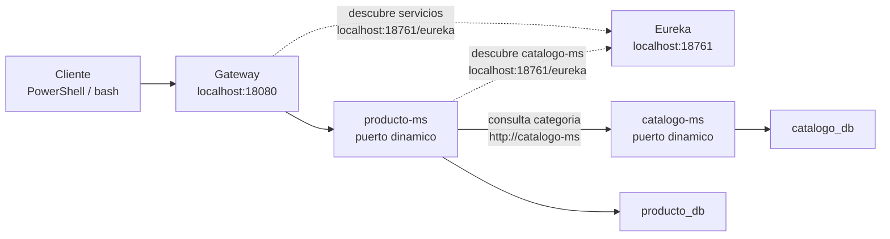
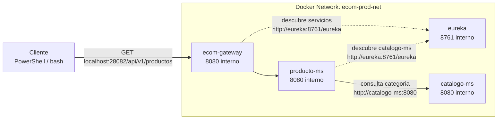

# S6 - Comunicacion sincronica resiliente entre servicios

## 1. Introduccion

Tiempo: 20 min.

### 1.1 Proposito

Implementar comunicacion entre microservicios para resolver operaciones que requieren datos de otro servicio, manteniendo respuestas controladas ante errores.

### 1.2 Resultado de aprendizaje

El estudiante implementa una llamada interna entre microservicios, valida el flujo distribuido y evidencia una respuesta controlada ante fallos.

### 1.3 Producto de sesion

`producto-ms` consulta `catalogo-ms` para validar o enriquecer informacion de categorias, con trazabilidad y manejo basico de errores.

### 1.4 Motivacion de la sesion

En un sistema distribuido, ningun microservicio debe leer directamente la base de datos de otro. Si `producto-ms` necesita informacion de categorias, debe comunicarse con `catalogo-ms` por una API interna.

### 1.5 Ubicacion en el curso

- Unidad: U2 - Sistema distribuido robusto.
- Producto de unidad: sistema distribuido seguro, resiliente, consistente, observable e integrado con cliente frontend.
- Avance del producto en esta sesion: comunicacion sincronica entre servicios.

## 2. Explica

Tiempo: 15 min.

### 2.1 Conceptos clave

- Comunicacion sincronica.
- Cliente HTTP interno.
- DTO entre servicios.
- Timeout y error controlado.
- Trazabilidad de peticiones entre microservicios.

### 2.2 Arquitectura del producto en `ecom`

#### 2.2.1 Comunicacion sincronica en DEV



#### 2.2.2 Comunicacion sincronica en PROD local



### 2.3 Observabilidad y diagnostico

Revisar logs de `producto-ms`, logs de `catalogo-ms`, correlation id, health y respuesta HTTP cuando `catalogo-ms` no responde.

## 3. Aplica: actividad practica guiada

Tiempo: 3h.

La ruta principal de la sesion es construir desde cero la comunicacion entre `producto-ms` y `catalogo-ms`. Si el estudiante necesita avanzar mas rapido, puede usar la ruta alternativa del paso 3.17.

### 3.1 Identificar servicios base

**Producto del paso:** `catalogo-ms` y `producto-ms` identificados como servicios que participaran en la comunicacion.

En esta sesion:

- `catalogo-ms` expone categorias.
- `producto-ms` consulta `catalogo-ms` para obtener el detalle de la categoria de un producto.
- La llamada se hace por nombre logico registrado en Eureka, no por puerto fijo.

### 3.2 Agregar dependencia de cliente HTTP interno

Producto del paso: `producto-ms` preparado para usar OpenFeign.

En `services/producto-ms/pom.xml`, agrega:

```xml
<dependency>
    <groupId>org.springframework.cloud</groupId>
    <artifactId>spring-cloud-starter-openfeign</artifactId>
</dependency>
```

Si tambien se trabajara respuesta controlada con Circuit Breaker, agrega:

```xml
<dependency>
    <groupId>io.github.resilience4j</groupId>
    <artifactId>resilience4j-spring-boot3</artifactId>
</dependency>
```

En la clase principal de `producto-ms`, habilita Feign:

```java
package com.upeu.producto;

import org.springframework.boot.SpringApplication;
import org.springframework.boot.autoconfigure.SpringBootApplication;
import org.springframework.cloud.openfeign.EnableFeignClients;

@SpringBootApplication
@EnableFeignClients
public class ProductoApplication {
    public static void main(String[] args) {
        SpringApplication.run(ProductoApplication.class, args);
    }
}
```

### 3.3 Crear DTO de categoria

Producto del paso: contrato de datos recibido desde `catalogo-ms`.

Crea:

```text
services/producto-ms/src/main/java/com/upeu/producto/dto/CategoriaDto.java
```

Pega:

```java
package com.upeu.producto.dto;

import lombok.AllArgsConstructor;
import lombok.Builder;
import lombok.Getter;
import lombok.NoArgsConstructor;
import lombok.Setter;

@Getter
@Setter
@Builder
@NoArgsConstructor
@AllArgsConstructor
public class CategoriaDto {
    private Long id;
    private String nombre;
    private String descripcion;
}
```

### 3.4 Crear cliente interno hacia `catalogo-ms`

Producto del paso: cliente Feign que consulta `catalogo-ms` por nombre logico.

Crea:

```text
services/producto-ms/src/main/java/com/upeu/producto/client/CatalogoClient.java
```

Pega:

```java
package com.upeu.producto.client;

import com.upeu.producto.dto.CategoriaDto;
import org.springframework.cloud.openfeign.FeignClient;
import org.springframework.web.bind.annotation.GetMapping;
import org.springframework.web.bind.annotation.PathVariable;

@FeignClient(name = "catalogo-ms")
public interface CatalogoClient {

    @GetMapping("/api/v1/categorias/{id}")
    CategoriaDto findCategoriaById(@PathVariable("id") Long id);
}
```

### 3.5 Integrar cliente en el servicio de producto

Producto del paso: `producto-ms` devuelve detalle de producto enriquecido con categoria.

Inyecta `CatalogoClient` en el servicio de producto:

```java
private final CatalogoClient catalogoClient;
```

Agrega un metodo de consulta de detalle:

```java
@Override
@Transactional(readOnly = true)
@CircuitBreaker(name = "catalogo", fallbackMethod = "fallbackCategoria")
public ProductoResponse findDetalleById(Integer id) {
    Producto producto = getProductoById(id);

    CategoriaDto categoria = catalogoClient.findCategoriaById(
            producto.getIdCategoria().longValue());

    return ProductoResponse.builder()
            .id(producto.getId())
            .nombre(producto.getNombre())
            .descripcion(producto.getDescripcion())
            .idCategoria(producto.getIdCategoria())
            .categoria(categoria)
            .build();
}
```

### 3.6 Configurar timeout o respuesta controlada

Producto del paso: respuesta controlada si `catalogo-ms` no responde.

Agrega el fallback en el mismo servicio:

```java
public ProductoResponse fallbackCategoria(Integer id, Throwable ex) {
    Producto producto = getProductoById(id);

    return ProductoResponse.builder()
            .id(producto.getId())
            .nombre(producto.getNombre())
            .descripcion(producto.getDescripcion())
            .idCategoria(producto.getIdCategoria())
            .categoria(null)
            .build();
}
```

En el controlador de productos, expone el endpoint de detalle si no existe:

```java
@GetMapping("/detalle/{id}")
public ProductoResponse findDetalleById(@PathVariable Integer id) {
    return productoService.findDetalleById(id);
}
```

### 3.7 Levantar infraestructura en DEV

PowerShell / bash macOS/Linux:

```bash
cd infra/config
mvn spring-boot:run
```

En otra terminal:

```bash
cd infra/eureka
mvn spring-boot:run
```

En otra terminal:

```bash
cd infra/gateway
mvn spring-boot:run
```

### 3.8 Levantar `catalogo-ms` en DEV

PowerShell / bash macOS/Linux:

```bash
cd services/catalogo-ms
docker compose -f compose-dev.yml up -d
mvn spring-boot:run
```

### 3.9 Levantar `producto-ms` en DEV

PowerShell / bash macOS/Linux:

```bash
cd services/producto-ms
docker compose -f compose-dev.yml up -d
mvn spring-boot:run
```

### 3.10 Probar flujo correcto

PowerShell:

```powershell
Invoke-RestMethod -Method Get -Uri "http://localhost:18080/api/v1/productos"
```

bash macOS/Linux:

```bash
curl http://localhost:18080/api/v1/productos
```

### 3.11 Probar detalle o validacion de categoria

Ejecutar una operacion de producto que obligue a consultar `catalogo-ms`.

### 3.12 Probar error controlado

Detener `catalogo-ms` o simular una categoria inexistente y verificar que `producto-ms` responde de forma controlada.

### 3.13 Validar trazabilidad en logs

Revisa logs de `producto-ms` y `catalogo-ms` para confirmar la llamada interna y el correlation id.

### 3.14 Preparar PROD local

Primero levantar infraestructura y luego microservicios:

```text
infra -> config + eureka + gateway
services/catalogo-ms
services/producto-ms
```

### 3.15 Probar comunicacion en PROD local

PowerShell / bash macOS/Linux:

```bash
cd infra
docker compose up -d --build config eureka gateway
```

En otra terminal:

```bash
cd services/catalogo-ms
docker compose up -d --build
```

En otra terminal:

```bash
cd services/producto-ms
docker compose up -d --build
```

Prueba por Gateway PROD con PowerShell:

```powershell
Invoke-RestMethod -Method Get -Uri "http://localhost:28082/api/v1/productos"
```

Prueba por Gateway PROD con bash macOS/Linux:

```bash
curl http://localhost:28082/api/v1/productos
```

### 3.16 Validar evidencias de cierre de la practica

Verifica:

- `producto-ms` consulta `catalogo-ms`.
- La llamada ocurre por nombre logico.
- El flujo correcto responde.
- El error controlado responde sin romper el sistema.
- PROD local mantiene el mismo comportamiento.

### 3.17 Ruta alternativa: clonar y ejecutar a partir del tag final de la sesion

```bash
git clone --branch vs06-comunicacion-sincronica https://github.com/261dist/ecom.git ecom-s06
cd ecom-s06
```

## 4. Crea: actividad autonoma

Tiempo: 4h fuera del aula.

Esta actividad autonoma se desarrolla sobre el proyecto de fin de curso del equipo. El producto de la unidad se construye por acumulacion de los avances de cada sesion; por eso, la evidencia de esta sesion debe incorporarse al MkDocs del proyecto y quedar trazable en GitHub.

### 4.1 Plantilla de evidencia individual

Entrega un PDF:

```text
S06_Equipo##_ApellidoNombre.pdf
```

#### 4.1.1 Datos del estudiante

- Nombre:
- Equipo:
- Sesion: S06 - Comunicacion sincronica resiliente entre servicios
- Rol o aporte realizado:
- Link de GitHub:

#### 4.1.2 Trabajo autonomo realizado

1. Evidenciar llamada de `producto-ms` a `catalogo-ms`.
2. Probar caso exitoso.
3. Probar error controlado.
4. Explicar por que no se comparte base de datos.
5. Registrar aporte individual.

### 4.2 Criterios minimos de aceptacion

- PDF con nombre correcto.
- Evidencia de comunicacion entre servicios.
- Evidencia de caso correcto y error controlado.
- Aporte individual verificable.

## 5. Cierre evaluativo

Tiempo: 20 min.

### 5.1 Resultados esperados

- `producto-ms` consume `catalogo-ms`.
- El flujo distribuido funciona.
- Los errores internos se responden de forma controlada.

### 5.2 Evidencia del producto de sesion

Entrega individual:

```text
S06_Equipo##_ApellidoNombre.pdf
```

### 5.3 Preguntas de defensa y reflexion

1. Por que un microservicio no debe leer la BD de otro?
2. Que pasa si el servicio llamado no responde?
3. Que evidencia demuestra la comunicacion entre servicios?
4. Como ayuda el correlation id?

### 5.4 Rubrica de evaluacion

| Dimension | Peso | 3 - Logro destacado | 2 - Logro | 1 - Proceso | 0 - Inicio | Puntuacion obtenida |
|---|---:|---|---|---|---|---:|
| 1. Comunicacion entre servicios | 2 | Evidencia flujo completo y consistente entre servicios. | Evidencia llamada funcional. | Evidencia parcial o poco clara. | No evidencia comunicacion. | |
| 2. Contrato y datos | 2 | Usa DTOs y valida datos correctamente. | Usa contrato funcional. | Contrato parcial o confuso. | No evidencia contrato. | |
| 3. Manejo de errores | 2 | Evidencia error controlado y explica causa. | Evidencia respuesta ante error. | Error probado parcialmente. | No evidencia manejo de error. | |
| 4. Observabilidad | 2 | Evidencia logs/correlation id del flujo. | Evidencia logs suficientes. | Evidencia limitada. | No evidencia diagnostico. | |
| 5. Aporte individual | 1 | Aporte claro y verificable. | Aporte identificable. | Aporte general. | No se identifica aporte. | |
| 6. Orden y reflexion | 1 | PDF ordenado y reflexion tecnica clara. | Evidencia suficiente. | Evidencia poco clara. | PDF insuficiente. | |

Puntuacion acumulada = suma de (`Peso` * `Puntuacion obtenida`) = ____.

Nota final = (`Puntuacion acumulada` / 30) * 20 = ____.

Para usar la rubrica con IA, solicita:

```text
Evalua el PDF usando la rubrica de la sesion.
Para cada dimension selecciona la puntuacion obtenida usando la escala Inicio=0, Proceso=1, Logro=2, Logro destacado=3.
Justifica brevemente cada puntuacion.
Calcula la puntuacion acumulada con la formula: suma de (Peso * Puntuacion obtenida).
Calcula la nota final sobre 20 con la formula: (Puntuacion acumulada / 30) * 20.
Indica 2 fortalezas y 2 recomendaciones.
```
