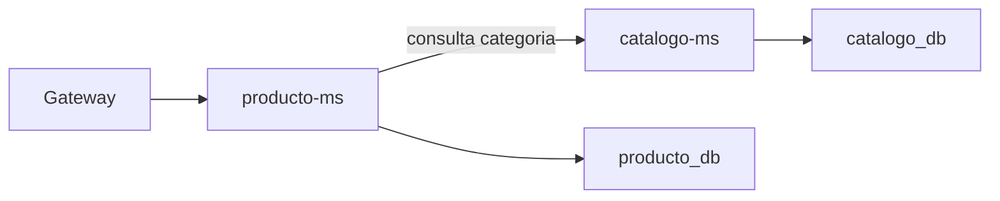

# S6 - Comunicacion sincronica resiliente entre servicios

## 1. Introduccion

Tiempo: 20 min.

### 1.1 Proposito

Implementar comunicacion entre microservicios para resolver operaciones que requieren datos de otro servicio, manteniendo respuestas controladas ante errores.

### 1.2 Resultado de aprendizaje

El estudiante implementa una llamada interna entre microservicios, valida el flujo distribuido y evidencia una respuesta controlada ante fallos.

### 1.3 Producto de sesion

`producto-ms` consulta `catalogo-ms` para validar o enriquecer informacion de categorias, con trazabilidad y manejo basico de errores.

### 1.4 Motivacion de la sesion

En un sistema distribuido, ningun microservicio debe leer directamente la base de datos de otro. Si `producto-ms` necesita informacion de categorias, debe comunicarse con `catalogo-ms` por una API interna.

### 1.5 Ubicacion en el curso

- Unidad: U2 - Sistema distribuido robusto.
- Producto de unidad: sistema distribuido seguro, resiliente, consistente, observable e integrado con cliente frontend.
- Avance del producto en esta sesion: comunicacion sincronica entre servicios.

## 2. Explica

Tiempo: 15 min.

### 2.1 Conceptos clave

- Comunicacion sincronica.
- Cliente HTTP interno.
- DTO entre servicios.
- Timeout y error controlado.
- Trazabilidad de peticiones entre microservicios.

### 2.2 Arquitectura del producto en `ecom`



### 2.3 Observabilidad y diagnostico

Revisar logs de `producto-ms`, logs de `catalogo-ms`, correlation id, health y respuesta HTTP cuando `catalogo-ms` no responde.

## 3. Aplica: actividad practica guiada

Tiempo: 3h.

### 3.1 Preparar servicios

Levantar Config Server, Eureka, Gateway, `catalogo-ms` y `producto-ms`.

### 3.2 Crear cliente interno

Implementar cliente para que `producto-ms` consulte `catalogo-ms` usando nombre logico del servicio.

### 3.3 Integrar el flujo de producto

Actualizar el flujo de creacion o consulta de producto para validar categoria mediante `catalogo-ms`.

### 3.4 Probar flujo correcto

PowerShell / bash macOS/Linux:

```bash
curl http://localhost:18080/api/v1/productos
```

### 3.5 Probar error controlado

Detener `catalogo-ms` o simular una categoria inexistente y verificar que `producto-ms` responde de forma controlada.

### 3.6 Ruta alternativa: clonar y ejecutar a partir del tag final de la sesion

```bash
git clone --branch vs06-comunicacion-sincronica https://github.com/261dist/ecom.git ecom-s06
cd ecom-s06
```

## 4. Crea: actividad autonoma

Tiempo: 4h fuera del aula.

### 4.1 Plantilla de evidencia individual

Entrega un PDF:

```text
S06_Equipo##_ApellidoNombre.pdf
```

#### 4.1.1 Datos del estudiante

- Nombre:
- Equipo:
- Sesion: S06 - Comunicacion sincronica resiliente entre servicios
- Rol o aporte realizado:
- Link de GitHub:

#### 4.1.2 Trabajo autonomo realizado

1. Evidenciar llamada de `producto-ms` a `catalogo-ms`.
2. Probar caso exitoso.
3. Probar error controlado.
4. Explicar por que no se comparte base de datos.
5. Registrar aporte individual.

### 4.2 Criterios minimos de aceptacion

- PDF con nombre correcto.
- Evidencia de comunicacion entre servicios.
- Evidencia de caso correcto y error controlado.
- Aporte individual verificable.

## 5. Cierre evaluativo

Tiempo: 20 min.

### 5.1 Resultados esperados

- `producto-ms` consume `catalogo-ms`.
- El flujo distribuido funciona.
- Los errores internos se responden de forma controlada.

### 5.2 Evidencia del producto de sesion

Entrega individual:

```text
S06_Equipo##_ApellidoNombre.pdf
```

### 5.3 Preguntas de defensa y reflexion

1. Por que un microservicio no debe leer la BD de otro?
2. Que pasa si el servicio llamado no responde?
3. Que evidencia demuestra la comunicacion entre servicios?
4. Como ayuda el correlation id?

### 5.4 Rubrica de evaluacion

| Dimension | Peso | 3 - Logro destacado | 2 - Logro | 1 - Proceso | 0 - Inicio | Puntuacion obtenida |
|---|---:|---|---|---|---|---:|
| 1. Comunicacion entre servicios | 2 | Evidencia flujo completo y consistente entre servicios. | Evidencia llamada funcional. | Evidencia parcial o poco clara. | No evidencia comunicacion. | |
| 2. Contrato y datos | 2 | Usa DTOs y valida datos correctamente. | Usa contrato funcional. | Contrato parcial o confuso. | No evidencia contrato. | |
| 3. Manejo de errores | 2 | Evidencia error controlado y explica causa. | Evidencia respuesta ante error. | Error probado parcialmente. | No evidencia manejo de error. | |
| 4. Observabilidad | 2 | Evidencia logs/correlation id del flujo. | Evidencia logs suficientes. | Evidencia limitada. | No evidencia diagnostico. | |
| 5. Aporte individual | 1 | Aporte claro y verificable. | Aporte identificable. | Aporte general. | No se identifica aporte. | |
| 6. Orden y reflexion | 1 | PDF ordenado y reflexion tecnica clara. | Evidencia suficiente. | Evidencia poco clara. | PDF insuficiente. | |

Puntuacion acumulada = suma de (`Peso` * `Puntuacion obtenida`) = ____.

Nota final = (`Puntuacion acumulada` / 30) * 20 = ____.

Para usar la rubrica con IA, solicita:

```text
Evalua el PDF usando la rubrica de la sesion.
Para cada dimension selecciona la puntuacion obtenida usando la escala Inicio=0, Proceso=1, Logro=2, Logro destacado=3.
Justifica brevemente cada puntuacion.
Calcula la puntuacion acumulada con la formula: suma de (Peso * Puntuacion obtenida).
Calcula la nota final sobre 20 con la formula: (Puntuacion acumulada / 30) * 20.
Indica 2 fortalezas y 2 recomendaciones.
```
