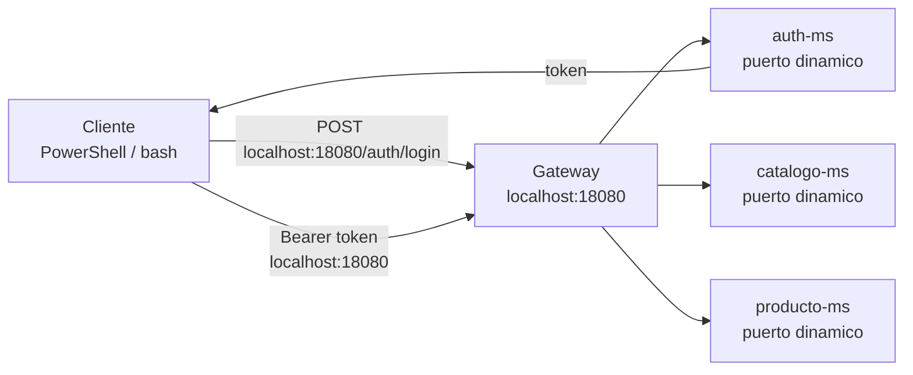
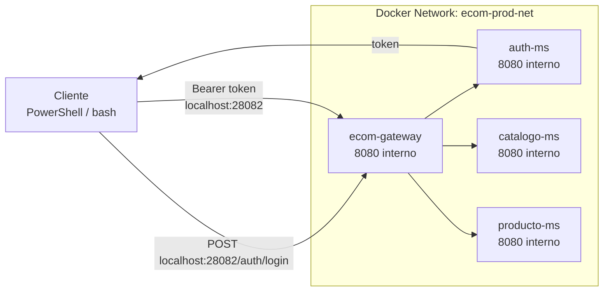

# S7 - Seguridad distribuida y control de acceso

## 1. Introduccion

Tiempo: 20 min.

### 1.1 Proposito

Proteger el sistema distribuido mediante autenticacion, autorizacion y validacion de acceso en rutas expuestas por Gateway y microservicios.

### 1.2 Resultado de aprendizaje

El estudiante implementa un flujo de acceso seguro, obtiene un token, consume rutas protegidas y evidencia respuestas 401/403 cuando corresponde.

### 1.3 Producto de sesion

Sistema con `auth-ms` operativo, token de acceso emitido y rutas protegidas en Gateway y microservicios.

### 1.4 Motivacion de la sesion

Un sistema distribuido no debe confiar en cualquier solicitud. La identidad del usuario y sus permisos deben viajar de forma verificable entre cliente, Gateway y servicios internos.

### 1.5 Ubicacion en el curso

- Unidad: U2 - Sistema distribuido robusto.
- Producto de unidad: sistema distribuido seguro, resiliente, consistente, observable e integrado con cliente frontend.
- Avance del producto en esta sesion: autenticacion, autorizacion y proteccion de rutas.

## 2. Explica

Tiempo: 15 min.

### 2.1 Conceptos clave

- Autenticacion.
- Autorizacion.
- Token de acceso.
- Claims.
- Rutas publicas y protegidas.
- Validacion en Gateway y microservicios.

### 2.2 Arquitectura del producto en `ecom`

#### 2.2.1 Seguridad en DEV



#### 2.2.2 Seguridad en PROD local



### 2.3 Observabilidad y diagnostico

Revisar health de `auth-ms`, logs de autenticacion, respuesta 401 sin token, respuesta 403 sin permisos y consumo correcto con token.

## 3. Aplica: actividad practica guiada

Tiempo: 3h.

La ruta principal de la sesion es construir desde cero el flujo de seguridad. Si el estudiante necesita avanzar mas rapido, puede usar la ruta alternativa del paso 3.17.

### 3.1 Crear `auth-ms`

**Producto del paso:** servicio de identidad disponible para login y emision de token.

En VS Code usa Spring Initializr:

```text
Spring Initializr: Create a Maven Project
Spring Boot: 3.5.x
Language: Java 17
Group Id: com.upeu
Artifact Id: ecom-auth-ms
Package name: com.upeu.auth
Packaging: Jar
Ubicacion: services/auth-ms
```

Dependencias base:

| Grupo | Dependencias | Proposito |
|---|---|---|
| Web | Spring Web, Validation | Endpoint de login y validacion |
| Seguridad | Spring Security | Autenticacion |
| Datos | Spring Data JPA, PostgreSQL, Flyway | Usuarios, roles y migraciones |
| Infra | Config Client, Eureka Discovery Client, Actuator | Configuracion, registro y health |
| Productividad | Lombok, DevTools | Codigo y desarrollo |

Agrega dependencias JWT en `services/auth-ms/pom.xml`:

```xml
<dependency>
    <groupId>io.jsonwebtoken</groupId>
    <artifactId>jjwt-api</artifactId>
    <version>0.12.7</version>
</dependency>
<dependency>
    <groupId>io.jsonwebtoken</groupId>
    <artifactId>jjwt-impl</artifactId>
    <version>0.12.7</version>
    <scope>runtime</scope>
</dependency>
<dependency>
    <groupId>io.jsonwebtoken</groupId>
    <artifactId>jjwt-jackson</artifactId>
    <version>0.12.7</version>
    <scope>runtime</scope>
</dependency>
```

### 3.2 Configurar credenciales y secreto de token

Producto del paso: `auth-ms` recibe configuracion externa para BD y JWT.

Crea `infra/config/config-repo/auth-ms-dev.yml`:

```yaml
server:
  port: 0

spring:
  datasource:
    url: jdbc:postgresql://localhost:15431/ecom_auth_db
    username: ecom
    password: ecom
    driver-class-name: org.postgresql.Driver
  flyway:
    enabled: false
  jpa:
    hibernate:
      ddl-auto: update
    show-sql: true

eureka:
  instance:
    hostname: localhost
    prefer-ip-address: false
    instance-id: ${spring.application.name}:${local.server.port:${random.value}}
  client:
    service-url:
      defaultZone: http://localhost:18761/eureka

jwt:
  secret: 1s3alJJATsWK91vf5zrODYlQa+LauM/9udaLZlQhHlpu46g/KzmSS5c3CGy6xF9kzAqBhvjmKBuZO/pSL7tfOg==
  expiration: 3600000
  issuer: auth
```

Crea `infra/config/config-repo/auth-ms-prod.yml`:

```yaml
server:
  port: 8080

spring:
  datasource:
    url: jdbc:postgresql://${DB_HOST}:${DB_PORT}/${DB_NAME}
    username: ${DB_USER}
    password: ${DB_PASS}
    driver-class-name: org.postgresql.Driver
  flyway:
    enabled: true
    locations: classpath:db/migration
  jpa:
    hibernate:
      ddl-auto: validate

eureka:
  client:
    service-url:
      defaultZone: http://eureka:8761/eureka

jwt:
  secret: ${JWT_SECRET}
  expiration: 3600000
  issuer: auth
```

### 3.3 Configurar rutas publicas y protegidas

Producto del paso: login publico y resto del servicio protegido.

Crea `JwtProperties`:

```java
package com.upeu.auth.config;

import lombok.Getter;
import lombok.Setter;
import org.springframework.boot.context.properties.ConfigurationProperties;

@Getter
@Setter
@ConfigurationProperties(prefix = "jwt")
public class JwtProperties {
    private String secret;
    private long expiration;
    private String issuer;
}
```

Crea la configuracion de seguridad:

```java
@Bean
public SecurityFilterChain securityFilterChain(HttpSecurity http) throws Exception {
    http
            .csrf(AbstractHttpConfigurer::disable)
            .sessionManagement(session -> session.sessionCreationPolicy(SessionCreationPolicy.STATELESS))
            .authorizeHttpRequests(auth -> auth
                    .requestMatchers(
                            "/auth/login",
                            "/actuator/health",
                            "/actuator/info",
                            "/v3/api-docs/**",
                            "/swagger-ui/**",
                            "/swagger-ui.html"
                    ).permitAll()
                    .anyRequest().authenticated()
            )
            .httpBasic(Customizer.withDefaults());

    return http.build();
}
```

### 3.4 Integrar validacion en Gateway

Producto del paso: Gateway valida JWT antes de enrutar a rutas protegidas.

En `infra/gateway/pom.xml`, agrega:

```xml
<dependency>
    <groupId>org.springframework.boot</groupId>
    <artifactId>spring-boot-starter-oauth2-resource-server</artifactId>
</dependency>
<dependency>
    <groupId>org.springframework.security</groupId>
    <artifactId>spring-security-oauth2-jose</artifactId>
</dependency>
```

En `gateway-dev.yml` y `gateway-prod.yml`, agrega el secreto compartido:

```yaml
jwt:
  secret: 1s3alJJATsWK91vf5zrODYlQa+LauM/9udaLZlQhHlpu46g/KzmSS5c3CGy6xF9kzAqBhvjmKBuZO/pSL7tfOg==
  issuer: auth
```

En PROD, el secreto debe llegar por variable:

```yaml
jwt:
  secret: ${JWT_SECRET}
  issuer: auth
```

### 3.5 Integrar validacion en microservicios

Producto del paso: microservicios preparados para rechazar accesos no autorizados cuando corresponda.

Agrega a los microservicios protegidos:

```xml
<dependency>
    <groupId>org.springframework.boot</groupId>
    <artifactId>spring-boot-starter-oauth2-resource-server</artifactId>
</dependency>
<dependency>
    <groupId>org.springframework.security</groupId>
    <artifactId>spring-security-oauth2-jose</artifactId>
</dependency>
```

La regla minima: health publico, API protegida.

### 3.6 Levantar infraestructura en DEV

PowerShell / bash macOS/Linux:

```bash
cd infra/config
mvn spring-boot:run
```

En otra terminal:

```bash
cd infra/eureka
mvn spring-boot:run
```

En otra terminal:

```bash
cd infra/gateway
mvn spring-boot:run
```

### 3.7 Levantar `auth-ms` y microservicios

PowerShell / bash macOS/Linux:

```bash
cd services/auth-ms
docker compose -f compose-dev.yml up -d
mvn spring-boot:run
```

En terminales separadas:

```bash
cd services/catalogo-ms
mvn spring-boot:run
```

```bash
cd services/producto-ms
mvn spring-boot:run
```

### 3.8 Obtener token

PowerShell:

PowerShell:

```powershell
$body = @{
  username = "admin"
  password = "admin123"
} | ConvertTo-Json

$response = Invoke-RestMethod -Method Post -Uri "http://localhost:18080/auth/login" -ContentType "application/json" -Body $body
$token = $response.accessToken
```

bash macOS/Linux:

```bash
TOKEN=$(curl -s -X POST http://localhost:18080/auth/login \
  -H "Content-Type: application/json" \
  -d '{"username":"admin","password":"admin123"}' | jq -r '.accessToken')
```

### 3.9 Probar ruta protegida

PowerShell:

```powershell
Invoke-RestMethod -Method Get -Uri "http://localhost:18080/api/v1/productos" -Headers @{ Authorization = "Bearer $token" }
```

bash macOS/Linux:

```bash
curl -H "Authorization: Bearer $TOKEN" http://localhost:18080/api/v1/productos
```

### 3.10 Probar error esperado sin token

```bash
curl -i http://localhost:18080/api/v1/productos
```

Resultado esperado: respuesta `401`.

### 3.11 Probar token invalido o expirado

Enviar un token incorrecto y verificar respuesta controlada.

### 3.12 Revisar claims o datos del token

Identificar usuario, roles o permisos usados por el sistema.

### 3.13 Validar logs de seguridad

Revisa logs de Gateway, `auth-ms` y microservicios para ubicar autenticacion/autorizacion.

### 3.14 Preparar PROD local

Primero levantar infraestructura y luego servicios:

```text
infra -> config + eureka + gateway
services/auth-ms
services/catalogo-ms
services/producto-ms
```

### 3.15 Probar seguridad en PROD local

Obtener token por Gateway PROD:

```bash
curl -s -X POST http://localhost:28082/auth/login \
  -H "Content-Type: application/json" \
  -d '{"username":"admin","password":"admin123"}'
```

Consumir ruta protegida con `Bearer token` usando `localhost:28082`.

### 3.16 Validar evidencias de cierre de la practica

Verifica:

- Login exitoso.
- Token recibido.
- Ruta protegida funciona con token.
- Ruta protegida falla sin token.
- DEV y PROD local usan Gateway como punto de entrada.

### 3.17 Ruta alternativa: clonar y ejecutar a partir del tag final de la sesion

```bash
git clone --branch vs07-seguridad-distribuida https://github.com/261dist/ecom.git ecom-s07
cd ecom-s07
```

## 4. Crea: actividad autonoma

Tiempo: 4h fuera del aula.

### 4.1 Plantilla de evidencia individual

Entrega un PDF:

```text
S07_Equipo##_ApellidoNombre.pdf
```

#### 4.1.1 Datos del estudiante

- Nombre:
- Equipo:
- Sesion: S07 - Seguridad distribuida y control de acceso
- Rol o aporte realizado:
- Link de GitHub:

#### 4.1.2 Trabajo autonomo realizado

1. Obtener token.
2. Consumir ruta protegida.
3. Probar error sin token.
4. Explicar claims o permisos usados.
5. Evidenciar aporte individual.

### 4.2 Criterios minimos de aceptacion

- PDF con nombre correcto.
- Token obtenido.
- Ruta protegida consumida con token.
- Error 401/403 evidenciado.
- Aporte individual verificable.

## 5. Cierre evaluativo

Tiempo: 20 min.

### 5.1 Resultados esperados

- El sistema emite token.
- Gateway o servicios validan acceso.
- Rutas protegidas responden segun autenticacion.

### 5.2 Evidencia del producto de sesion

Entrega individual:

```text
S07_Equipo##_ApellidoNombre.pdf
```

### 5.3 Preguntas de defensa y reflexion

1. Que diferencia hay entre autenticacion y autorizacion?
2. Que contiene un token?
3. Por que una ruta responde 401?
4. Donde conviene validar acceso: Gateway, servicio o ambos?

### 5.4 Rubrica de evaluacion

| Dimension | Peso | 3 - Logro destacado | 2 - Logro | 1 - Proceso | 0 - Inicio | Puntuacion obtenida |
|---|---:|---|---|---|---|---:|
| 1. Autenticacion | 2 | Evidencia login, token y explicacion clara. | Evidencia login y token. | Evidencia parcial. | No evidencia autenticacion. | |
| 2. Autorizacion | 2 | Evidencia rutas protegidas y permisos. | Evidencia ruta protegida. | Evidencia incompleta. | No evidencia autorizacion. | |
| 3. Errores esperados | 2 | Evidencia y explica 401/403. | Evidencia error esperado. | Error poco claro. | No evidencia error. | |
| 4. Integracion con Gateway/MS | 2 | Explica validacion en arquitectura distribuida. | Evidencia integracion funcional. | Integracion parcial. | No evidencia integracion. | |
| 5. Aporte individual | 1 | Aporte claro y verificable. | Aporte identificable. | Aporte general. | No se identifica aporte. | |
| 6. Orden y reflexion | 1 | PDF ordenado y reflexion tecnica clara. | Evidencia suficiente. | Evidencia poco clara. | PDF insuficiente. | |

Puntuacion acumulada = suma de (`Peso` * `Puntuacion obtenida`) = ____.

Nota final = (`Puntuacion acumulada` / 30) * 20 = ____.

Para usar la rubrica con IA, solicita:

```text
Evalua el PDF usando la rubrica de la sesion.
Para cada dimension selecciona la puntuacion obtenida usando la escala Inicio=0, Proceso=1, Logro=2, Logro destacado=3.
Justifica brevemente cada puntuacion.
Calcula la puntuacion acumulada con la formula: suma de (Peso * Puntuacion obtenida).
Calcula la nota final sobre 20 con la formula: (Puntuacion acumulada / 30) * 20.
Indica 2 fortalezas y 2 recomendaciones.
```
