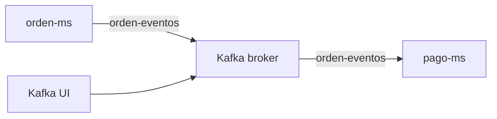

# S8 - Mensajeria asincrona entre servicios

## 1. Introduccion

Tiempo: 20 min.

### 1.1 Proposito

Incorporar comunicacion por eventos para desacoplar microservicios y permitir que operaciones de negocio avancen sin depender de una respuesta inmediata.

### 1.2 Resultado de aprendizaje

El estudiante publica y consume eventos entre microservicios, verifica topics y evidencia procesamiento asincrono.

### 1.3 Producto de sesion

Broker de eventos operativo, topics creados y comunicacion asincrona entre `orden-ms` y `pago-ms`.

### 1.4 Motivacion de la sesion

No todas las operaciones requieren una llamada inmediata. Cuando una orden se crea, otros servicios pueden reaccionar por eventos sin bloquear al usuario ni acoplar directamente los servicios.

### 1.5 Ubicacion en el curso

- Unidad: U2 - Sistema distribuido robusto.
- Producto de unidad: sistema distribuido seguro, resiliente, consistente, observable e integrado con cliente frontend.
- Avance del producto en esta sesion: comunicacion por eventos entre servicios desacoplados.

## 2. Explica

Tiempo: 15 min.

### 2.1 Conceptos clave

- Mensajeria asincrona.
- Evento.
- Productor.
- Consumidor.
- Broker.
- Topic.
- Desacoplamiento temporal.

### 2.2 Arquitectura del producto en `ecom`



### 2.3 Observabilidad y diagnostico

Revisar topics, logs de productor, logs de consumidor, Kafka UI y errores de serializacion/deserializacion.

## 3. Aplica: actividad practica guiada

Tiempo: 3h.

### 3.1 Levantar broker

PowerShell / bash macOS/Linux:

```bash
cd kafka
docker compose up -d
```

### 3.2 Crear topics

PowerShell / bash macOS/Linux:

```bash
docker exec -it kafka kafka-topics --bootstrap-server localhost:9092 --create --if-not-exists --topic orden-eventos
docker exec -it kafka kafka-topics --bootstrap-server localhost:9092 --create --if-not-exists --topic pago-eventos
docker exec -it kafka kafka-topics --bootstrap-server localhost:9092 --list
```

### 3.3 Configurar productor

Configurar `orden-ms` para publicar eventos de orden en `orden-eventos`.

### 3.4 Configurar consumidor

Configurar `pago-ms` para consumir eventos desde `orden-eventos`.

### 3.5 Probar flujo asincrono

Crear una orden y verificar que se publica un evento y que `pago-ms` lo consume.

### 3.6 Ruta alternativa: clonar y ejecutar a partir del tag final de la sesion

```bash
git clone --branch vs08-mensajeria-asincrona https://github.com/261dist/ecom.git ecom-s08
cd ecom-s08
```

## 4. Crea: actividad autonoma

Tiempo: 4h fuera del aula.

### 4.1 Plantilla de evidencia individual

Entrega un PDF:

```text
S08_Equipo##_ApellidoNombre.pdf
```

#### 4.1.1 Datos del estudiante

- Nombre:
- Equipo:
- Sesion: S08 - Mensajeria asincrona entre servicios
- Rol o aporte realizado:
- Link de GitHub:

#### 4.1.2 Trabajo autonomo realizado

1. Crear o verificar topics.
2. Publicar evento desde un microservicio.
3. Consumir evento en otro microservicio.
4. Revisar Kafka UI.
5. Explicar ventaja frente a comunicacion sincronica.

### 4.2 Criterios minimos de aceptacion

- PDF con nombre correcto.
- Topics evidenciados.
- Evento publicado.
- Evento consumido.
- Aporte individual verificable.

## 5. Cierre evaluativo

Tiempo: 20 min.

### 5.1 Resultados esperados

- Broker operativo.
- Topics creados.
- Productor publica eventos.
- Consumidor procesa eventos.

### 5.2 Evidencia del producto de sesion

Entrega individual:

```text
S08_Equipo##_ApellidoNombre.pdf
```

### 5.3 Preguntas de defensa y reflexion

1. Que diferencia hay entre mensaje y evento?
2. Por que la mensajeria reduce acoplamiento?
3. Que hace un productor?
4. Que hace un consumidor?
5. Como diagnosticas que un evento no llega?

### 5.4 Rubrica de evaluacion

| Dimension | Peso | 3 - Logro destacado | 2 - Logro | 1 - Proceso | 0 - Inicio | Puntuacion obtenida |
|---|---:|---|---|---|---|---:|
| 1. Broker y topics | 2 | Evidencia broker, topics y UI funcionando. | Evidencia broker y topics. | Evidencia parcial. | No evidencia broker. | |
| 2. Productor | 2 | Evento publicado correctamente y explicado. | Evento publicado. | Publicacion parcial. | No evidencia productor. | |
| 3. Consumidor | 2 | Evento consumido y procesado correctamente. | Evento consumido. | Consumo parcial. | No evidencia consumidor. | |
| 4. Diagnostico | 2 | Analiza errores de mensajeria con solucion. | Explica un problema. | Menciona problema sin analisis. | No diagnostica. | |
| 5. Aporte individual | 1 | Aporte claro y verificable. | Aporte identificable. | Aporte general. | No se identifica aporte. | |
| 6. Orden y reflexion | 1 | PDF ordenado y reflexion tecnica clara. | Evidencia suficiente. | Evidencia poco clara. | PDF insuficiente. | |

Puntuacion acumulada = suma de (`Peso` * `Puntuacion obtenida`) = ____.

Nota final = (`Puntuacion acumulada` / 30) * 20 = ____.

Para usar la rubrica con IA, solicita:

```text
Evalua el PDF usando la rubrica de la sesion.
Para cada dimension selecciona la puntuacion obtenida usando la escala Inicio=0, Proceso=1, Logro=2, Logro destacado=3.
Justifica brevemente cada puntuacion.
Calcula la puntuacion acumulada con la formula: suma de (Peso * Puntuacion obtenida).
Calcula la nota final sobre 20 con la formula: (Puntuacion acumulada / 30) * 20.
Indica 2 fortalezas y 2 recomendaciones.
```
