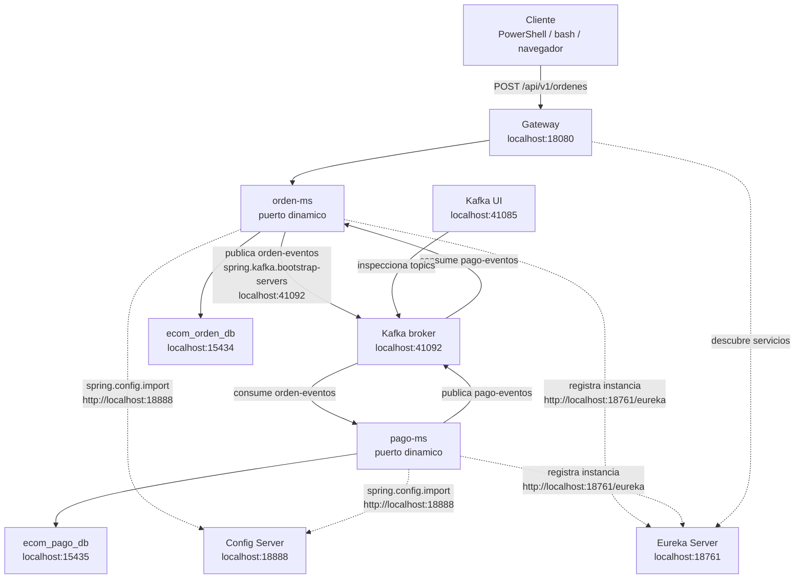
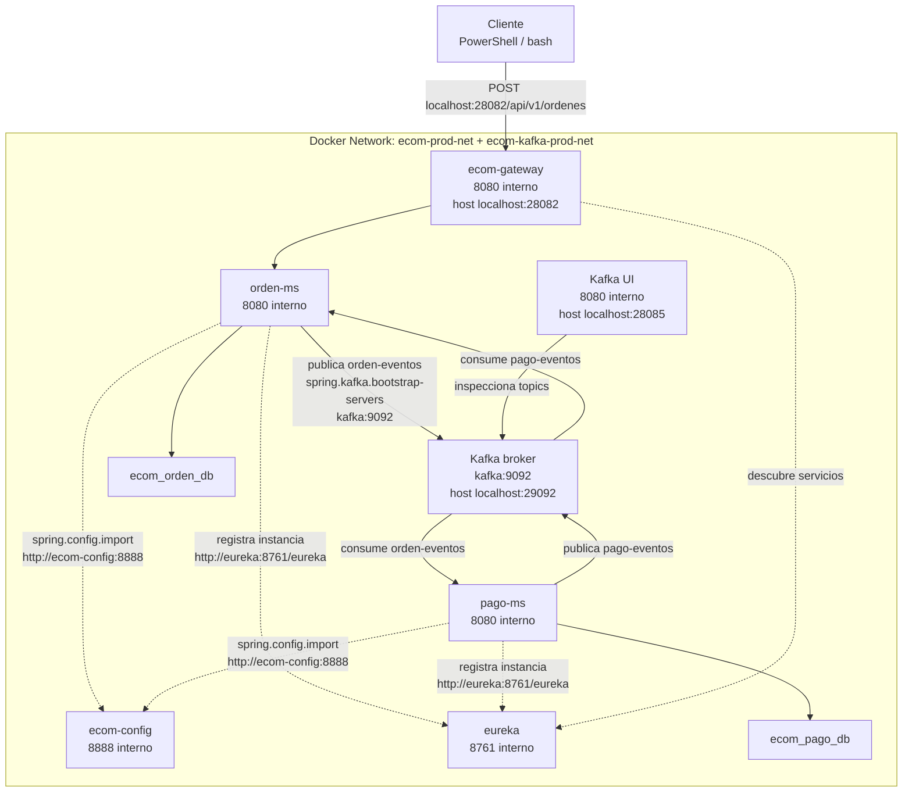

# S8 - Mensajeria asincrona entre servicios

## 1. Introduccion

Tiempo: 20 min.

### 1.1 Proposito

Incorporar comunicacion por eventos para desacoplar microservicios y permitir que operaciones de negocio avancen sin depender de una respuesta inmediata.

### 1.2 Resultado de aprendizaje

El estudiante publica y consume eventos entre microservicios, verifica topics y evidencia procesamiento asincrono.

### 1.3 Producto de sesion

Broker de eventos operativo, topics creados y comunicacion asincrona entre `orden-ms` y `pago-ms`.

### 1.4 Motivacion de la sesion

No todas las operaciones requieren una llamada inmediata. Cuando una orden se crea, otros servicios pueden reaccionar por eventos sin bloquear al usuario ni acoplar directamente los servicios.

### 1.5 Ubicacion en el curso

- Unidad: U2 - Sistema distribuido robusto.
- Producto de unidad: sistema distribuido seguro, resiliente, consistente, observable e integrado con cliente frontend.
- Avance del producto en esta sesion: comunicacion por eventos entre servicios desacoplados.

## 2. Explica

Tiempo: 15 min.

### 2.1 Conceptos clave

- Mensajeria asincrona.
- Evento.
- Productor.
- Consumidor.
- Broker.
- Topic.
- Desacoplamiento temporal.

### 2.2 Arquitectura del producto en `ecom`

En esta sesion se agrega mensajeria asincrona. `orden-ms` publica eventos de orden y `pago-ms` los consume. `pago-ms` tambien puede publicar eventos de pago para que `orden-ms` actualice el estado de negocio.

#### 2.2.1 Mensajeria en DEV



En DEV, Kafka corre en Docker pero los microservicios corren con Maven en el host:

```text
Kafka broker: localhost:41092
Kafka UI: http://localhost:41085
Microservicios: puerto dinamico
```

#### 2.2.2 Mensajeria en PROD local



### 2.3 Observabilidad y diagnostico

Revisar topics, logs de productor, logs de consumidor, Kafka UI y errores de serializacion/deserializacion.

## 3. Aplica: actividad practica guiada

Tiempo: 3h.

En el laboratorio, el docente guia la incorporacion de mensajeria asincrona entre `orden-ms` y `pago-ms`. El foco es construir el flujo desde cero: levantar Kafka, crear topics, configurar productor/consumidor y probar que el proceso ya no depende de una llamada sincronica directa.

### 3.1 Preparar el punto de partida

Producto del paso: identificar que el sistema ya tiene Config Server, Eureka, Gateway, seguridad y microservicios base.

Antes de construir eventos, confirma que existan o crea estos modulos:

- `infra/config`
- `infra/eureka`
- `infra/gateway`
- `services/orden-ms`
- `services/pago-ms`
- `kafka`

### 3.2 Levantar Kafka en DEV

Producto del paso: broker y Kafka UI disponibles para trabajo local.

PowerShell / bash macOS/Linux:

```bash
cd kafka
docker compose -f compose-dev.yml up -d
docker compose -f compose-dev.yml ps
```

### 3.3 Crear topics base

Producto del paso: topics `orden-eventos` y `pago-eventos` creados.

PowerShell / bash macOS/Linux:

```bash
docker exec -it ecom-kafka-dev /opt/kafka/bin/kafka-topics.sh --create --topic orden-eventos --bootstrap-server kafka:9092 --partitions 1 --replication-factor 1
docker exec -it ecom-kafka-dev /opt/kafka/bin/kafka-topics.sh --create --topic pago-eventos --bootstrap-server kafka:9092 --partitions 1 --replication-factor 1
docker exec -it ecom-kafka-dev /opt/kafka/bin/kafka-topics.sh --list --bootstrap-server kafka:9092
```

Tambien puedes revisar Kafka UI:

```text
http://localhost:41085
```

### 3.4 Agregar dependencias de mensajeria

Producto del paso: `orden-ms` y `pago-ms` preparados para usar Kafka.

Agregar en los `pom.xml` de los microservicios que publican o consumen eventos:

```xml
<dependency>
    <groupId>org.springframework.kafka</groupId>
    <artifactId>spring-kafka</artifactId>
</dependency>
```

### 3.5 Externalizar configuracion de Kafka

Producto del paso: bootstrap server definido por ambiente desde Config Server.

En los archivos de configuracion DEV:

```yaml
spring:
  kafka:
    bootstrap-servers: localhost:41092
```

En PROD:

```yaml
spring:
  kafka:
    bootstrap-servers: ${KAFKA_BOOTSTRAP_SERVERS:kafka:9092}
```

### 3.6 Crear DTO de evento de orden

Producto del paso: contrato simple para publicar una orden como evento.

Crea:

```text
services/orden-ms/src/main/java/com/upeu/ordenms/evento/EventoOrden.java
services/pago-ms/src/main/java/com/upeu/pagoms/evento/EventoOrden.java
```

Pega una estructura base:

```java
package com.upeu.ordenms.evento;

import lombok.AllArgsConstructor;
import lombok.Builder;
import lombok.Getter;
import lombok.NoArgsConstructor;
import lombok.Setter;

@Getter
@Setter
@Builder
@NoArgsConstructor
@AllArgsConstructor
public class EventoOrden {
    private String tipoEvento;
    private Long ordenId;
    private Long clienteId;
    private Double total;
    private Long timestamp;
}
```

### 3.7 Configurar serializacion JSON

Producto del paso: productor y consumidor comparten formato JSON.

Crea una configuracion Kafka en el microservicio productor:

```text
services/orden-ms/src/main/java/com/upeu/ordenms/configuracion/KafkaConfiguracion.java
```

Pega la base:

```java
@Configuration
public class KafkaConfiguracion {

    @Value("${spring.kafka.bootstrap-servers}")
    private String bootstrapServers;

    @Bean
    public ProducerFactory<String, EventoOrden> producerFactory() {
        Map<String, Object> propiedades = new HashMap<>();
        propiedades.put(ProducerConfig.BOOTSTRAP_SERVERS_CONFIG, bootstrapServers);
        propiedades.put(ProducerConfig.KEY_SERIALIZER_CLASS_CONFIG, StringSerializer.class);
        propiedades.put(ProducerConfig.VALUE_SERIALIZER_CLASS_CONFIG, JsonSerializer.class);
        return new DefaultKafkaProducerFactory<>(propiedades);
    }

    @Bean
    public KafkaTemplate<String, EventoOrden> kafkaTemplate() {
        return new KafkaTemplate<>(producerFactory());
    }
}
```

En el consumidor se usa `JsonDeserializer` y un `groupId` para leer `orden-eventos`.

### 3.8 Implementar productor en `orden-ms`

Producto del paso: `orden-ms` publica en `orden-eventos` cuando se crea una orden.

El productor debe enviar el evento despues de persistir la orden. Si la orden no se guarda, no debe publicarse el evento.

Crea:

```text
services/orden-ms/src/main/java/com/upeu/ordenms/servicio/ProductorOrden.java
```

Fragmento base:

```java
@Service
@RequiredArgsConstructor
public class ProductorOrden {

    private final KafkaTemplate<String, EventoOrden> kafkaTemplate;

    @Value("${app.kafka.topic.ordenes}")
    private String topicOrdenes;

    public void publicarOrdenCreada(EventoOrden eventoOrden) {
        kafkaTemplate.send(topicOrdenes, String.valueOf(eventoOrden.getOrdenId()), eventoOrden);
    }
}
```

### 3.9 Implementar consumidor en `pago-ms`

Producto del paso: `pago-ms` escucha `orden-eventos` y registra el intento de pago.

El consumidor debe:

- Recibir el evento.
- Registrar logs con correlation id si existe.
- Guardar o simular el pago.
- Dejar evidencia en BD o logs.

### 3.10 Publicar evento de pago

Producto del paso: `pago-ms` publica resultado en `pago-eventos`.

El evento de pago debe indicar:

- `ordenId`
- `pagoId`
- `estadoPago`
- `mensaje`

### 3.11 Consumir resultado de pago en `orden-ms`

Producto del paso: `orden-ms` actualiza el estado de la orden con base en el pago.

`orden-ms` debe escuchar `pago-eventos` y actualizar la orden como confirmada o rechazada.

### 3.12 Levantar infraestructura DEV

Producto del paso: Config Server, Eureka y Gateway disponibles antes de iniciar microservicios.

PowerShell / bash macOS/Linux:

```bash
cd infra/config
mvn spring-boot:run
```

En otra terminal:

```bash
cd infra/eureka
mvn spring-boot:run
```

En otra terminal:

```bash
cd infra/gateway
mvn spring-boot:run
```

### 3.13 Levantar microservicios DEV

Producto del paso: `orden-ms` y `pago-ms` ejecutando con puertos dinamicos.

PowerShell / bash macOS/Linux:

```bash
cd services/orden-ms
mvn spring-boot:run
```

En otra terminal:

```bash
cd services/pago-ms
mvn spring-boot:run
```

### 3.14 Probar flujo asincrono por Gateway

Producto del paso: orden creada, evento publicado y pago procesado por evento.

Ejecutar una solicitud de creacion de orden desde shell o Swagger, segun los endpoints reales del proyecto. Luego valida:

- Logs de `orden-ms`.
- Logs de `pago-ms`.
- Kafka UI.
- Tablas de orden y pago.

### 3.15 Probar en PROD local

Producto del paso: flujo de eventos funcionando dentro de Docker.

Levantar primero infraestructura y Kafka PROD, luego microservicios:

```bash
cd infra
docker compose up -d --build
```

```bash
cd kafka
docker compose up -d
```

```bash
cd services/orden-ms
docker compose up -d --build
```

```bash
cd services/pago-ms
docker compose up -d --build
```

### 3.16 Diagnosticar errores frecuentes

Producto del paso: estudiante reconoce fallos tipicos de mensajeria.

Prueba o identifica estos casos:

- Topic no existe.
- Broker apagado.
- Error de serializacion.
- Consumidor no recibe por `groupId`.
- Diferencia entre `localhost:41092` en DEV y `kafka:9092` en PROD.

### 3.17 Ruta alternativa: clonar y ejecutar a partir del tag final de la sesion

```bash
git clone --branch vs08-mensajeria-asincrona https://github.com/261dist/ecom.git ecom-s08
cd ecom-s08
```

## 4. Crea: actividad autonoma

Tiempo: 4h fuera del aula.

Esta actividad autonoma se desarrolla sobre el proyecto de fin de curso del equipo. El producto de la unidad se construye por acumulacion de los avances de cada sesion; por eso, la evidencia de esta sesion debe incorporarse al MkDocs del proyecto y quedar trazable en GitHub.

### 4.1 Plantilla de evidencia individual

Entrega un PDF:

```text
S08_Equipo##_ApellidoNombre.pdf
```

#### 4.1.1 Datos del estudiante

- Nombre:
- Equipo:
- Sesion: S08 - Mensajeria asincrona entre servicios
- Rol o aporte realizado:
- Link de GitHub:

#### 4.1.2 Trabajo autonomo realizado

1. Crear o verificar topics.
2. Publicar evento desde un microservicio.
3. Consumir evento en otro microservicio.
4. Revisar Kafka UI.
5. Explicar ventaja frente a comunicacion sincronica.

### 4.2 Criterios minimos de aceptacion

- PDF con nombre correcto.
- Topics evidenciados.
- Evento publicado.
- Evento consumido.
- Aporte individual verificable.

## 5. Cierre evaluativo

Tiempo: 20 min.

### 5.1 Resultados esperados

- Broker operativo.
- Topics creados.
- Productor publica eventos.
- Consumidor procesa eventos.

### 5.2 Evidencia del producto de sesion

Entrega individual:

```text
S08_Equipo##_ApellidoNombre.pdf
```

### 5.3 Preguntas de defensa y reflexion

1. Que diferencia hay entre mensaje y evento?
2. Por que la mensajeria reduce acoplamiento?
3. Que hace un productor?
4. Que hace un consumidor?
5. Como diagnosticas que un evento no llega?

### 5.4 Rubrica de evaluacion

| Dimension | Peso | 3 - Logro destacado | 2 - Logro | 1 - Proceso | 0 - Inicio | Puntuacion obtenida |
|---|---:|---|---|---|---|---:|
| 1. Broker y topics | 2 | Evidencia broker, topics y UI funcionando. | Evidencia broker y topics. | Evidencia parcial. | No evidencia broker. | |
| 2. Productor | 2 | Evento publicado correctamente y explicado. | Evento publicado. | Publicacion parcial. | No evidencia productor. | |
| 3. Consumidor | 2 | Evento consumido y procesado correctamente. | Evento consumido. | Consumo parcial. | No evidencia consumidor. | |
| 4. Diagnostico | 2 | Analiza errores de mensajeria con solucion. | Explica un problema. | Menciona problema sin analisis. | No diagnostica. | |
| 5. Aporte individual | 1 | Aporte claro y verificable. | Aporte identificable. | Aporte general. | No se identifica aporte. | |
| 6. Orden y reflexion | 1 | PDF ordenado y reflexion tecnica clara. | Evidencia suficiente. | Evidencia poco clara. | PDF insuficiente. | |

Puntuacion acumulada = suma de (`Peso` * `Puntuacion obtenida`) = ____.

Nota final = (`Puntuacion acumulada` / 30) * 20 = ____.

Para usar la rubrica con IA, solicita:

```text
Evalua el PDF usando la rubrica de la sesion.
Para cada dimension selecciona la puntuacion obtenida usando la escala Inicio=0, Proceso=1, Logro=2, Logro destacado=3.
Justifica brevemente cada puntuacion.
Calcula la puntuacion acumulada con la formula: suma de (Peso * Puntuacion obtenida).
Calcula la nota final sobre 20 con la formula: (Puntuacion acumulada / 30) * 20.
Indica 2 fortalezas y 2 recomendaciones.
```
