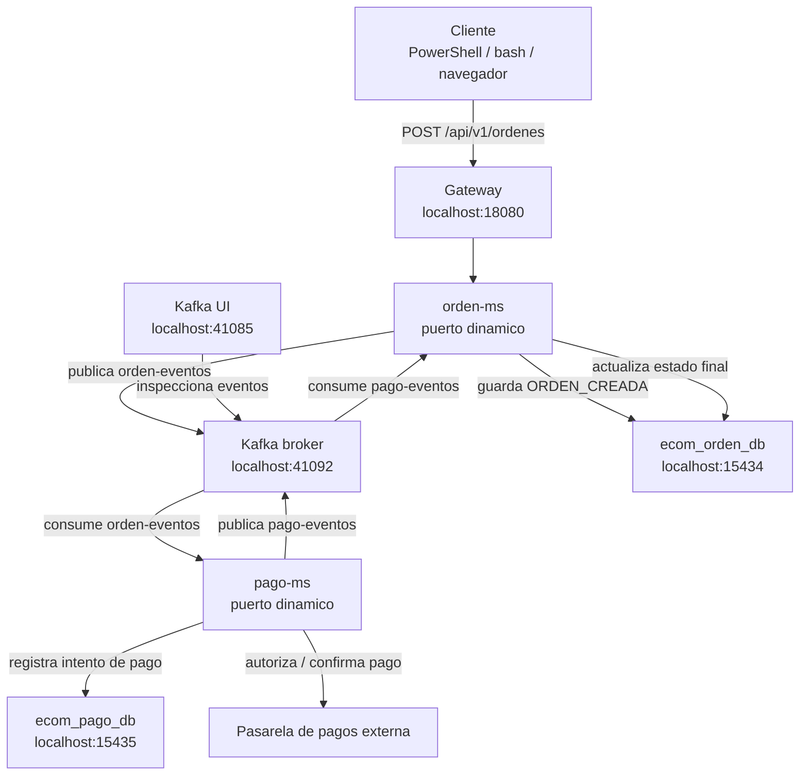
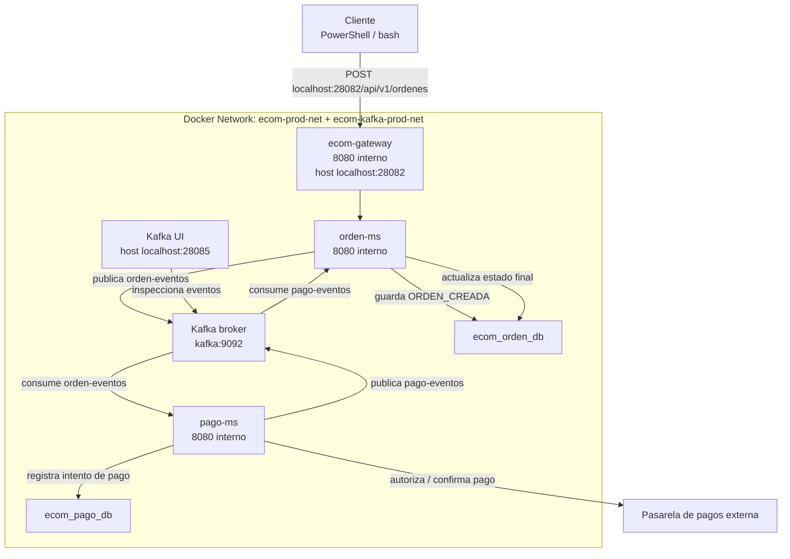

# S9 - Consistencia distribuida en procesos de negocio

## 1. Introduccion

Tiempo: 20 min.

### 1.1 Proposito

Modelar un proceso de negocio distribuido donde varios microservicios colaboran sin una transaccion unica compartida.

### 1.2 Resultado de aprendizaje

El estudiante implementa un flujo con consistencia eventual, eventos de confirmacion o rechazo, compensacion e idempotencia basica.

### 1.3 Producto de sesion

Proceso `orden-ms` y `pago-ms` integrado por eventos, con estados de orden y respuesta ante pago confirmado o rechazado.

### 1.4 Motivacion de la sesion

En un monolito se puede usar una transaccion local. En microservicios, cada servicio tiene su base de datos. Por eso, una compra no se valida con una unica transaccion global, sino mediante pasos coordinados y compensaciones.

### 1.5 Ubicacion en el curso

- Unidad: U2 - Sistema distribuido robusto.
- Producto de unidad: sistema distribuido seguro, resiliente, consistente, observable e integrado con cliente frontend.
- Avance del producto en esta sesion: proceso distribuido con consistencia eventual.

## 2. Explica

Tiempo: 15 min.

### 2.1 Conceptos clave

- Consistencia eventual.
- Saga.
- Compensacion.
- Idempotencia.
- Estado de negocio.
- Evento de confirmacion/rechazo.

### 2.2 Arquitectura del producto en `ecom`

En esta sesion se usa mensajeria para sostener un proceso distribuido: `orden-ms` crea la orden, `pago-ms` procesa el pago y la orden cambia de estado cuando llega el resultado. La idea central no es la tecnologia del broker, sino la consistencia eventual del negocio.

#### 2.2.1 Consistencia distribuida en DEV



#### 2.2.2 Consistencia distribuida en PROD local



### 2.3 Observabilidad y diagnostico

Revisar estados en BD, eventos publicados, eventos consumidos, duplicados, errores de pago y compensaciones ejecutadas.

## 3. Aplica: actividad practica guiada

Tiempo: 3h.

En el laboratorio, el docente guia la construccion de un flujo de negocio distribuido. El estudiante debe ver que ya no existe una transaccion unica: cada microservicio cuida su base de datos y el proceso avanza por eventos.

### 3.1 Preparar el punto de partida

Producto del paso: identificar o crear los servicios que participan en el flujo distribuido.

Componentes:

- `orden-ms`: inicia el proceso y conserva el estado de la orden.
- `pago-ms`: procesa o simula el pago.
- `kafka`: transporta eventos.
- Base de datos de ordenes y pagos.
- Pasarela externa simulada o integrada.

### 3.2 Definir estados de negocio

Producto del paso: estados minimos acordados para la orden.

Estados sugeridos:

```text
ORDEN_CREADA
PAGO_PENDIENTE
PAGO_CONFIRMADO
PAGO_RECHAZADO
ORDEN_CANCELADA
```

### 3.3 Definir contratos de eventos

Producto del paso: contratos claros para eventos de orden y pago.

Evento de orden:

```text
ordenId
clienteId
monto
estado
fecha
```

Evento de pago:

```text
ordenId
pagoId
estadoPago
mensaje
fecha
```

### 3.4 Preparar topics

Producto del paso: topics disponibles para el flujo.

PowerShell / bash macOS/Linux:

```bash
cd kafka
docker compose -f compose-dev.yml up -d
docker exec -it ecom-kafka-dev /opt/kafka/bin/kafka-topics.sh --create --topic orden-eventos --bootstrap-server kafka:9092 --partitions 1 --replication-factor 1
docker exec -it ecom-kafka-dev /opt/kafka/bin/kafka-topics.sh --create --topic pago-eventos --bootstrap-server kafka:9092 --partitions 1 --replication-factor 1
docker exec -it ecom-kafka-dev /opt/kafka/bin/kafka-topics.sh --list --bootstrap-server kafka:9092
```

### 3.5 Implementar persistencia inicial en `orden-ms`

Producto del paso: una orden se registra antes de publicar evento.

La orden debe guardarse con estado inicial, por ejemplo `ORDEN_CREADA` o `PAGO_PENDIENTE`.

### 3.6 Publicar evento de orden

`orden-ms` publica un evento cuando se crea una orden.

Producto del paso: cada orden creada genera un evento en `orden-eventos`.

### 3.7 Procesar pago

`pago-ms` consume el evento de orden, registra intento de pago y responde con evento de pago.

Producto del paso: `pago-ms` produce una respuesta de pago sin acoplarse al controlador de ordenes.

### 3.8 Conectar pasarela de pagos externa o simulada

Producto del paso: pago confirmado o rechazado con una decision de negocio controlada.

La pasarela puede ser real, simulada o reemplazada por un adaptador temporal para laboratorio.

### 3.9 Actualizar estado de orden

`orden-ms` consume el evento de pago y actualiza el estado final.

Producto del paso: la orden refleja el resultado final del proceso.

### 3.10 Probar idempotencia basica

Reenviar o simular un evento repetido y verificar que no se duplique el efecto de negocio.

Producto del paso: el servicio no genera efectos duplicados ante eventos repetidos.

### 3.11 Levantar infraestructura DEV

Producto del paso: Config Server, Eureka, Gateway y Kafka disponibles.

PowerShell / bash macOS/Linux:

```bash
cd infra/config
mvn spring-boot:run
```

En otra terminal:

```bash
cd infra/eureka
mvn spring-boot:run
```

En otra terminal:

```bash
cd infra/gateway
mvn spring-boot:run
```

### 3.12 Levantar microservicios DEV

Producto del paso: `orden-ms` y `pago-ms` ejecutando con configuracion externa.

PowerShell / bash macOS/Linux:

```bash
cd services/orden-ms
mvn spring-boot:run
```

En otra terminal:

```bash
cd services/pago-ms
mvn spring-boot:run
```

### 3.13 Probar flujo completo por Gateway

Producto del paso: una orden cambia de estado mediante eventos.

Crear una orden y verificar:

- Respuesta HTTP del Gateway.
- Registro en `ecom_orden_db`.
- Evento en `orden-eventos`.
- Registro en `ecom_pago_db`.
- Evento en `pago-eventos`.
- Estado final actualizado en orden.

### 3.14 Inspeccionar base de datos

Producto del paso: evidencia de estados y registros de negocio.

Usar `docker exec` con `psql` segun el contenedor de cada microservicio para revisar tablas y registros.

### 3.15 Probar en PROD local

Producto del paso: consistencia eventual funcionando dentro de Docker.

Levantar primero infraestructura y Kafka, luego microservicios:

```bash
cd infra
docker compose up -d --build
```

```bash
cd kafka
docker compose up -d
```

```bash
cd services/orden-ms
docker compose up -d --build
```

```bash
cd services/pago-ms
docker compose up -d --build
```

### 3.16 Diagnosticar errores frecuentes

Producto del paso: estudiante interpreta problemas de consistencia distribuida.

Prueba o identifica estos casos:

- Orden creada pero evento no publicado.
- Pago registrado pero orden no actualizada.
- Evento duplicado.
- Evento consumido por grupo incorrecto.
- Pasarela externa no disponible.

### 3.17 Ruta alternativa: clonar y ejecutar a partir del tag final de la sesion

```bash
git clone --branch vs09-consistencia-distribuida https://github.com/261dist/ecom.git ecom-s09
cd ecom-s09
```

## 4. Crea: actividad autonoma

Tiempo: 4h fuera del aula.

Esta actividad autonoma se desarrolla sobre el proyecto de fin de curso del equipo. El producto de la unidad se construye por acumulacion de los avances de cada sesion; por eso, la evidencia de esta sesion debe incorporarse al MkDocs del proyecto y quedar trazable en GitHub.

### 4.1 Plantilla de evidencia individual

Entrega un PDF:

```text
S09_Equipo##_ApellidoNombre.pdf
```

#### 4.1.1 Datos del estudiante

- Nombre:
- Equipo:
- Sesion: S09 - Consistencia distribuida en procesos de negocio
- Rol o aporte realizado:
- Link de GitHub:

#### 4.1.2 Trabajo autonomo realizado

1. Evidenciar flujo orden-pago.
2. Mostrar estados en BD.
3. Probar evento de confirmacion o rechazo.
4. Explicar compensacion.
5. Explicar idempotencia.

### 4.2 Criterios minimos de aceptacion

- PDF con nombre correcto.
- Flujo distribuido evidenciado.
- Estados de negocio visibles.
- Evento de pago procesado.
- Aporte individual verificable.

## 5. Cierre evaluativo

Tiempo: 20 min.

### 5.1 Resultados esperados

- El proceso distribuido avanza por eventos.
- La orden cambia de estado segun el resultado del pago.
- El estudiante explica consistencia eventual y compensacion.

### 5.2 Evidencia del producto de sesion

Entrega individual:

```text
S09_Equipo##_ApellidoNombre.pdf
```

### 5.3 Preguntas de defensa y reflexion

1. Por que no se usa una transaccion global?
2. Que significa consistencia eventual?
3. Que es una compensacion?
4. Que problema resuelve la idempotencia?
5. Que evidencia demuestra que el proceso fue distribuido?

### 5.4 Rubrica de evaluacion

| Dimension | Peso | 3 - Logro destacado | 2 - Logro | 1 - Proceso | 0 - Inicio | Puntuacion obtenida |
|---|---:|---|---|---|---|---:|
| 1. Flujo distribuido | 2 | Evidencia proceso completo orden-pago. | Evidencia flujo principal. | Flujo parcial. | No evidencia flujo. | |
| 2. Consistencia eventual | 2 | Explica estados y transiciones con claridad. | Evidencia estados principales. | Estados confusos o incompletos. | No evidencia consistencia. | |
| 3. Compensacion/idempotencia | 2 | Evidencia compensacion o idempotencia aplicada. | Explica el mecanismo. | Mencion parcial. | No evidencia ni explica. | |
| 4. Diagnostico | 2 | Analiza fallos de evento/pago con solucion. | Explica un problema. | Menciona problema sin analisis. | No diagnostica. | |
| 5. Aporte individual | 1 | Aporte claro y verificable. | Aporte identificable. | Aporte general. | No se identifica aporte. | |
| 6. Orden y reflexion | 1 | PDF ordenado y reflexion tecnica clara. | Evidencia suficiente. | Evidencia poco clara. | PDF insuficiente. | |

Puntuacion acumulada = suma de (`Peso` * `Puntuacion obtenida`) = ____.

Nota final = (`Puntuacion acumulada` / 30) * 20 = ____.

Para usar la rubrica con IA, solicita:

```text
Evalua el PDF usando la rubrica de la sesion.
Para cada dimension selecciona la puntuacion obtenida usando la escala Inicio=0, Proceso=1, Logro=2, Logro destacado=3.
Justifica brevemente cada puntuacion.
Calcula la puntuacion acumulada con la formula: suma de (Peso * Puntuacion obtenida).
Calcula la nota final sobre 20 con la formula: (Puntuacion acumulada / 30) * 20.
Indica 2 fortalezas y 2 recomendaciones.
```
