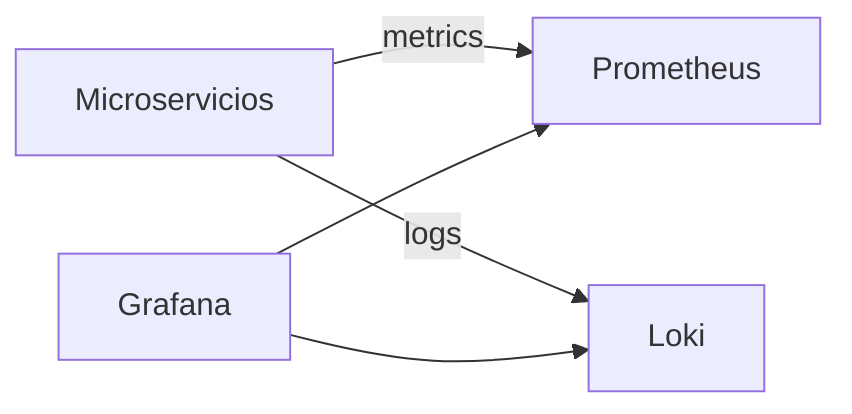

# S10 - Observabilidad y diagnostico de sistemas distribuidos

## 1. Introduccion

Tiempo: 20 min.

### 1.1 Proposito

Consolidar practicas de observabilidad para diagnosticar el comportamiento del sistema distribuido mediante logs, health, metricas y paneles.

### 1.2 Resultado de aprendizaje

El estudiante configura y consulta herramientas de observabilidad, interpreta senales del sistema y diagnostica fallos comunes.

### 1.3 Producto de sesion

Stack de observabilidad operativo con Prometheus, Loki y Grafana, conectado a servicios del sistema.

### 1.4 Motivacion de la sesion

En microservicios no basta con saber que “algo fallo”. Se necesita ubicar en que servicio, en que instancia, con que solicitud y bajo que condicion ocurrio el problema.

### 1.5 Ubicacion en el curso

- Unidad: U2 - Sistema distribuido robusto.
- Producto de unidad: sistema distribuido seguro, resiliente, consistente, observable e integrado con cliente frontend.
- Avance del producto en esta sesion: diagnostico operacional del sistema distribuido.

## 2. Explica

Tiempo: 15 min.

### 2.1 Conceptos clave

- Logs.
- Health checks.
- Metricas.
- Trazabilidad.
- Dashboard.
- Correlation id.

### 2.2 Arquitectura del producto en `ecom`



### 2.3 Observabilidad y diagnostico

Senales a revisar:

- `/actuator/health`.
- `/actuator/metrics`.
- Logs por servicio.
- Logs por correlation id.
- Paneles de Grafana.
- Errores 4xx/5xx.

## 3. Aplica: actividad practica guiada

Tiempo: 3h.

### 3.1 Levantar observabilidad

PowerShell / bash macOS/Linux:

```bash
cd obs
docker compose up -d
```

### 3.2 Verificar herramientas

URLs:

```text
Grafana DEV: http://localhost:13000
Prometheus DEV: http://localhost:19090
Loki DEV: http://localhost:13100
```

### 3.3 Verificar endpoints Actuator

PowerShell / bash macOS/Linux:

```bash
curl http://localhost:<puerto>/actuator/health
curl http://localhost:<puerto>/actuator/metrics
```

### 3.4 Generar trafico

Ejecutar pruebas por Gateway para generar logs y metricas.

### 3.5 Diagnosticar un fallo

Provocar un error controlado y ubicarlo mediante logs, health o metricas.

### 3.6 Ruta alternativa: clonar y ejecutar a partir del tag final de la sesion

```bash
git clone --branch vs10-observabilidad https://github.com/261dist/ecom.git ecom-s10
cd ecom-s10
```

## 4. Crea: actividad autonoma

Tiempo: 4h fuera del aula.

### 4.1 Plantilla de evidencia individual

Entrega un PDF:

```text
S10_Equipo##_ApellidoNombre.pdf
```

#### 4.1.1 Datos del estudiante

- Nombre:
- Equipo:
- Sesion: S10 - Observabilidad y diagnostico de sistemas distribuidos
- Rol o aporte realizado:
- Link de GitHub:

#### 4.1.2 Trabajo autonomo realizado

1. Consultar health y metrics.
2. Revisar logs de un servicio.
3. Revisar panel o consulta en Grafana/Prometheus/Loki.
4. Diagnosticar un error.
5. Explicar correlation id o trazabilidad.

### 4.2 Criterios minimos de aceptacion

- PDF con nombre correcto.
- Evidencia de health/metrics.
- Evidencia de logs o paneles.
- Diagnostico tecnico.
- Aporte individual verificable.

## 5. Cierre evaluativo

Tiempo: 20 min.

### 5.1 Resultados esperados

- Stack de observabilidad operativo.
- Servicios exponen health/metrics.
- Logs permiten diagnosticar errores.
- El estudiante interpreta una senal operacional.

### 5.2 Evidencia del producto de sesion

Entrega individual:

```text
S10_Equipo##_ApellidoNombre.pdf
```

### 5.3 Preguntas de defensa y reflexion

1. Que diferencia hay entre logs y metricas?
2. Para que sirve un health check?
3. Como ayuda un correlation id?
4. Que revisas ante un error 500?

### 5.4 Rubrica de evaluacion

| Dimension | Peso | 3 - Logro destacado | 2 - Logro | 1 - Proceso | 0 - Inicio | Puntuacion obtenida |
|---|---:|---|---|---|---|---:|
| 1. Herramientas operativas | 2 | Evidencia Grafana, Prometheus y Loki operativos. | Evidencia herramientas principales. | Evidencia parcial. | No evidencia stack. | |
| 2. Health y metricas | 2 | Consulta e interpreta health/metrics. | Consulta health/metrics. | Consulta parcial. | No evidencia. | |
| 3. Logs y trazabilidad | 2 | Usa logs/correlation id para diagnosticar. | Evidencia logs suficientes. | Logs poco claros. | No evidencia logs. | |
| 4. Diagnostico | 2 | Analiza fallo con causa y solucion. | Explica problema. | Menciona problema sin analisis. | No diagnostica. | |
| 5. Aporte individual | 1 | Aporte claro y verificable. | Aporte identificable. | Aporte general. | No se identifica aporte. | |
| 6. Orden y reflexion | 1 | PDF ordenado y reflexion tecnica clara. | Evidencia suficiente. | Evidencia poco clara. | PDF insuficiente. | |

Puntuacion acumulada = suma de (`Peso` * `Puntuacion obtenida`) = ____.

Nota final = (`Puntuacion acumulada` / 30) * 20 = ____.

Para usar la rubrica con IA, solicita:

```text
Evalua el PDF usando la rubrica de la sesion.
Para cada dimension selecciona la puntuacion obtenida usando la escala Inicio=0, Proceso=1, Logro=2, Logro destacado=3.
Justifica brevemente cada puntuacion.
Calcula la puntuacion acumulada con la formula: suma de (Peso * Puntuacion obtenida).
Calcula la nota final sobre 20 con la formula: (Puntuacion acumulada / 30) * 20.
Indica 2 fortalezas y 2 recomendaciones.
```
