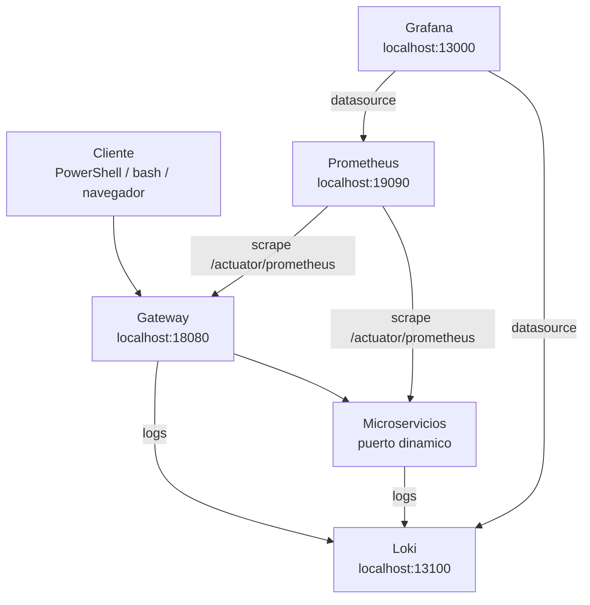
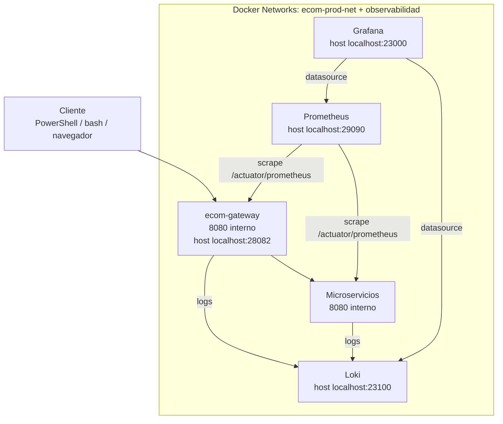

# S10 - Observabilidad y diagnóstico de sistemas distribuidos

## 1. Introducción

Tiempo: 20 min.

### 1.1 Propósito

Consolidar prácticas de observabilidad para diagnosticar el comportamiento del sistema distribuido mediante logs, health, métricas y paneles.

### 1.2 Resultado de aprendizaje

El estudiante configura y consulta herramientas de observabilidad, interpreta señales del sistema y diagnostica fallos comunes.

### 1.3 Producto de sesión

Stack de observabilidad operativo con Prometheus, Loki y Grafana, conectado a servicios del sistema.

### 1.4 Motivacion de la sesión

En microservicios no basta con saber que "algo fallo". Se necesita ubicar en que servicio, en que instancia, con que solicitud y bajo que condición ocurrió el problema.

### 1.5 Ubicación en el curso

- Unidad: U2 - Sistema distribuido robusto.
- Producto de unidad: sistema distribuido seguro, resiliente, consistente, observable e integrado con cliente frontend.
- Avance del producto en esta sesión: diagnóstico operacional del sistema distribuido.

## 2. Explica

Tiempo: 15 min.

### 2.1 Conceptos clave

- Logs.
- Health checks.
- Métricas.
- Trazabilidad.
- Dashboard.
- Correlation id.

### 2.2 Arquitectura del producto en `ecom`

En esta sesión se consolida la observabilidad. Los servicios ya exponen Actuator; ahora se agrega recoleccion, consulta y visualización con Prometheus, Loki y Grafana.

#### 2.2.1 Observabilidad en DEV



#### 2.2.2 Observabilidad en PROD local



### 2.3 Observabilidad y diagnóstico

Señales a revisar:

- `/actuator/health`.
- `/actuator/metrics`.
- Logs por servicio.
- Logs por correlation id.
- Paneles de Grafana.
- Errores 4xx/5xx.

## 3. Aplica: actividad práctica guiada

Tiempo: 3h.

En el laboratorio, el docente guía la puesta en marcha del stack de observabilidad y los estudiantes diagnostican el sistema usando señales reales: health, métricas, logs y dashboards.

### 3.1 Configurar exposición de Actuator

Producto del paso: servicios preparados para exponer health, metrics y prometheus.

En los microservicios y Gateway, agrega la dependencia Actuator:

```xml
<dependency>
    <groupId>org.springframework.boot</groupId>
    <artifactId>spring-boot-starter-actuator</artifactId>
</dependency>
```

Para exponer `/actuator/prometheus`, agrega:

```xml
<dependency>
    <groupId>io.micrometer</groupId>
    <artifactId>micrometer-registry-prometheus</artifactId>
</dependency>
```

En la configuración externa del servicio, agrega:

```yaml
management:
  endpoints:
    web:
      exposure:
        include: health,info,metrics,prometheus
```

Nota: `/actuator/metrics` funciona con Actuator. Para `/actuator/prometheus` se requiere `micrometer-registry-prometheus` en el servicio.

### 3.2 Levantar observabilidad DEV

Producto del paso: Prometheus, Loki y Grafana disponibles en host.

PowerShell / bash macOS/Linux:

```bash
cd obs
docker compose -f compose-dev.yml up -d
docker compose -f compose-dev.yml ps
```

### 3.3 Verificar herramientas

URLs:

```text
Grafana DEV: http://localhost:13000
Prometheus DEV: http://localhost:19090
Loki DEV: http://localhost:13100
```

### 3.4 Levantar backend DEV

Producto del paso: Gateway y microservicios generando señales.

Levantar Config Server, Eureka, Gateway y al menos dos microservicios:

```bash
cd infra/config
mvn spring-boot:run
```

En terminales separadas:

```bash
cd infra/eureka
mvn spring-boot:run
```

```bash
cd infra/gateway
mvn spring-boot:run
```

```bash
cd services/catalogo-ms
mvn spring-boot:run
```

```bash
cd services/producto-ms
mvn spring-boot:run
```

### 3.5 Verificar endpoints Actuator

Producto del paso: health y métricas consultables desde consola.

PowerShell:

```powershell
Invoke-RestMethod -Method Get -Uri "http://localhost:<puerto>/actuator/health"
Invoke-RestMethod -Method Get -Uri "http://localhost:<puerto>/actuator/metrics"
Invoke-RestMethod -Method Get -Uri "http://localhost:<puerto>/actuator/prometheus"
```

bash macOS/Linux:

```bash
curl http://localhost:<puerto>/actuator/health
curl http://localhost:<puerto>/actuator/metrics
curl http://localhost:<puerto>/actuator/prometheus
```

### 3.6 Generar tráfico por Gateway

Producto del paso: logs y métricas con actividad real.

Ejecutar pruebas por Gateway para generar logs y métricas.

Ejemplos:

PowerShell:

```powershell
Invoke-RestMethod -Method Get -Uri "http://localhost:18080/actuator/health"
Invoke-RestMethod -Method Get -Uri "http://localhost:18080/api/v1/categorias"
```

bash macOS/Linux:

```bash
curl http://localhost:18080/actuator/health
curl http://localhost:18080/api/v1/categorias
```

### 3.7 Consultar Prometheus

Producto del paso: Prometheus consulta métricas expuestas por servicios.

Entrar a:

```text
http://localhost:19090
```

Probar consultas como:

```text
up
http_server_requests_seconds_count
jvm_memory_used_bytes
```

### 3.8 Consultar Loki

Producto del paso: logs consultables desde el stack de observabilidad.

Consulta logs por servicio y, si existe, por correlation id.

### 3.9 Crear dashboard básico en Grafana

Producto del paso: visualización básica de estado del sistema.

Entrar a:

```text
http://localhost:13000
```

Verificar datasources:

- Prometheus.
- Loki.

### 3.10 Diagnosticar un fallo

Provocar un error controlado y ubicarlo mediante logs, health o métricas.

Producto del paso: hallazgo documentado con causa probable y solución.

### 3.11 Validar correlation id

Producto del paso: una solicitud puede seguirse en logs del sistema.

Enviar una petición con header:

PowerShell:

```powershell
Invoke-RestMethod `
  -Method Get `
  -Uri "http://localhost:18080/api/v1/categorias" `
  -Headers @{ "X-Correlation-Id" = "prueba-s10-001" }
```

bash macOS/Linux:

```bash
curl -H "X-Correlation-Id: prueba-s10-001" http://localhost:18080/api/v1/categorias
```

Luego buscar ese valor en logs.

### 3.12 Validar observabilidad en Gateway

Producto del paso: Gateway también expone señales operacionales.

Verificar:

PowerShell:

```powershell
Invoke-RestMethod -Method Get -Uri "http://localhost:18080/actuator/health"
Invoke-RestMethod -Method Get -Uri "http://localhost:18080/actuator/metrics"
Invoke-RestMethod -Method Get -Uri "http://localhost:18080/actuator/prometheus"
```

bash macOS/Linux:

```bash
curl http://localhost:18080/actuator/health
curl http://localhost:18080/actuator/metrics
curl http://localhost:18080/actuator/prometheus
```

### 3.13 Probar en PROD local

Producto del paso: observabilidad conectada al sistema Dockerizado.

Levantar infraestructura y observabilidad:

```bash
cd infra
docker compose up -d --build
```

```bash
cd obs
docker compose up -d
```

Luego levantar microservicios necesarios con Docker.

### 3.14 Consultar URLs PROD

Producto del paso: herramientas abiertas en puertos de producción local.

```text
Gateway PROD health: http://localhost:28082/actuator/health
Prometheus PROD: http://localhost:29090
Loki PROD: http://localhost:23100
Grafana PROD: http://localhost:23000
```

### 3.15 Registrar evidencias de diagnóstico

Producto del paso: captura o registro claro del análisis.

Evidenciar:

- Health de un servicio.
- Métrica consultada.
- Log de una solicitud.
- Dashboard o panel.
- Error controlado con solución.

### 3.16 Detener stack cuando termine la práctica

Producto del paso: recursos locales liberados.

PowerShell / bash macOS/Linux:

```bash
cd obs
docker compose -f compose-dev.yml down
```

Para PROD:

```bash
cd obs
docker compose down
```

### 3.17 Ruta alternativa: clonar y ejecutar a partir del tag final de la sesión

```bash
git clone --branch vs10-observabilidad https://github.com/261dist/ecom.git ecom-s10
cd ecom-s10
```

## 4. Crea: actividad autónoma

Tiempo: 4h fuera del aula.

Esta actividad autónoma se desarrolla sobre el proyecto de fin de curso del equipo. El producto de la unidad se construye por acumulacion de los avances de cada sesión; por eso, la evidencia de esta sesión debe incorporarse a la documentación del proyecto y quedar trazable en GitHub.

### 4.1 Plantilla de evidencia individual

Entrega un PDF:

El PDF de esta sesión debe generarse como impresion o exportacion de la sección correspondiente en MkDocs o una herramienta equivalente. No se acepta un PDF armado manualmente fuera de la documentación del proyecto.

```text
S10_Equipo##_ApellidoNombre.pdf
```

#### 4.1.1 Datos del estudiante

- Nombre:
- Equipo:
- Sesión: S10 - Observabilidad y diagnóstico de sistemas distribuidos
- Rol o aporte realizado:
- Link de GitHub:

#### 4.1.2 Trabajo autónomo realizado

1. Consultar health y metrics.
2. Revisar logs de un servicio.
3. Revisar panel o consulta en Grafana/Prometheus/Loki.
4. Diagnosticar un error.
5. Explicar correlation id o trazabilidad.

### 4.2 Criterios mínimos de aceptación

- PDF con nombre correcto.
- Evidencia de health/metrics.
- Evidencia de logs o paneles.
- Diagnóstico técnico.
- Aporte individual verificable.

## 5. Cierre evaluativo

Tiempo: 20 min.

### 5.1 Resultados esperados

- Stack de observabilidad operativo.
- Servicios exponen health/metrics.
- Logs permiten diagnosticar errores.
- El estudiante interpreta una señal operacional.

### 5.2 Evidencia del producto de sesión

Entrega individual:

```text
S10_Equipo##_ApellidoNombre.pdf
```

### 5.3 Preguntas de defensa y reflexión

1. Qué diferencia hay entre logs y métricas?
2. Para qué sirve un health check?
3. Cómo ayuda un correlation id?
4. Qué revisas ante un error 500?

### 5.4 Rúbrica de evaluación

| Dimensión | Peso | 3 - Logro destacado | 2 - Logro | 1 - Proceso | 0 - Inicio | Puntuación obtenida |
|---|---:|---|---|---|---|---:|
| 1. Herramientas operativas | 2 | Evidencia Grafana, Prometheus y Loki operativos. | Evidencia herramientas principales. | Evidencia parcial. | No evidencia stack. | |
| 2. Health y métricas | 2 | Consulta e interpreta health/metrics. | Consulta health/metrics. | Consulta parcial. | No evidencia. | |
| 3. Logs y trazabilidad | 2 | Usa logs/correlation id para diagnosticar. | Evidencia logs suficientes. | Logs poco claros. | No evidencia logs. | |
| 4. Diagnóstico | 2 | Analiza fallo con causa y solución. | Explica problema. | Menciona problema sin análisis. | No diagnostica. | |
| 5. Aporte individual | 1 | Aporte claro y verificable. | Aporte identificable. | Aporte general. | No se identifica aporte. | |
| 6. Orden y reflexión | 1 | PDF ordenado y reflexión técnica clara. | Evidencia suficiente. | Evidencia poco clara. | PDF insuficiente. | |

Puntuación acumulada = suma de (`Peso` * `Puntuacion obtenida`) = ____.

Nota final = (`Puntuacion acumulada` / 30) * 20 = ____.

Para usar la rúbrica con IA, solicita:

```text
Evalúa el PDF usando la rúbrica de la sesión.
Para cada dimensión selecciona la puntuación obtenida usando la escala Inicio=0, Proceso=1, Logro=2, Logro destacado=3.
Justifica brevemente cada puntuación.
Calcula la puntuación acumulada con la fórmula: suma de (Peso * Puntuación obtenida).
Calcula la nota final sobre 20 con la fórmula: (Puntuación acumulada / 30) * 20.
Indica 2 fortalezas y 2 recomendaciones.
```
