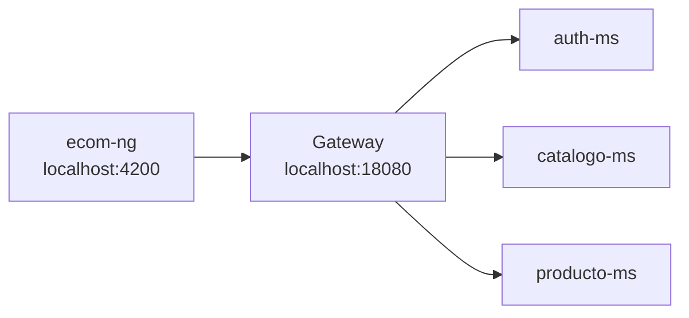

# S11 - Integracion con cliente frontend

## 1. Introduccion

Tiempo: 20 min.

### 1.1 Proposito

Integrar el cliente frontend con el sistema distribuido mediante Gateway, manteniendo seguridad, CORS y consumo centralizado de APIs.

### 1.2 Resultado de aprendizaje

El estudiante conecta el frontend al Gateway, ejecuta flujos autenticados y evidencia consumo de microservicios desde la interfaz.

### 1.3 Producto de sesion

`ecom-ng` integrado con Gateway para consumir categorias, productos y flujos protegidos.

### 1.4 Motivacion de la sesion

El usuario no interactua con microservicios aislados. La experiencia real ocurre desde el frontend, que debe consumir el sistema por un punto unico de entrada.

### 1.5 Ubicacion en el curso

- Unidad: U2 - Sistema distribuido robusto.
- Producto de unidad: sistema distribuido seguro, resiliente, consistente, observable e integrado con cliente frontend.
- Avance del producto en esta sesion: cliente web integrado mediante Gateway.

## 2. Explica

Tiempo: 15 min.

### 2.1 Conceptos clave

- Cliente frontend.
- Gateway como backend de entrada.
- CORS.
- Token en cliente.
- Consumo de API.
- Manejo de errores.

### 2.2 Arquitectura del producto en `ecom`



### 2.3 Observabilidad y diagnostico

Revisar consola del navegador, network requests, respuestas 401/403, errores CORS, health de Gateway y logs de backend.

## 3. Aplica: actividad practica guiada

Tiempo: 3h.

### 3.1 Levantar backend

Levantar Config Server, Eureka, Gateway, `auth-ms`, `catalogo-ms` y `producto-ms`.

### 3.2 Configurar URL del frontend

El frontend apunta al Gateway DEV:

```text
http://localhost:18080
```

### 3.3 Levantar frontend

PowerShell / bash macOS/Linux:

```bash
cd clients/ecom-ng
npm install
npm start
```

### 3.4 Probar login y CRUD

Probar desde navegador:

```text
http://localhost:4200
```

### 3.5 Diagnosticar errores frecuentes

Revisar:

- CORS.
- Token ausente o expirado.
- Gateway apagado.
- Ruta no encontrada.

### 3.6 Ruta alternativa: clonar y ejecutar a partir del tag final de la sesion

```bash
git clone --branch vs11-integracion-frontend https://github.com/261dist/ecom.git ecom-s11
cd ecom-s11
```

## 4. Crea: actividad autonoma

Tiempo: 4h fuera del aula.

### 4.1 Plantilla de evidencia individual

Entrega un PDF:

```text
S11_Equipo##_ApellidoNombre.pdf
```

#### 4.1.1 Datos del estudiante

- Nombre:
- Equipo:
- Sesion: S11 - Integracion con cliente frontend
- Rol o aporte realizado:
- Link de GitHub:

#### 4.1.2 Trabajo autonomo realizado

1. Levantar frontend.
2. Probar consumo por Gateway.
3. Probar login o ruta protegida.
4. Evidenciar CRUD desde interfaz.
5. Diagnosticar un error de integracion.

### 4.2 Criterios minimos de aceptacion

- PDF con nombre correcto.
- Frontend ejecutando.
- Gateway consumido desde frontend.
- Evidencia de API o CRUD.
- Aporte individual verificable.

## 5. Cierre evaluativo

Tiempo: 20 min.

### 5.1 Resultados esperados

- `ecom-ng` se ejecuta.
- Frontend consume Gateway.
- Flujo autenticado o protegido funciona.
- El estudiante diagnostica errores de integracion.

### 5.2 Evidencia del producto de sesion

Entrega individual:

```text
S11_Equipo##_ApellidoNombre.pdf
```

### 5.3 Preguntas de defensa y reflexion

1. Por que el frontend consume Gateway y no cada microservicio?
2. Que problema resuelve CORS?
3. Donde se usa el token?
4. Como diagnosticas un error 401 desde Angular?

### 5.4 Rubrica de evaluacion

| Dimension | Peso | 3 - Logro destacado | 2 - Logro | 1 - Proceso | 0 - Inicio | Puntuacion obtenida |
|---|---:|---|---|---|---|---:|
| 1. Frontend operativo | 2 | Evidencia frontend funcionando e integrado. | Frontend ejecuta correctamente. | Ejecucion parcial. | No evidencia frontend. | |
| 2. Consumo por Gateway | 2 | Evidencia varias APIs consumidas por Gateway. | Evidencia consumo de una API. | Consumo parcial. | No evidencia consumo. | |
| 3. Seguridad/CORS | 2 | Evidencia login/token o diagnostico CORS claro. | Evidencia flujo protegido. | Evidencia parcial. | No evidencia seguridad/CORS. | |
| 4. Diagnostico | 2 | Analiza fallo frontend-backend con solucion. | Explica problema. | Menciona problema sin analisis. | No diagnostica. | |
| 5. Aporte individual | 1 | Aporte claro y verificable. | Aporte identificable. | Aporte general. | No se identifica aporte. | |
| 6. Orden y reflexion | 1 | PDF ordenado y reflexion tecnica clara. | Evidencia suficiente. | Evidencia poco clara. | PDF insuficiente. | |

Puntuacion acumulada = suma de (`Peso` * `Puntuacion obtenida`) = ____.

Nota final = (`Puntuacion acumulada` / 30) * 20 = ____.

Para usar la rubrica con IA, solicita:

```text
Evalua el PDF usando la rubrica de la sesion.
Para cada dimension selecciona la puntuacion obtenida usando la escala Inicio=0, Proceso=1, Logro=2, Logro destacado=3.
Justifica brevemente cada puntuacion.
Calcula la puntuacion acumulada con la formula: suma de (Peso * Puntuacion obtenida).
Calcula la nota final sobre 20 con la formula: (Puntuacion acumulada / 30) * 20.
Indica 2 fortalezas y 2 recomendaciones.
```
