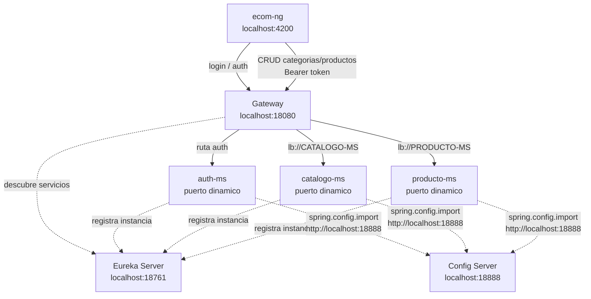
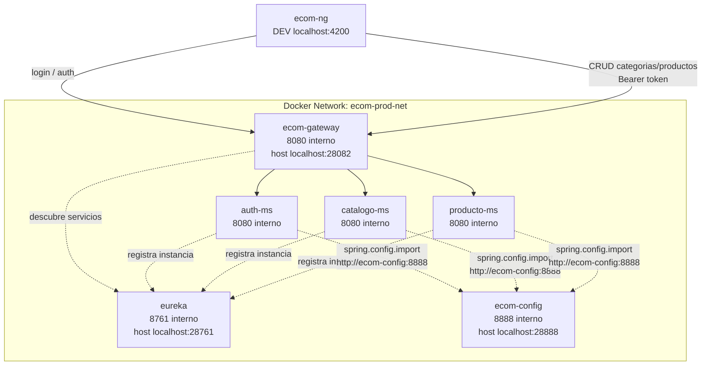

# S11 - Integracion con cliente frontend

## 1. Introduccion

Tiempo: 20 min.

### 1.1 Proposito

Integrar el cliente frontend con el sistema distribuido mediante Gateway, manteniendo seguridad, CORS y consumo centralizado de APIs.

### 1.2 Resultado de aprendizaje

El estudiante conecta el frontend al Gateway, ejecuta flujos autenticados y evidencia consumo de microservicios desde la interfaz.

### 1.3 Producto de sesion

`ecom-ng` integrado con Gateway para consumir categorias, productos y flujos protegidos.

### 1.4 Motivacion de la sesion

El usuario no interactua con microservicios aislados. La experiencia real ocurre desde el frontend, que debe consumir el sistema por un punto unico de entrada.

### 1.5 Ubicacion en el curso

- Unidad: U2 - Sistema distribuido robusto.
- Producto de unidad: sistema distribuido seguro, resiliente, consistente, observable e integrado con cliente frontend.
- Avance del producto en esta sesion: cliente web integrado mediante Gateway.

## 2. Explica

Tiempo: 15 min.

### 2.1 Conceptos clave

- Cliente frontend.
- Gateway como backend de entrada.
- CORS.
- Token en cliente.
- Consumo de API.
- Manejo de errores.

### 2.2 Arquitectura del producto en `ecom`

En esta sesion el frontend deja de ser una pieza aislada. `ecom-ng` consume el sistema por Gateway, obtiene token desde `auth-ms` y ejecuta CRUD contra los microservicios protegidos.

#### 2.2.1 Integracion frontend en DEV



#### 2.2.2 Integracion frontend en PROD local



### 2.3 Observabilidad y diagnostico

Revisar consola del navegador, network requests, respuestas 401/403, errores CORS, health de Gateway y logs de backend.

## 3. Aplica: actividad practica guiada

Tiempo: 3h.

En el laboratorio, el docente guia la integracion de `ecom-ng` con el backend distribuido. El estudiante prueba desde navegador y confirma que el frontend usa Gateway como unico punto de entrada.

### 3.1 Preparar el punto de partida

Producto del paso: identificar backend, frontend y contrato de URLs.

Confirma que existan estos modulos. Si alguno falta, crealo o usa la ruta alternativa de la sesion correspondiente:

- `clients/ecom-ng`
- `infra/gateway`
- `infra/config/config-repo/gateway-dev.yml`
- `services/auth-ms`
- `services/catalogo-ms`
- `services/producto-ms`

### 3.2 Levantar backend DEV

Producto del paso: infraestructura y microservicios listos para el frontend.

Levantar Config Server, Eureka, Gateway, `auth-ms`, `catalogo-ms` y `producto-ms`.

Comandos base en terminales separadas:

```bash
cd infra/config
mvn spring-boot:run
```

```bash
cd infra/eureka
mvn spring-boot:run
```

```bash
cd infra/gateway
mvn spring-boot:run
```

```bash
cd services/auth-ms
mvn spring-boot:run
```

```bash
cd services/catalogo-ms
mvn spring-boot:run
```

```bash
cd services/producto-ms
mvn spring-boot:run
```

### 3.3 Verificar Gateway DEV

Producto del paso: Gateway responde antes de abrir frontend.

PowerShell:

```powershell
Invoke-RestMethod -Method Get -Uri "http://localhost:18080/actuator/health"
```

bash macOS/Linux:

```bash
curl http://localhost:18080/actuator/health
```

### 3.4 Configurar URL del frontend

Producto del paso: `ecom-ng` apunta al Gateway DEV.

El frontend apunta al Gateway DEV:

```text
http://localhost:18080
```

Crea o actualiza:

```text
clients/ecom-ng/src/environments/environment.ts
```

Pega:

```ts
export const environment = {
  production: false,
  apiBaseUrl: 'http://localhost:18080'
};
```

Crea o actualiza el servicio base de API:

```text
clients/ecom-ng/src/app/core/services/api.service.ts
```

Pega:

```ts
import { Injectable } from '@angular/core';
import { environment } from '../../../environments/environment';

@Injectable({ providedIn: 'root' })
export class ApiService {
  readonly baseUrl = environment.apiBaseUrl;

  buildUrl(path: string): string {
    const normalizedPath = path.startsWith('/') ? path : `/${path}`;
    return `${this.baseUrl}${normalizedPath}`;
  }
}
```

### 3.5 Configurar CORS en Gateway

Producto del paso: Gateway permite peticiones desde `http://localhost:4200`.

Crea o actualiza:

```text
infra/gateway/src/main/java/com/upeu/gateway/config/CorsGlobalConfig.java
```

Pega:

```java
package com.upeu.gateway.config;

import org.springframework.context.annotation.Bean;
import org.springframework.context.annotation.Configuration;
import org.springframework.web.cors.CorsConfiguration;
import org.springframework.web.cors.reactive.CorsWebFilter;
import org.springframework.web.cors.reactive.UrlBasedCorsConfigurationSource;

@Configuration
public class CorsGlobalConfig {

    @Bean
    public CorsWebFilter corsWebFilter() {
        CorsConfiguration config = new CorsConfiguration();
        config.setAllowedOrigins(java.util.Arrays.asList(
                "http://localhost:4200",
                "http://localhost:4300"
        ));
        config.addAllowedMethod("*");
        config.addAllowedHeader("*");
        config.setAllowCredentials(true);

        UrlBasedCorsConfigurationSource source = new UrlBasedCorsConfigurationSource();
        source.registerCorsConfiguration("/**", config);
        return new CorsWebFilter(source);
    }
}
```

### 3.6 Instalar dependencias del frontend

Producto del paso: dependencias del cliente instaladas.

PowerShell / bash macOS/Linux:

```bash
cd clients/ecom-ng
npm install
```

### 3.7 Levantar frontend DEV

Producto del paso: `ecom-ng` ejecutando en navegador.

PowerShell / bash macOS/Linux:

```bash
npm start
```

Abrir:

```text
http://localhost:4200
```

### 3.8 Probar login

Producto del paso: token obtenido desde frontend.

Usar credenciales de laboratorio y verificar en Network:

- Peticion a Gateway.
- Respuesta 200.
- Token recibido.

### 3.9 Probar CRUD de categorias

Producto del paso: frontend consume `catalogo-ms` por Gateway.

Crear, listar, editar o eliminar una categoria desde la interfaz y verificar que la llamada va a `localhost:18080`.

### 3.10 Probar CRUD de productos

Producto del paso: frontend consume `producto-ms` por Gateway.

Crear un producto asociado a una categoria existente.

### 3.11 Diagnosticar 401/403

Producto del paso: estudiante distingue error de autenticacion y autorizacion.

Probar:

- Peticion sin token.
- Token incorrecto.
- Token vencido o mal formado.

### 3.12 Diagnosticar CORS

Producto del paso: estudiante reconoce un bloqueo CORS en navegador.

Valida:

- Consola del navegador.
- Cabeceras de respuesta.
- Configuracion de origen permitido.

### 3.13 Probar en PROD local

Producto del paso: frontend consume Gateway PROD local si el backend esta dockerizado.

Levantar backend PROD:

```bash
cd infra
docker compose up -d --build
```

Levantar microservicios necesarios con Docker. Luego configurar temporalmente el frontend contra:

```text
http://localhost:28082
```

### 3.14 Validar observabilidad del flujo

Producto del paso: una accion del frontend se encuentra en logs del backend.

Revisa logs del Gateway y del microservicio llamado. Si existe correlation id, sigue la solicitud.

### 3.15 Registrar evidencia funcional

Producto del paso: capturas y comandos suficientes para demostrar integracion.

Evidenciar:

- Pantalla del frontend.
- Network request al Gateway.
- Respuesta exitosa.
- Registro creado o modificado.
- Log del backend.

### 3.16 Detener procesos al terminar

Producto del paso: entorno local ordenado.

Detener `npm start` y procesos Maven con `Ctrl+C`. Para Docker, ejecutar `docker compose down` en cada modulo levantado.

### 3.17 Ruta alternativa: clonar y ejecutar a partir del tag final de la sesion

```bash
git clone --branch vs11-integracion-frontend https://github.com/261dist/ecom.git ecom-s11
cd ecom-s11
```

## 4. Crea: actividad autonoma

Tiempo: 4h fuera del aula.

Esta actividad autonoma se desarrolla sobre el proyecto de fin de curso del equipo. El producto de la unidad se construye por acumulacion de los avances de cada sesion; por eso, la evidencia de esta sesion debe incorporarse a la documentacion del proyecto y quedar trazable en GitHub.

### 4.1 Plantilla de evidencia individual

Entrega un PDF:

El PDF de esta sesion debe generarse como impresion o exportacion de la seccion correspondiente en MkDocs o una herramienta equivalente. No se acepta un PDF armado manualmente fuera de la documentacion del proyecto.

```text
S11_Equipo##_ApellidoNombre.pdf
```

#### 4.1.1 Datos del estudiante

- Nombre:
- Equipo:
- Sesion: S11 - Integracion con cliente frontend
- Rol o aporte realizado:
- Link de GitHub:

#### 4.1.2 Trabajo autonomo realizado

1. Levantar frontend.
2. Probar consumo por Gateway.
3. Probar login o ruta protegida.
4. Evidenciar CRUD desde interfaz.
5. Diagnosticar un error de integracion.

### 4.2 Criterios minimos de aceptacion

- PDF con nombre correcto.
- Frontend ejecutando.
- Gateway consumido desde frontend.
- Evidencia de API o CRUD.
- Aporte individual verificable.

## 5. Cierre evaluativo

Tiempo: 20 min.

### 5.1 Resultados esperados

- `ecom-ng` se ejecuta.
- Frontend consume Gateway.
- Flujo autenticado o protegido funciona.
- El estudiante diagnostica errores de integracion.

### 5.2 Evidencia del producto de sesion

Entrega individual:

```text
S11_Equipo##_ApellidoNombre.pdf
```

### 5.3 Preguntas de defensa y reflexion

1. Por que el frontend consume Gateway y no cada microservicio?
2. Que problema resuelve CORS?
3. Donde se usa el token?
4. Como diagnosticas un error 401 desde Angular?

### 5.4 Rubrica de evaluacion

| Dimension | Peso | 3 - Logro destacado | 2 - Logro | 1 - Proceso | 0 - Inicio | Puntuacion obtenida |
|---|---:|---|---|---|---|---:|
| 1. Frontend operativo | 2 | Evidencia frontend funcionando e integrado. | Frontend ejecuta correctamente. | Ejecucion parcial. | No evidencia frontend. | |
| 2. Consumo por Gateway | 2 | Evidencia varias APIs consumidas por Gateway. | Evidencia consumo de una API. | Consumo parcial. | No evidencia consumo. | |
| 3. Seguridad/CORS | 2 | Evidencia login/token o diagnostico CORS claro. | Evidencia flujo protegido. | Evidencia parcial. | No evidencia seguridad/CORS. | |
| 4. Diagnostico | 2 | Analiza fallo frontend-backend con solucion. | Explica problema. | Menciona problema sin analisis. | No diagnostica. | |
| 5. Aporte individual | 1 | Aporte claro y verificable. | Aporte identificable. | Aporte general. | No se identifica aporte. | |
| 6. Orden y reflexion | 1 | PDF ordenado y reflexion tecnica clara. | Evidencia suficiente. | Evidencia poco clara. | PDF insuficiente. | |

Puntuacion acumulada = suma de (`Peso` * `Puntuacion obtenida`) = ____.

Nota final = (`Puntuacion acumulada` / 30) * 20 = ____.

Para usar la rubrica con IA, solicita:

```text
Evalua el PDF usando la rubrica de la sesion.
Para cada dimension selecciona la puntuacion obtenida usando la escala Inicio=0, Proceso=1, Logro=2, Logro destacado=3.
Justifica brevemente cada puntuacion.
Calcula la puntuacion acumulada con la formula: suma de (Peso * Puntuacion obtenida).
Calcula la nota final sobre 20 con la formula: (Puntuacion acumulada / 30) * 20.
Indica 2 fortalezas y 2 recomendaciones.
```
