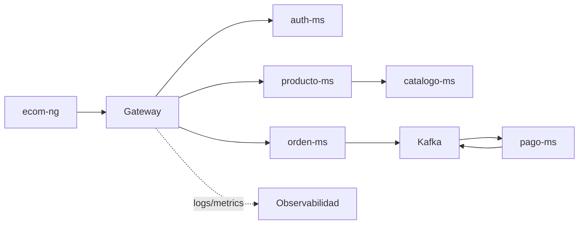

# S12 - Evaluacion U2

## 1. Introduccion

Tiempo: 20 min.

### 1.1 Proposito

Validar que el sistema distribuido robusto integra comunicacion entre servicios, seguridad, eventos, consistencia, observabilidad y frontend.

### 1.2 Resultado de aprendizaje

El estudiante demuestra que el sistema responde ante condiciones reales de operacion y sustenta su aporte individual dentro del producto U2.

### 1.3 Producto de sesion

Sistema robusto validado: comunicacion sincronica, seguridad, mensajeria, consistencia distribuida, observabilidad e integracion frontend.

### 1.4 Motivacion de la sesion

Un sistema distribuido robusto debe funcionar cuando hay usuarios, errores, multiples servicios, eventos, seguridad y necesidad de diagnostico. Esta evaluacion valida el sistema en condiciones integradas.

Preguntas que el docente puede realizar a cada estudiante:

1. Como se protege el sistema?
2. Que flujo demuestra comunicacion entre servicios?
3. Que evidencia muestra mensajeria asincrona?
4. Como se diagnostica un fallo?
5. Cual fue tu aporte individual?

### 1.5 Ubicacion en el curso

- Unidad: U2 - Sistema distribuido robusto.
- Producto de unidad: sistema distribuido seguro, resiliente, consistente, observable e integrado con cliente frontend.
- Avance del producto en esta sesion: evaluacion integradora de la Unidad 2.

## 2. Explica

Tiempo: 15 min.

### 2.1 Arquitectura del producto de unidad



### 2.2 Tiempo de exposicion por equipo

Cada grupo dispone de 25 minutos:

- 15 minutos de exposicion del proyecto U2.
- 5 minutos de demo tecnica.
- 5 minutos de preguntas del docente a integrantes del equipo.

## 3. Aplica: actividad practica guiada

Tiempo: 3h.

En esta sesion se realiza la exposicion y evaluacion practica. El equipo presenta el producto U2, muestra la demo y cada integrante evidencia su aporte.

### 3.1 Plantilla de entrega

La evaluacion U2 requiere tres entregables:

1. Evidencia individual en PDF.
2. Presentacion del proyecto U2 (PPT o equivalente).
3. Documentacion en MkDocs con guias reproducibles de los artefactos trabajados en las sesiones de U2.

Ademas, el repositorio GitHub debe evidenciar el aporte o participacion de cada integrante del equipo, y cada integrante debe mostrar una demo de la parte que trabajo.

Entrega el PDF:

```text
S12_Equipo##_ApellidoNombre.pdf
```

Entrega la presentacion con el siguiente nombre:

```text
U2_Equipo##_Presentacion.pdf
```

La documentacion MkDocs debe estar en el repositorio GitHub y publicada o ejecutable localmente con `mkdocs serve`.

#### 3.1.1 Datos del estudiante

- Nombre:
- Equipo:
- Sesion: S12 - Evaluacion U2
- Rol o aporte realizado:
- Link de GitHub:
- Evidencia de participacion en GitHub:
- Parte del sistema que demostrara en vivo:

#### 3.1.2 Evidencia tecnica individual

- Seguridad: login, token y ruta protegida.
- Comunicacion sincronica entre servicios.
- Eventos o consistencia distribuida.
- Observabilidad: health, logs, metricas o panel.
- Frontend integrado mediante Gateway.
- Aporte individual.

#### 3.1.3 Presentacion del proyecto U2

La presentacion debe incluir:

- Nombre del proyecto y equipo.
- Arquitectura robusta U2.
- Flujo seguro con JWT.
- Comunicacion sincronica entre servicios.
- Mensajeria, consistencia eventual y estados finales.
- Observabilidad y diagnostico.
- Integracion frontend.
- Aporte individual de cada integrante.
- Evidencia de participacion de cada integrante en GitHub.
- Demo asignada a cada integrante.

#### 3.1.4 Documentacion MkDocs

La documentacion debe incluir guias para reproducir cada artefacto de sesion:

- S06: comunicacion sincronica resiliente.
- S07: seguridad distribuida y JWT.
- S08: mensajeria asincrona.
- S09: consistencia distribuida.
- S10: observabilidad y diagnostico.
- S11: integracion frontend.
- S12: validacion integrada U2.

Cada guia debe contener comandos, puertos, rutas probadas, datos de prueba, evidencias esperadas y errores frecuentes.

### 3.2 Secuencia sugerida de presentacion

1. Presentar nombre del proyecto, equipo y repositorio GitHub.
2. Explicar la arquitectura U2 usando el diagrama del producto.
3. Mostrar login, token y ruta protegida.
4. Mostrar comunicacion sincronica entre servicios.
5. Mostrar mensajeria, consistencia eventual y estado final.
6. Mostrar integracion frontend y evidencia operacional.
7. Mostrar participacion de cada integrante en GitHub.
8. Cada integrante muestra la parte que trabajo.
9. Cerrar con hallazgos, problemas y decisiones tecnicas.

### 3.3 Criterios minimos de aceptacion

- PDF con nombre correcto.
- Presentacion del proyecto U2 entregada.
- Documentacion MkDocs con guias reproducibles de S06 a S12.
- Evidencia de sistema robusto integrado.
- Seguridad demostrada.
- Eventos o consistencia demostrados.
- Observabilidad demostrada.
- Aporte individual verificable.
- GitHub evidencia aporte o participacion de cada integrante.
- Cada integrante demuestra en vivo la parte que trabajo.

## 4. Crea: actividad autonoma

Tiempo: 4h fuera del aula.

### 4.1 Mejoras y recomendaciones para la siguiente unidad

Despues de la evaluacion, cada estudiante debe implementar las mejoras y recomendaciones recibidas. Esta actividad no forma parte de la calificacion de la evaluacion U2; sirve como preparacion para la siguiente unidad.

Trabajo autonomo:

1. Corregir observaciones detectadas en la exposicion.
2. Completar o ajustar la documentacion MkDocs.
3. Mejorar evidencias individuales incompletas.
4. Registrar en GitHub los cambios posteriores a la evaluacion.
5. Preparar una breve reflexion tecnica sobre la mejora aplicada.

## 5. Cierre evaluativo

Tiempo: 20 min.

La rubrica evalua el entregable y la sustentacion del producto U2 presentados durante la sesion.

### 5.1 Rubrica de evaluacion

| Dimension | Peso | 3 - Logro destacado | 2 - Logro | 1 - Proceso | 0 - Inicio | Puntuacion obtenida |
|---|---:|---|---|---|---|---:|
| 1. Integracion U2 | 2 | Evidencia sistema robusto completo. | Evidencia componentes principales. | Evidencia parcial. | No evidencia integracion. | |
| 2. Seguridad | 2 | Evidencia login, token, rutas protegidas y errores esperados. | Evidencia seguridad funcional. | Seguridad parcial. | No evidencia seguridad. | |
| 3. Eventos/consistencia | 2 | Evidencia eventos y consistencia de negocio. | Evidencia flujo de eventos. | Evidencia parcial. | No evidencia eventos. | |
| 4. Observabilidad/diagnostico | 2 | Diagnostica con logs/metricas/paneles. | Evidencia observabilidad. | Evidencia limitada. | No evidencia observabilidad. | |
| 5. Aporte individual y participacion en GitHub | 1 | Aporte claro, verificable en GitHub y conectado al producto. | Aporte identificable en GitHub. | Aporte general o poco trazable. | No se identifica aporte. | |
| 6. Defensa, presentacion, documentacion y demo individual | 1 | Defensa clara, presentacion completa (PPT o equivalente), MkDocs reproducible y demo individual de la parte trabajada. | Defensa suficiente con presentacion, documentacion y demo. | Defensa parcial, documentacion incompleta o demo parcial. | No sustenta ni documenta. | |

Puntuacion acumulada = suma de (`Peso` * `Puntuacion obtenida`) = ____.

Nota final = (`Puntuacion acumulada` / 30) * 20 = ____.

Para usar la rubrica con IA, solicita:

```text
Evalua el PDF, la presentacion, la documentacion MkDocs, la participacion en GitHub y la demo individual usando la rubrica de la sesion.
Para cada dimension selecciona la puntuacion obtenida usando la escala Inicio=0, Proceso=1, Logro=2, Logro destacado=3.
Justifica brevemente cada puntuacion.
Calcula la puntuacion acumulada con la formula: suma de (Peso * Puntuacion obtenida).
Calcula la nota final sobre 20 con la formula: (Puntuacion acumulada / 30) * 20.
Indica 2 fortalezas y 2 recomendaciones.
```
