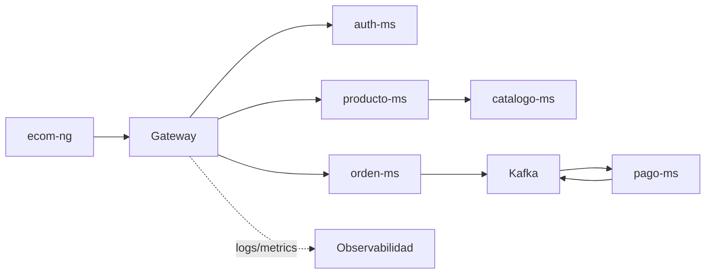

# S12 - Evaluación U2

## 1. Instrucciones iniciales

Tiempo: 5 min.

### 1.1 Propósito

Validar que el sistema distribuido robusto integra comunicación entre servicios, seguridad, eventos, consistencia, observabilidad y frontend.

### 1.2 Resultado de aprendizaje

El estudiante demuestra que el sistema responde ante condiciones reales de operación y sustenta su aporte individual dentro del producto U2.

### 1.3 Producto de sesión

Sistema robusto validado: comunicación síncrona, seguridad, mensajería, consistencia distribuida, observabilidad e integración frontend.

### 1.4 Preguntas del docente durante la sustentación

Un sistema distribuido robusto debe funcionar cuando hay usuarios, errores, múltiples servicios, eventos, seguridad y necesidad de diagnóstico. Esta evaluación valida el sistema en condiciones integradas.

Preguntas que el docente puede realizar a cada estudiante:

1. Cómo se protege el sistema?
2. Qué flujo demuestra comunicación entre servicios?
3. Qué evidencia muestra mensajería asíncrona?
4. Cómo se diagnostica un fallo?
5. Cuál fue tu aporte individual?

### 1.5 Ubicación en el curso

- Unidad: U2 - Sistema distribuido robusto.
- Producto de unidad: sistema distribuido seguro, resiliente, consistente, observable e integrado con cliente frontend.
- Avance del producto en esta sesión: evaluación integradora de la Unidad 2.

## 2. Encuadre de la evaluación

Tiempo: 10 min.

El docente presenta brevemente la arquitectura del producto de unidad, recuerda la distribución de tiempo por equipo y pasa directamente a las exposiciones.

### 2.1 Arquitectura del producto de unidad



### 2.2 Tiempo de exposición por equipo

Cada grupo dispone de hasta 18 minutos:

- 10 minutos de exposición del proyecto U2.
- 5 minutos de demo técnica.
- 3 minutos de preguntas del docente a integrantes del equipo.

## 3. Presentación y sustentación del producto

Tiempo: 3h 45 min para la ronda de evaluación de equipos.

En esta sesión se realiza la exposición y evaluación práctica. Cada equipo dispone de hasta 18 minutos para presentar el producto U2, mostrar la demo y responder preguntas. La rúbrica se aplica al cierre de la exposición de cada equipo.

### 3.1 Plantilla de entrega

La evaluación U2 requiere tres entregables:

1. Documentación en MkDocs o herramienta equivalente del avance U2 del proyecto final, organizada por sesiones y con guías reproducibles.
2. PDF grupal de la evaluación generado como impresion o exportacion de la documentación y subido a la plataforma BLearning (BL).
3. Presentación del proyecto U2 (PPT o equivalente) subida a BL.

El link de la documentación debe aparecer en el `index` del PDF. La documentación no presenta productos aislados de sesión: organiza el avance U2 del proyecto final usando S06, S07, S08, S09, S10, S11 y S12 como estructura de evidencias. Para la unidad, el equipo debe juntar e integrar los productos de sesión desarrollados por todos los integrantes en una rama común del equipo. No basta con mostrar ramas o PR separados: debe evidenciarse el merge o integración, la resolución de conflictos si aplica y la ejecución del sistema integrado. Además, el repositorio GitHub debe evidenciar el aporte o participación individual de cada integrante mediante commits, ramas, merges o pull requests de código y documentación. Esa evidencia debe incluirse también en la documentación como anexos, un anexo por integrante, para que al imprimir o exportar el sitio se genere un PDF ordenado. Cada integrante debe mostrar una demo de la parte que trabajó.

El PDF de esta evaluación debe ser la impresion o exportacion directa del sitio de documentación. No se acepta un PDF armado manualmente fuera de la documentación.

Entrega el PDF grupal:

```text
S12_Equipo##_U2_Docs.pdf
```

Entrega la presentación con el siguiente nombre:

```text
U2_Equipo##_Presentación.pdf
```

La documentación debe estar en el repositorio GitHub y publicarse como sitio navegable, por ejemplo en GitHub Pages (`github.io`) u otra plataforma equivalente. Si usan MkDocs, también pueden verificarla localmente con `mkdocs serve`.

#### 3.1.1 Datos del equipo

- Equipo:
- Sesión: S12 - Evaluación U2
- Proyecto:
- Link de GitHub:
- Link de documentación:
- Rama integrada evaluada:
- Evidencia de integración o merge:
- Integrantes:
- Productos de sesión integrados por el equipo:
- Anexos individuales incluidos:

#### 3.1.2 Evidencia técnica del avance U2

- Seguridad: login, token y ruta protegida.
- Comunicación síncrona entre servicios.
- Eventos o consistencia distribuida.
- Observabilidad: health, logs, métricas o panel.
- Frontend integrado mediante Gateway.
- Avance del proyecto final correspondiente a U2.

#### 3.1.3 Presentación del proyecto U2

La presentación debe incluir:

- Nombre del proyecto y equipo.
- Arquitectura robusta U2.
- Flujo seguro con JWT.
- Comunicación síncrona entre servicios.
- Mensajería, consistencia eventual y estados finales.
- Observabilidad y diagnóstico.
- Integración frontend.
- Aporte individual de cada integrante.
- Evidencia de participación individual de cada integrante en GitHub.
- Demo asignada a cada integrante.

#### 3.1.4 Documentación en MkDocs o herramienta equivalente

La documentación debe seguir una estructura ordenada por sesión y anexos. Cada sesión documenta el avance del proyecto final que corresponde a esa etapa y debe integrar los aportes realizados por los integrantes del equipo:

- S06: comunicación síncrona resiliente.
- S07: seguridad distribuida y JWT.
- S08: mensajería asíncrona.
- S09: consistencia distribuida.
- S10: observabilidad y diagnóstico.
- S11: integración frontend.
- S12: validación integrada U2.
- Anexos: evidencia de participación individual, un anexo por integrante.

Cada guía debe contener comandos, puertos, rutas probadas, datos de prueba, evidencias esperadas y errores frecuentes. El `index` debe incluir el link de la documentación publicada o ejecutable.

Cada anexo individual debe contener:

- Nombre del integrante.
- Rol o responsabilidad.
- Rama de trabajo, commits, merges o PR de código.
- Rama de trabajo, commits, merges o PR de documentación.
- Evidencia breve de la parte que demostrará en vivo.
- Evidencia de que su aporte quedó integrado en la rama común del equipo.

### 3.2 Secuencia sugerida de presentación

1. Presentar nombre del proyecto, equipo y repositorio GitHub.
2. Explicar la arquitectura U2 usando el diagrama del producto.
3. Mostrar login, token y ruta protegida.
4. Mostrar comunicación síncrona entre servicios.
5. Mostrar mensajería, consistencia eventual y estado final.
6. Mostrar integración frontend y evidencia operacional.
7. Mostrar participación de cada integrante en GitHub.
8. Cada integrante muestra la parte que trabajó.
9. Cerrar con hallazgos, problemas y decisiones técnicas.

### 3.3 Criterios mínimos de aceptación

- PDF grupal generado desde la documentación y subido a BL con nombre correcto.
- Presentación del proyecto U2 subida a BL.
- Documentación en MkDocs o herramienta equivalente con guías reproducibles de S06 a S12.
- Evidencia del avance U2 del proyecto final integrado.
- Seguridad demostrada.
- Eventos o consistencia demostrados.
- Observabilidad demostrada.
- Aporte individual verificable.
- Productos de sesión de todos los integrantes integrados en el avance U2.
- Rama común del equipo con aportes integrados y ejecutables.
- Evidencia de merge, integración o resolución de conflictos cuando aplique.
- La documentación incluye anexos de participación individual, uno por integrante.
- GitHub evidencia aporte individual de cada integrante mediante ramas, commits, merges o PR de código y documentación.
- Cada integrante demuestra en vivo la parte que trabajó.

## 4. Retroalimentacion posterior

Tiempo: 4h fuera del aula.

### 4.1 Mejoras y recomendaciones para la siguiente unidad

Después de la evaluación, cada estudiante debe implementar las mejoras y recomendaciones recibidas. Esta actividad no forma parte de la calificación de la evaluación U2; sirve como preparación para la siguiente unidad.

Trabajo autónomo:

1. Corregir observaciones detectadas en la exposición.
2. Completar o ajustar la documentación.
3. Mejorar evidencias individuales incompletas.
4. Registrar en GitHub los cambios posteriores a la evaluación.
5. Preparar una breve reflexión técnica sobre la mejora aplicada.

## 5. Rúbrica de evaluación

La rúbrica evalúa el entregable y la sustentación del producto U2 presentados durante la sesión.

| Dimensión | Peso | 3 - Logro destacado | 2 - Logro | 1 - Proceso | 0 - Inicio | Puntuación obtenida |
|---|---:|---|---|---|---|---:|
| 1. Integración del producto U2 | 2 | Integra los productos de S06-S12 y los aportes de todos los integrantes sobre el producto U1 en un sistema robusto funcionando como un todo. | Integra los componentes principales del producto U2. | La integración de componentes o aportes es parcial. | No evidencia integración. | |
| 2. Funcionamiento técnico U2 | 2 | Demuestra seguridad, comunicación síncrona, mensajería asíncrona, consistencia distribuida, observabilidad e integración frontend. | Demuestra el funcionamiento de los componentes principales de U2. | El funcionamiento es parcial o presenta fallos relevantes. | No demuestra el funcionamiento del producto U2. | |
| 3. Pruebas, evidencia y diagnóstico | 2 | Ejecuta pruebas reproducibles, evidencia estados y eventos, y diagnostica fallos mediante logs, métricas, trazas o paneles. | Presenta pruebas y evidencia suficientes, y explica la causa probable de un fallo. | Las pruebas, evidencias o el diagnóstico son incompletos. | No presenta evidencia verificable ni diagnostica. | |
| 4. Aporte individual, GitHub y demo | 2 | El aporte individual de código y documentación es verificable en GitHub y anexos, está integrado en la rama común y se demuestra en vivo con autonomía. | El aporte es identificable, está integrado y se demuestra adecuadamente. | El aporte es poco trazable, no esta claramente integrado o la demo es parcial. | No se identifica ni demuestra el aporte individual. | |
| 5. Defensa técnica | 1 | Explica decisiones y responde las preguntas con precisión, autonomía y criterio técnico. | Explica las decisiones principales y responde adecuadamente. | Responde parcialmente o con escaso sustento técnico. | No sustenta su trabajo. | |
| 6. Presentación, documentación y reproducibilidad | 1 | Presentación clara; sitio y PDF ordenados por S06-S12, con guías reproducibles, enlace en el index y anexos individuales completos. | La presentación y la documentación permiten comprender y reproducir el flujo principal. | La presentación es poco clara o la documentación es incompleta y poco reproducible. | No presenta documentación o presentación suficiente. | |

Puntuación acumulada = suma de (`Peso` * `Puntuacion obtenida`) = ____.

Nota final = (`Puntuacion acumulada` / 30) * 20 = ____.

Para usar la rúbrica con IA, solicita:

```text
Evalúa el PDF, la presentación, la documentación, la participación en GitHub y la demo individual usando la rúbrica de la sesión.
Para cada dimensión selecciona la puntuación obtenida usando la escala Inicio=0, Proceso=1, Logro=2, Logro destacado=3.
Justifica brevemente cada puntuación.
Calcula la puntuación acumulada con la fórmula: suma de (Peso * Puntuación obtenida).
Calcula la nota final sobre 20 con la fórmula: (Puntuación acumulada / 30) * 20.
Indica 2 fortalezas y 2 recomendaciones.
```
