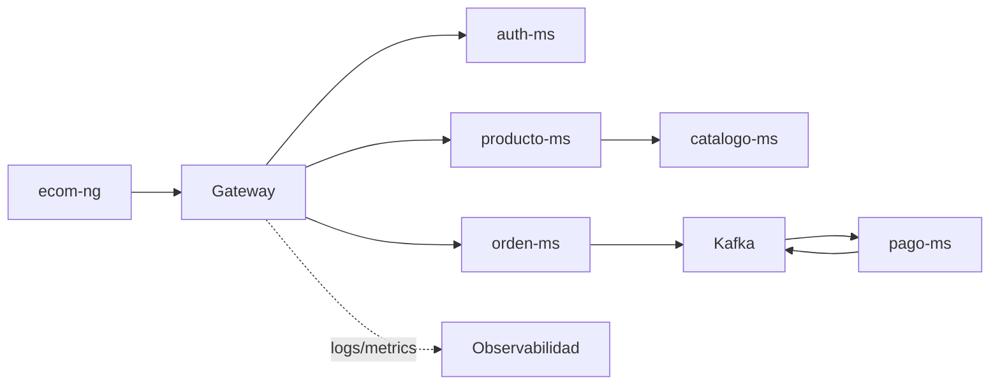

# S12 - Evaluacion U2

## 1. Introduccion

Tiempo: 20 min.

### 1.1 Proposito

Validar que el sistema distribuido robusto integra comunicacion entre servicios, seguridad, eventos, consistencia, observabilidad y frontend.

### 1.2 Resultado de aprendizaje

El estudiante demuestra que el sistema responde ante condiciones reales de operacion y sustenta su aporte individual dentro del producto U2.

### 1.3 Producto de sesion

Sistema robusto validado: comunicacion sincronica, seguridad, mensajeria, consistencia distribuida, observabilidad e integracion frontend.

### 1.4 Motivacion de la sesion

Un sistema distribuido robusto debe funcionar cuando hay usuarios, errores, multiples servicios, eventos, seguridad y necesidad de diagnostico. Esta evaluacion valida el sistema en condiciones integradas.

### 1.5 Ubicacion en el curso

- Unidad: U2 - Sistema distribuido robusto.
- Producto de unidad: sistema distribuido seguro, resiliente, consistente, observable e integrado con cliente frontend.
- Avance del producto en esta sesion: evaluacion integradora de la Unidad 2.

## 2. Explica

Tiempo: 15 min.

### 2.1 Conceptos clave

- Robustez.
- Seguridad distribuida.
- Comunicacion sincronica y asincrona.
- Consistencia eventual.
- Observabilidad.
- Integracion frontend.

### 2.2 Arquitectura del producto en `ecom`



### 2.3 Observabilidad y diagnostico

Validar health, logs, metricas, eventos, errores controlados, seguridad y experiencia desde frontend.

## 3. Aplica: actividad practica guiada

Tiempo: 3h.

### 3.1 Preparar demostracion

El equipo define el flujo a demostrar y el orden de arranque.

### 3.2 Validar seguridad

Obtener token y consumir una ruta protegida.

### 3.3 Validar comunicacion entre servicios

Ejecutar un flujo donde un microservicio consulte a otro.

### 3.4 Validar eventos y consistencia

Ejecutar flujo de orden-pago y revisar eventos/estados.

### 3.5 Validar observabilidad

Mostrar health, logs, metricas o dashboard.

### 3.6 Validar frontend

Consumir el sistema desde `ecom-ng` mediante Gateway.

## 4. Crea: actividad autonoma

Tiempo: 4h fuera del aula.

### 4.1 Plantilla de evidencia individual

Entrega un PDF:

```text
S12_Equipo##_ApellidoNombre.pdf
```

#### 4.1.1 Datos del estudiante

- Nombre:
- Equipo:
- Sesion: S12 - Evaluacion U2
- Rol o aporte realizado:
- Link de GitHub:

#### 4.1.2 Trabajo autonomo realizado

1. Ordenar evidencias de U2.
2. Registrar aporte individual.
3. Corregir observaciones.
4. Preparar defensa tecnica.
5. Documentar flujo integrado.

### 4.2 Criterios minimos de aceptacion

- PDF con nombre correcto.
- Evidencia de sistema robusto integrado.
- Seguridad demostrada.
- Eventos o consistencia demostrados.
- Observabilidad demostrada.
- Aporte individual verificable.

## 5. Cierre evaluativo

Tiempo: 20 min.

### 5.1 Resultados esperados

- Sistema U2 integrado.
- Flujo seguro y observable.
- Comunicacion sincronica y asincrona validada.
- Defensa individual del aporte.

### 5.2 Evidencia del producto de sesion

Entrega individual:

```text
S12_Equipo##_ApellidoNombre.pdf
```

### 5.3 Preguntas de defensa y reflexion

1. Como se protege el sistema?
2. Que flujo demuestra comunicacion entre servicios?
3. Que evidencia muestra mensajeria asincrona?
4. Como se diagnostica un fallo?
5. Cual fue tu aporte individual?

### 5.4 Rubrica de evaluacion

| Dimension | Peso | 3 - Logro destacado | 2 - Logro | 1 - Proceso | 0 - Inicio | Puntuacion obtenida |
|---|---:|---|---|---|---|---:|
| 1. Integracion U2 | 2 | Evidencia sistema robusto completo. | Evidencia componentes principales. | Evidencia parcial. | No evidencia integracion. | |
| 2. Seguridad | 2 | Evidencia login, token, rutas protegidas y errores esperados. | Evidencia seguridad funcional. | Seguridad parcial. | No evidencia seguridad. | |
| 3. Eventos/consistencia | 2 | Evidencia eventos y consistencia de negocio. | Evidencia flujo de eventos. | Evidencia parcial. | No evidencia eventos. | |
| 4. Observabilidad/diagnostico | 2 | Diagnostica con logs/metricas/paneles. | Evidencia observabilidad. | Evidencia limitada. | No evidencia observabilidad. | |
| 5. Aporte individual | 1 | Aporte claro y verificable. | Aporte identificable. | Aporte general. | No se identifica aporte. | |
| 6. Defensa y orden | 1 | Defensa clara y PDF completo. | Defensa suficiente. | Defensa parcial. | No sustenta. | |

Puntuacion acumulada = suma de (`Peso` * `Puntuacion obtenida`) = ____.

Nota final = (`Puntuacion acumulada` / 30) * 20 = ____.

Para usar la rubrica con IA, solicita:

```text
Evalua el PDF usando la rubrica de la sesion.
Para cada dimension selecciona la puntuacion obtenida usando la escala Inicio=0, Proceso=1, Logro=2, Logro destacado=3.
Justifica brevemente cada puntuacion.
Calcula la puntuacion acumulada con la formula: suma de (Peso * Puntuacion obtenida).
Calcula la nota final sobre 20 con la formula: (Puntuacion acumulada / 30) * 20.
Indica 2 fortalezas y 2 recomendaciones.
```
