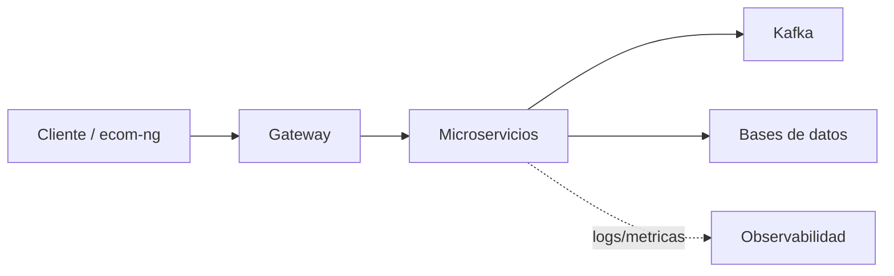

# S13 - Validacion end-to-end del producto del curso

## 1. Introduccion

Tiempo: 20 min.

### 1.1 Proposito

Validar el producto del curso como sistema completo, desde cliente o shell hasta Gateway, servicios, eventos, base de datos y observabilidad.

### 1.2 Resultado de aprendizaje

El estudiante ejecuta flujos end-to-end, verifica resultados en cada capa y produce evidencias reproducibles.

### 1.3 Producto de sesion

Checklist end-to-end del producto del curso con evidencias por capa.

### 1.4 Motivacion de la sesion

Un sistema distribuido solo se considera completo cuando sus componentes cooperan en un flujo real de negocio y el equipo puede demostrarlo de forma reproducible.

### 1.5 Ubicacion en el curso

- Unidad: U3 - Validacion y consolidacion del producto del curso.
- Producto de unidad: producto final del curso validado, documentado, estabilizado y defendido.
- Avance del producto en esta sesion: validacion integral del producto del curso.

## 2. Explica

Tiempo: 15 min.

### 2.1 Conceptos clave

- Validacion end-to-end.
- Evidencia reproducible.
- Trazabilidad del flujo.
- Datos finales.
- Diagnostico por capas.

### 2.2 Arquitectura del producto en `ecom`



### 2.3 Observabilidad y diagnostico

Validar cada salto del flujo con logs, metricas, BD, Kafka UI, Eureka, Gateway y respuestas HTTP.

## 3. Aplica: actividad practica guiada

Tiempo: 3h.

### 3.1 Definir flujo principal

Ejemplo minimo:

1. Login.
2. Crear categoria.
3. Crear producto.
4. Crear orden.
5. Procesar pago.
6. Revisar estado final.

### 3.2 Ejecutar flujo

Usar shell, frontend o ambos, siempre mediante Gateway cuando corresponda.

### 3.3 Verificar resultados por capa

Validar:

- Respuesta HTTP.
- Registro en BD.
- Evento publicado/consumido.
- Logs.
- Metricas o dashboard.

### 3.4 Registrar incidencias

Documentar errores, causa probable y accion correctiva.

## 4. Crea: actividad autonoma

Tiempo: 4h fuera del aula.

### 4.1 Plantilla de evidencia individual

Entrega un PDF:

```text
S13_Equipo##_ApellidoNombre.pdf
```

#### 4.1.1 Datos del estudiante

- Nombre:
- Equipo:
- Sesion: S13 - Validacion end-to-end del producto del curso
- Rol o aporte realizado:
- Link de GitHub:

#### 4.1.2 Trabajo autonomo realizado

1. Completar evidencias del flujo end-to-end.
2. Corregir fallos detectados.
3. Registrar datos finales.
4. Documentar aporte individual.
5. Preparar demo final.

### 4.2 Criterios minimos de aceptacion

- PDF con nombre correcto.
- Flujo end-to-end evidenciado.
- Evidencias por capa.
- Incidencias registradas.
- Aporte individual verificable.

## 5. Cierre evaluativo

Tiempo: 20 min.

### 5.1 Resultados esperados

- Flujo completo probado.
- Evidencia de datos y eventos.
- Diagnostico por capas.
- Incidencias documentadas.

### 5.2 Evidencia del producto de sesion

Entrega individual:

```text
S13_Equipo##_ApellidoNombre.pdf
```

### 5.3 Preguntas de defensa y reflexion

1. Cual es el flujo end-to-end principal?
2. Donde se valida seguridad?
3. Donde ocurre consistencia eventual?
4. Como demuestras que el flujo llego a BD?
5. Que aportaste individualmente a la validacion?

### 5.4 Rubrica de evaluacion

| Dimension | Peso | 3 - Logro destacado | 2 - Logro | 1 - Proceso | 0 - Inicio | Puntuacion obtenida |
|---|---:|---|---|---|---|---:|
| 1. Flujo end-to-end | 2 | Evidencia flujo completo y reproducible. | Evidencia flujo principal. | Flujo parcial. | No evidencia flujo. | |
| 2. Evidencias por capa | 2 | Evidencia cliente, Gateway, servicios, eventos y BD. | Evidencia capas principales. | Evidencia incompleta. | No evidencia capas. | |
| 3. Diagnostico | 2 | Analiza incidencias con causa y solucion. | Explica problemas principales. | Menciona incidencias sin analisis. | No diagnostica. | |
| 4. Reproducibilidad | 2 | Comandos y pasos claros para repetir la prueba. | Pasos suficientes. | Pasos incompletos. | No es reproducible. | |
| 5. Aporte individual | 1 | Aporte claro y verificable. | Aporte identificable. | Aporte general. | No se identifica aporte. | |
| 6. Orden y reflexion | 1 | PDF ordenado y reflexion tecnica clara. | Evidencia suficiente. | Evidencia poco clara. | PDF insuficiente. | |

Puntuacion acumulada = suma de (`Peso` * `Puntuacion obtenida`) = ____.

Nota final = (`Puntuacion acumulada` / 30) * 20 = ____.

Para usar la rubrica con IA, solicita:

```text
Evalua el PDF usando la rubrica de la sesion.
Para cada dimension selecciona la puntuacion obtenida usando la escala Inicio=0, Proceso=1, Logro=2, Logro destacado=3.
Justifica brevemente cada puntuacion.
Calcula la puntuacion acumulada con la formula: suma de (Peso * Puntuacion obtenida).
Calcula la nota final sobre 20 con la formula: (Puntuacion acumulada / 30) * 20.
Indica 2 fortalezas y 2 recomendaciones.
```
