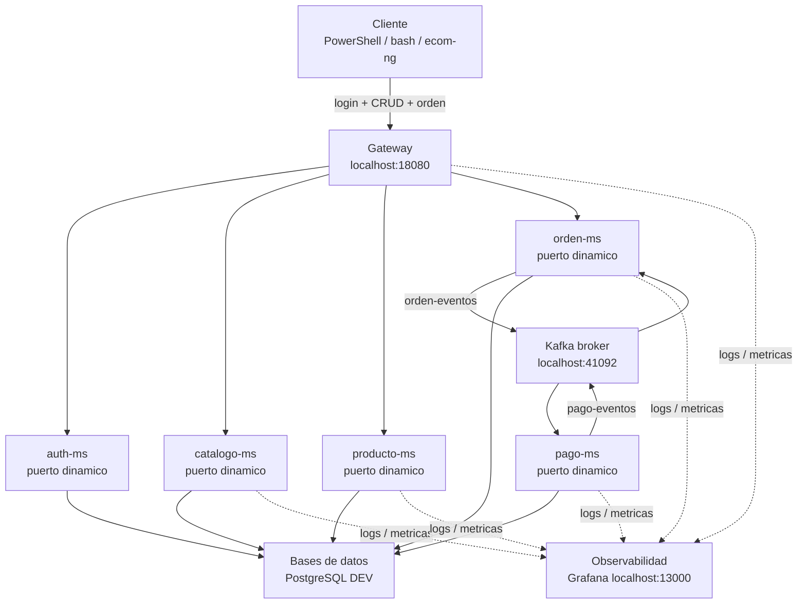
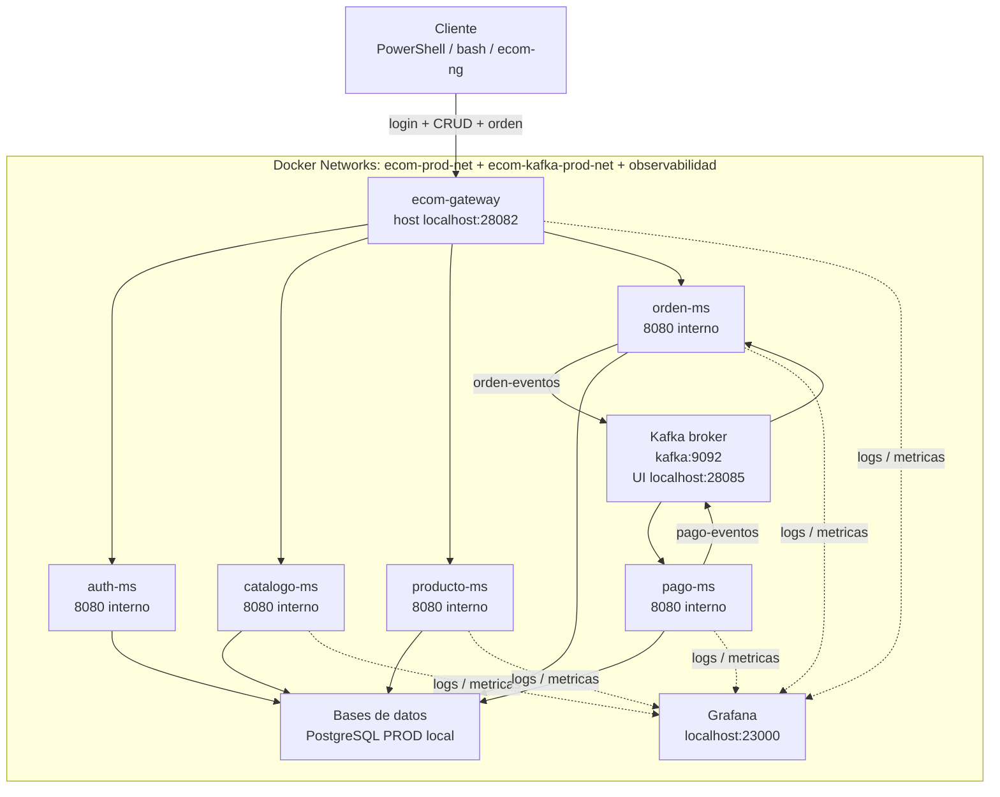

# S13 - Validacion end-to-end del producto del curso

## 1. Introduccion

Tiempo: 20 min.

### 1.1 Proposito

Validar el producto del curso como sistema completo, desde cliente o shell hasta Gateway, servicios, eventos, base de datos y observabilidad.

### 1.2 Resultado de aprendizaje

El estudiante ejecuta flujos end-to-end, verifica resultados en cada capa y produce evidencias reproducibles.

### 1.3 Producto de sesion

Checklist end-to-end del producto del curso con evidencias por capa.

### 1.4 Motivacion de la sesion

Un sistema distribuido solo se considera completo cuando sus componentes cooperan en un flujo real de negocio y el equipo puede demostrarlo de forma reproducible.

### 1.5 Ubicacion en el curso

- Unidad: U3 - Validacion y consolidacion del producto del curso.
- Producto de unidad: producto final del curso validado, documentado, estabilizado y defendido.
- Avance del producto en esta sesion: validacion integral del producto del curso.

## 2. Explica

Tiempo: 15 min.

### 2.1 Conceptos clave

- Validacion end-to-end.
- Evidencia reproducible.
- Trazabilidad del flujo.
- Datos finales.
- Diagnostico por capas.

### 2.2 Arquitectura del producto en `ecom`

En esta sesion se valida el producto completo. El foco no es agregar un componente nuevo, sino demostrar que el flujo atraviesa cliente, Gateway, seguridad, microservicios, eventos, bases de datos y observabilidad.

#### 2.2.1 Validacion end-to-end en DEV



#### 2.2.2 Validacion end-to-end en PROD local



### 2.3 Observabilidad y diagnostico

Validar cada salto del flujo con logs, metricas, BD, Kafka UI, Eureka, Gateway y respuestas HTTP.

## 3. Aplica: actividad practica guiada

Tiempo: 3h.

En el laboratorio, el docente guia una validacion integral. Cada equipo ejecuta el mismo flujo, registra evidencias por capa y anota incidencias tecnicas con causa probable.

### 3.1 Preparar checklist end-to-end

Producto del paso: flujo principal y evidencias esperadas definidas antes de ejecutar.

Checklist minimo:

- Login.
- CRUD de categoria.
- CRUD de producto.
- Creacion de orden.
- Procesamiento de pago.
- Validacion en BD.
- Validacion en Kafka.
- Validacion en logs/metricas.

### 3.2 Definir flujo principal

Ejemplo minimo:

1. Login.
2. Crear categoria.
3. Crear producto.
4. Crear orden.
5. Procesar pago.
6. Revisar estado final.

### 3.3 Levantar sistema DEV

Producto del paso: sistema completo disponible en desarrollo.

Levantar:

- Config Server.
- Eureka.
- Gateway.
- Kafka.
- Observabilidad.
- Microservicios necesarios.
- Frontend, si se usara en la demo.

### 3.4 Validar health y registro de servicios

Producto del paso: infraestructura base saludable.

Verificar:

PowerShell:

```powershell
Invoke-RestMethod -Method Get -Uri "http://localhost:18080/actuator/health"
```

bash macOS/Linux:

```bash
curl http://localhost:18080/actuator/health
```

Abrir Eureka:

```text
http://localhost:18761
```

### 3.5 Ejecutar login

Producto del paso: token valido para el flujo protegido.

Guardar token si la prueba se realiza desde shell.

### 3.6 Ejecutar CRUD de categoria

Producto del paso: categoria creada y consultable por Gateway.

Evidenciar respuesta HTTP y registro en base de datos.

### 3.7 Ejecutar CRUD de producto

Producto del paso: producto creado con categoria asociada.

Evidenciar respuesta HTTP y validacion de relacion con categoria.

### 3.8 Ejecutar flujo de orden y pago

Producto del paso: orden creada y pago procesado por eventos.

Usar shell, frontend o ambos, siempre mediante Gateway cuando corresponda.

### 3.9 Verificar resultados por capa

Validar:

- Respuesta HTTP.
- Registro en BD.
- Evento publicado/consumido.
- Logs.
- Metricas o dashboard.

### 3.10 Verificar Kafka UI

Producto del paso: eventos de orden y pago visibles.

Abrir:

```text
http://localhost:41085
```

Revisar `orden-eventos` y `pago-eventos`.

### 3.11 Verificar bases de datos

Producto del paso: datos finales visibles en las tablas de cada microservicio.

Consultar tablas de categorias, productos, ordenes y pagos con `docker exec` y `psql`.

### 3.12 Revisar observabilidad

Producto del paso: evidencias de logs o metricas del flujo.

Revisar:

- Grafana DEV: `http://localhost:13000`
- Prometheus DEV: `http://localhost:19090`
- Loki DEV: `http://localhost:13100`

### 3.13 Registrar incidencias

Documentar errores, causa probable y accion correctiva.

### 3.14 Repetir flujo en PROD local

Producto del paso: flujo principal probado con contenedores.

Levantar infraestructura, Kafka, observabilidad y microservicios con Docker. Usar Gateway PROD:

```text
http://localhost:28082
```

### 3.15 Comparar DEV y PROD local

Producto del paso: diferencias operativas identificadas.

Comparar:

- Puertos.
- URLs.
- Uso de `localhost` vs nombres de servicio Docker.
- Swagger habilitado o deshabilitado.
- Health y logs.

### 3.16 Consolidar evidencia del equipo

Producto del paso: evidencia lista para la revision de cierre.

Agrupar capturas, comandos, logs y hallazgos. Cada integrante debe identificar su aporte.

### 3.17 Ruta alternativa: clonar y ejecutar a partir del tag final de la sesion

```bash
git clone --branch vs13-validacion-end-to-end https://github.com/261dist/ecom.git ecom-s13
cd ecom-s13
```

## 4. Crea: actividad autonoma

Tiempo: 4h fuera del aula.

Esta actividad autonoma se desarrolla sobre el proyecto de fin de curso del equipo. El producto de la unidad se construye por acumulacion de los avances de cada sesion; por eso, la evidencia de esta sesion debe incorporarse al MkDocs del proyecto y quedar trazable en GitHub.

### 4.1 Plantilla de evidencia individual

Entrega un PDF:

```text
S13_Equipo##_ApellidoNombre.pdf
```

#### 4.1.1 Datos del estudiante

- Nombre:
- Equipo:
- Sesion: S13 - Validacion end-to-end del producto del curso
- Rol o aporte realizado:
- Link de GitHub:

#### 4.1.2 Trabajo autonomo realizado

1. Completar evidencias del flujo end-to-end.
2. Corregir fallos detectados.
3. Registrar datos finales.
4. Documentar aporte individual.
5. Preparar demo final.

### 4.2 Criterios minimos de aceptacion

- PDF con nombre correcto.
- Flujo end-to-end evidenciado.
- Evidencias por capa.
- Incidencias registradas.
- Aporte individual verificable.

## 5. Cierre evaluativo

Tiempo: 20 min.

### 5.1 Resultados esperados

- Flujo completo probado.
- Evidencia de datos y eventos.
- Diagnostico por capas.
- Incidencias documentadas.

### 5.2 Evidencia del producto de sesion

Entrega individual:

```text
S13_Equipo##_ApellidoNombre.pdf
```

### 5.3 Preguntas de defensa y reflexion

1. Cual es el flujo end-to-end principal?
2. Donde se valida seguridad?
3. Donde ocurre consistencia eventual?
4. Como demuestras que el flujo llego a BD?
5. Que aportaste individualmente a la validacion?

### 5.4 Rubrica de evaluacion

| Dimension | Peso | 3 - Logro destacado | 2 - Logro | 1 - Proceso | 0 - Inicio | Puntuacion obtenida |
|---|---:|---|---|---|---|---:|
| 1. Flujo end-to-end | 2 | Evidencia flujo completo y reproducible. | Evidencia flujo principal. | Flujo parcial. | No evidencia flujo. | |
| 2. Evidencias por capa | 2 | Evidencia cliente, Gateway, servicios, eventos y BD. | Evidencia capas principales. | Evidencia incompleta. | No evidencia capas. | |
| 3. Diagnostico | 2 | Analiza incidencias con causa y solucion. | Explica problemas principales. | Menciona incidencias sin analisis. | No diagnostica. | |
| 4. Reproducibilidad | 2 | Comandos y pasos claros para repetir la prueba. | Pasos suficientes. | Pasos incompletos. | No es reproducible. | |
| 5. Aporte individual | 1 | Aporte claro y verificable. | Aporte identificable. | Aporte general. | No se identifica aporte. | |
| 6. Orden y reflexion | 1 | PDF ordenado y reflexion tecnica clara. | Evidencia suficiente. | Evidencia poco clara. | PDF insuficiente. | |

Puntuacion acumulada = suma de (`Peso` * `Puntuacion obtenida`) = ____.

Nota final = (`Puntuacion acumulada` / 30) * 20 = ____.

Para usar la rubrica con IA, solicita:

```text
Evalua el PDF usando la rubrica de la sesion.
Para cada dimension selecciona la puntuacion obtenida usando la escala Inicio=0, Proceso=1, Logro=2, Logro destacado=3.
Justifica brevemente cada puntuacion.
Calcula la puntuacion acumulada con la formula: suma de (Peso * Puntuacion obtenida).
Calcula la nota final sobre 20 con la formula: (Puntuacion acumulada / 30) * 20.
Indica 2 fortalezas y 2 recomendaciones.
```
