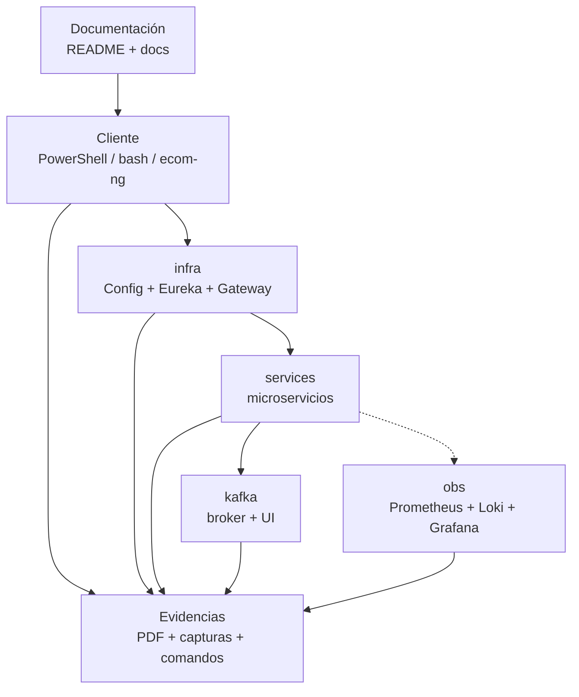
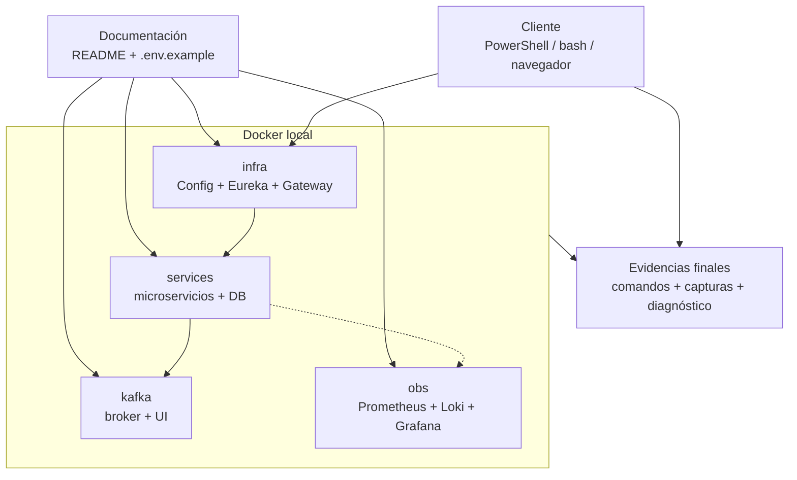

# S14 - Revisión técnica y estabilización del producto

## 1. Introducción

Tiempo: 20 min.

### 1.1 Propósito

Cerrar brechas técnicas, ordenar documentación y asegurar que el producto sea reproducible por el docente.

### 1.2 Resultado de aprendizaje

El estudiante estabiliza el producto, corrige fallos, documenta ejecución y prepara defensa técnica.

### 1.3 Producto de sesión

Producto documentado, reproducible, depurado y con evidencias organizadas para defensa.

### 1.4 Motivacion de la sesión

Un producto final no solo debe funcionar en la maquina del equipo. Debe poder levantarse, probarse, diagnosticarse y explicarse con documentos claros.

### 1.5 Ubicación en el curso

- Unidad: U3 - Validación y consolidación del producto del curso.
- Producto de unidad: producto final del curso validado, documentado, estabilizado y defendido.
- Avance del producto en esta sesión: estabilización final antes de defensa.

## 2. Explica

Tiempo: 15 min.

### 2.1 Conceptos clave

- Reproducibilidad.
- Documentación técnica.
- Checklist operativo.
- Incidencias.
- Guion de defensa.

### 2.2 Arquitectura del producto en `ecom`

Revisar que la documentación explique como levantar e integrar el producto completo.

#### 2.2.1 Revisión técnica en DEV



#### 2.2.2 Revisión técnica en PROD local



### 2.3 Observabilidad y diagnóstico

La revisión debe incluir al menos un caso de fallo documentado y su ruta de diagnóstico.

## 3. Aplica: actividad práctica guiada

Tiempo: 3h.

En el laboratorio, el docente guía una revisión técnica final. El equipo no solo demuestra que funciona: deja el producto ordenado, reproducible y defendible.

### 3.1 Preparar checklist de estabilización

Producto del paso: lista de verificación acordada por equipo.

Checklist mínimo:

- README principal.
- README por módulo.
- `.env.example`.
- Comandos DEV.
- Comandos PROD local.
- Health por componente.
- Flujo end-to-end.
- Evidencias por integrante.

### 3.2 Revisar README principal y por módulo

Verificar que los comandos funcionen en DEV y PROD local cuando aplique.

Producto del paso: documentación alineada al código real.

### 3.3 Revisar variables y perfiles

Confirmar `.env.example`, perfiles `dev/prod`, puertos, health y rutas.

Producto del paso: configuración externa comprensible y sin secretos innecesarios.

### 3.4 Validar comandos DEV

Producto del paso: el sistema se puede levantar desde consola en desarrollo.

Probar, como mínimo:

- Config Server.
- Eureka.
- Gateway.
- Dos microservicios.
- Kafka u observabilidad si participan en el flujo.

### 3.5 Validar comandos PROD local

Producto del paso: el sistema se puede levantar con Docker Compose.

Probar:

```bash
cd infra
docker compose up -d --build
```

Luego levantar los módulos necesarios y verificar health.

### 3.6 Ejecutar prueba principal

Repetir el flujo end-to-end principal y registrar incidencias.

Producto del paso: flujo funcional y reproducible.

### 3.7 Registrar incidencias técnicas

Producto del paso: errores descritos con causa probable y decisión tomada.

Usar formato:

```text
Incidencia:
Causa probable:
Evidencia:
Accion aplicada:
Resultado:
```

### 3.8 Corregir fallos prioritarios

Priorizar fallos que bloquean ejecución, evidencia o defensa.

Producto del paso: producto estabilizado para la defensa.

### 3.9 Revisar observabilidad mínima

Producto del paso: diagnóstico básico disponible.

Verificar:

- Health de Gateway.
- Logs de un microservicio.
- Una métrica o panel.
- Un correlation id si aplica.

### 3.10 Revisar seguridad

Producto del paso: rutas protegidas y publicas verificadas.

Probar:

- Login correcto.
- Ruta protegida con token.
- Ruta protegida sin token.

### 3.11 Revisar mensajería y consistencia

Producto del paso: topics, eventos y estados finales coherentes.

Verificar:

- `orden-eventos`.
- `pago-eventos`.
- Estado final de orden.
- Registro de pago.

### 3.12 Preparar guion de defensa

Asignar a cada integrante:

- Componente.
- Evidencia.
- Pregunta probable.
- Riesgo técnico.

### 3.13 Preparar evidencias individuales

Producto del paso: cada estudiante tiene evidencia propia.

Cada integrante debe tener:

- Captura o comando de su aporte.
- Explicación breve.
- Link de GitHub.
- Riesgo o aprendizaje técnico.

### 3.14 Validar repositorio GitHub

Producto del paso: trabajo versionado y revisable.

Verificar:

- Rama o tag usado.
- Commits del equipo.
- README actualizado.
- Archivos generados no necesarios fuera del repo.

### 3.15 Ejecutar simulacro breve de defensa

Producto del paso: cada integrante responde al menos una pregunta técnica.

El docente puede seleccionar integrantes al azar y pedir evidencia directa.

### 3.16 Cerrar pendientes

Producto del paso: lista corta de pendientes o confirmación de cierre.

Clasificar:

- Bloqueante.
- Importante pero no bloqueante.
- Mejora futura.

### 3.17 Ruta alternativa: clonar y ejecutar a partir del tag final de la sesión

```bash
git clone --branch vs14-estabilizacion-final https://github.com/261dist/ecom.git ecom-s14
cd ecom-s14
```

## 4. Crea: actividad autónoma

Tiempo: 4h fuera del aula.

Esta actividad autónoma se desarrolla sobre el proyecto de fin de curso del equipo. El producto de la unidad se construye por acumulacion de los avances de cada sesión; por eso, la evidencia de esta sesión debe incorporarse a la documentación del proyecto y quedar trazable en GitHub.

### 4.1 Plantilla de evidencia individual

Entrega un PDF:

El PDF de esta sesión debe generarse como impresion o exportacion de la sección correspondiente en MkDocs o una herramienta equivalente. No se acepta un PDF armado manualmente fuera de la documentación del proyecto.

```text
S14_Equipo##_ApellidoNombre.pdf
```

#### 4.1.1 Datos del estudiante

- Nombre:
- Equipo:
- Sesión: S14 - Revisión técnica y estabilización del producto
- Rol o aporte realizado:
- Link de GitHub:

#### 4.1.2 Trabajo autónomo realizado

1. Corregir una incidencia o mejorar documentación.
2. Validar comandos reales.
3. Preparar evidencia final.
4. Ensayar defensa individual.
5. Registrar riesgo técnico pendiente, si existe.

### 4.2 Criterios mínimos de aceptación

- PDF con nombre correcto.
- Evidencia de estabilización o documentación.
- Comandos validados.
- Aporte individual verificable.
- Defensa preparada.

## 5. Cierre evaluativo

Tiempo: 20 min.

### 5.1 Resultados esperados

- README y evidencias ordenadas.
- Producto reproducible.
- Incidencias prioritarias cerradas.
- Defensa preparada por integrante.

### 5.2 Evidencia del producto de sesión

Entrega individual:

```text
S14_Equipo##_ApellidoNombre.pdf
```

### 5.3 Preguntas de defensa y reflexión

1. Qué cambio técnico estabilizaste?
2. Cómo sabe el docente que el proyecto es reproducible?
3. Qué evidencia individual presentaras?
4. Qué riesgo técnico queda y cómo lo mitigarias?

### 5.4 Rúbrica de evaluación

| Dimensión | Peso | 3 - Logro destacado | 2 - Logro | 1 - Proceso | 0 - Inicio | Puntuación obtenida |
|---|---:|---|---|---|---|---:|
| 1. Reproducibilidad | 2 | Comandos probados y documentados claramente. | Comandos principales validados. | Validación parcial. | No evidencia reproducibilidad. | |
| 2. Documentación | 2 | README completo y alineado al código. | README suficiente. | Documentación incompleta. | No evidencia documentación. | |
| 3. Corrección de incidencias | 2 | Incidencias cerradas con evidencia. | Incidencias principales atendidas. | Corrección parcial. | No corrige incidencias. | |
| 4. Preparación de defensa | 2 | Guion y evidencias por integrante claros. | Defensa preparada. | Preparación parcial. | No evidencia preparación. | |
| 5. Aporte individual | 1 | Aporte claro y verificable. | Aporte identificable. | Aporte general. | No se identifica aporte. | |
| 6. Orden y reflexión | 1 | PDF ordenado y reflexión técnica clara. | Evidencia suficiente. | Evidencia poco clara. | PDF insuficiente. | |

Puntuación acumulada = suma de (`Peso` * `Puntuacion obtenida`) = ____.

Nota final = (`Puntuacion acumulada` / 30) * 20 = ____.

Para usar la rúbrica con IA, solicita:

```text
Evalúa el PDF usando la rúbrica de la sesión.
Para cada dimensión selecciona la puntuación obtenida usando la escala Inicio=0, Proceso=1, Logro=2, Logro destacado=3.
Justifica brevemente cada puntuación.
Calcula la puntuación acumulada con la fórmula: suma de (Peso * Puntuación obtenida).
Calcula la nota final sobre 20 con la fórmula: (Puntuación acumulada / 30) * 20.
Indica 2 fortalezas y 2 recomendaciones.
```
