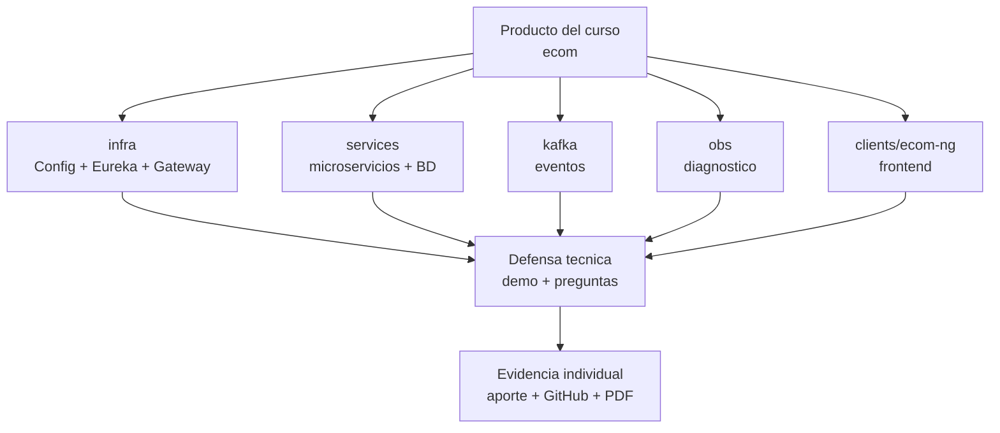

# S15 - Defensa tecnica

## 1. Introduccion

Tiempo: 20 min.

### 1.1 Proposito

Sustentar tecnicamente el producto del curso, las decisiones tomadas, las evidencias obtenidas y el aporte individual de cada integrante.

### 1.2 Resultado de aprendizaje

El estudiante explica, demuestra y defiende su contribucion dentro de un sistema distribuido completo.

### 1.3 Producto de sesion

Defensa tecnica grupal del producto del curso con nota individual.

### 1.4 Motivacion de la sesion

Defender un sistema distribuido exige demostrar arquitectura, flujos, fallos, diagnostico, datos y decisiones tecnicas. No basta con ejecutar una demo.

### 1.5 Ubicacion en el curso

- Unidad: U3 - Validacion y consolidacion del producto del curso.
- Producto de unidad: producto final del curso validado, documentado, estabilizado y defendido.
- Avance del producto en esta sesion: sustentacion grupal del producto con evaluacion individual.

## 2. Explica

Tiempo: 15 min.

### 2.1 Conceptos clave

- Defensa tecnica.
- Evidencia individual.
- Demo reproducible.
- Diagnostico en vivo.
- Argumentacion de decisiones.

### 2.2 Arquitectura del producto en `ecom`

El equipo presenta la arquitectura final del producto, sus componentes, relaciones y decisiones tecnicas.



### 2.3 Observabilidad y diagnostico

Durante la defensa se puede solicitar diagnosticar un fallo, revisar logs, consultar BD, revisar eventos o explicar una metrica.

## 3. Aplica: actividad practica guiada

Tiempo: 3h.

### 3.1 Presentar arquitectura

El equipo explica componentes, responsabilidades y relaciones.

### 3.2 Ejecutar demo end-to-end

La demo debe mostrar un flujo completo y evidencia verificable.

### 3.3 Sustentar decisiones

Cada integrante explica una decision tecnica relacionada con su aporte.

### 3.4 Responder preguntas individuales

El docente realiza preguntas por integrante.

### 3.5 Diagnosticar variacion o fallo

El docente puede solicitar una variacion de la demo o diagnostico de un fallo.

## 4. Crea: actividad autonoma

Tiempo: 4h fuera del aula.

### 4.1 Plantilla de evidencia individual

Entrega un PDF:

```text
S15_Equipo##_ApellidoNombre.pdf
```

#### 4.1.1 Datos del estudiante

- Nombre:
- Equipo:
- Sesion: S15 - Defensa tecnica
- Rol o aporte realizado:
- Link de GitHub:

#### 4.1.2 Trabajo autonomo realizado

1. Preparar defensa individual.
2. Ordenar evidencias personales.
3. Ensayar explicacion tecnica.
4. Preparar respuesta a fallos.
5. Registrar mejoras pendientes.

### 4.2 Criterios minimos de aceptacion

- PDF con nombre correcto.
- Evidencia de aporte individual.
- Arquitectura o flujo relacionado con su aporte.
- Evidencia tecnica verificable.
- Reflexion o mejora propuesta.

## 5. Cierre evaluativo

Tiempo: 20 min.

### 5.1 Resultados esperados

- Producto defendido.
- Demo ejecutada.
- Evidencias revisadas.
- Cada integrante evaluado individualmente.

### 5.2 Evidencia del producto de sesion

Entrega individual:

```text
S15_Equipo##_ApellidoNombre.pdf
```

### 5.3 Preguntas de defensa y reflexion

1. Que componente construiste o configuraste?
2. Como se comunica tu parte con el resto?
3. Que fallo puede ocurrir y como lo diagnosticas?
4. Que mejorarias si tuvieras una iteracion mas?

### 5.4 Rubrica de evaluacion

| Dimension | Peso | 3 - Logro destacado | 2 - Logro | 1 - Proceso | 0 - Inicio | Puntuacion obtenida |
|---|---:|---|---|---|---|---:|
| 1. Dominio tecnico | 2 | Explica con precision arquitectura y decisiones. | Explica adecuadamente. | Explica parcialmente. | No demuestra dominio. | |
| 2. Demo y evidencia | 2 | Demo reproducible y evidencias completas. | Demo funcional. | Demo parcial. | No evidencia demo. | |
| 3. Diagnostico | 2 | Diagnostica fallos con criterio tecnico. | Explica diagnostico basico. | Diagnostico parcial. | No diagnostica. | |
| 4. Aporte individual | 2 | Aporte claro, verificable y defendido. | Aporte identificable. | Aporte general. | No se identifica aporte. | |
| 5. Comunicacion | 1 | Sustenta con claridad y orden. | Sustenta adecuadamente. | Sustenta parcialmente. | No sustenta. | |
| 6. Reflexion y mejora | 1 | Propone mejoras tecnicas pertinentes. | Propone mejora general. | Reflexion superficial. | No reflexiona. | |

Puntuacion acumulada = suma de (`Peso` * `Puntuacion obtenida`) = ____.

Nota final = (`Puntuacion acumulada` / 30) * 20 = ____.

Para usar la rubrica con IA, solicita:

```text
Evalua el PDF usando la rubrica de la sesion.
Para cada dimension selecciona la puntuacion obtenida usando la escala Inicio=0, Proceso=1, Logro=2, Logro destacado=3.
Justifica brevemente cada puntuacion.
Calcula la puntuacion acumulada con la formula: suma de (Peso * Puntuacion obtenida).
Calcula la nota final sobre 20 con la formula: (Puntuacion acumulada / 30) * 20.
Indica 2 fortalezas y 2 recomendaciones.
```
