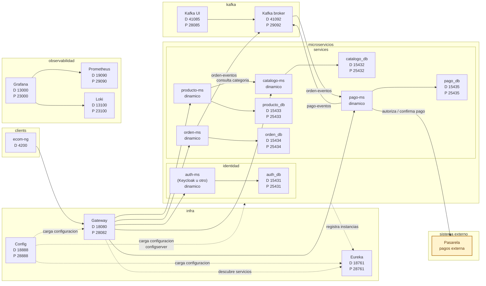

# S15 - Defensa tecnica

## 1. Instrucciones iniciales

Tiempo: 5 min.

### 1.1 Proposito

Sustentar tecnicamente el producto del curso, las decisiones tomadas, las evidencias obtenidas y el aporte individual de cada integrante.

### 1.2 Resultado de aprendizaje

El estudiante explica, demuestra y defiende su contribucion dentro de un sistema distribuido completo.

### 1.3 Producto de sesion

Defensa tecnica grupal del producto del curso con nota individual.

### 1.4 Preguntas del docente durante la sustentacion

Defender un sistema distribuido exige demostrar arquitectura, flujos, fallos, diagnostico, datos y decisiones tecnicas. No basta con ejecutar una demo.

Preguntas que el docente puede realizar a cada estudiante:

1. Que parte del producto desarrollaste y como se integra con el sistema?
2. Que evidencia demuestra que tu aporte funciona?
3. Como diagnosticarias un fallo relacionado con tu componente?

### 1.5 Ubicacion en el curso

- Unidad: U3 - Validacion y consolidacion del producto del curso.
- Producto de unidad: producto final del curso validado, documentado, estabilizado y defendido.
- Avance del producto en esta sesion: sustentacion grupal del producto con evaluacion individual.

## 2. Encuadre de la evaluacion

Tiempo: 10 min.

El docente presenta brevemente la arquitectura del producto del curso, recuerda la distribucion del tiempo y pasa directamente a las exposiciones.

### 2.1 Arquitectura ecom v2026

La arquitectura de referencia para la defensa del producto U3 es la misma arquitectura integral definida en el `index.md`. El equipo debe presentar los componentes que implemento, sus relaciones y el flujo end-to-end. Si realizo adaptaciones para su proyecto, debe reflejarlas en su propio diagrama y justificar tecnicamente cada diferencia.



Las flechas continuas representan interacciones de negocio o consultas directas. Las flechas punteadas representan dependencias de infraestructura, configuracion o descubrimiento.

### 2.2 Tiempo de exposicion por equipo

Cada equipo dispone de hasta 18 minutos:

- 10 minutos de exposicion del producto final.
- 5 minutos de demo tecnica.
- 3 minutos de preguntas del docente a los integrantes del equipo.

## 3. Presentacion y sustentacion del producto

Tiempo: 3h 45 min para la ronda de evaluacion de equipos.

En esta sesion se realiza la defensa tecnica del producto final. Cada equipo dispone de hasta 18 minutos para presentar su producto, ejecutar la demo y responder preguntas. La rubrica se aplica al cierre de la exposicion de cada equipo.

### 3.1 Plantilla de entrega

La defensa tecnica requiere tres entregables grupales:

1. Documentacion en MkDocs o una herramienta equivalente, organizada por unidad y sesion, con guias reproducibles.
2. PDF grupal generado como impresion o exportacion directa de la documentacion y subido a la plataforma BLearning (BL).
3. Presentacion final clara del proyecto (PPT o equivalente) subida a BL.

El PDF debe generarse como impresion o exportacion directa del sitio de documentacion. No se acepta un PDF armado manualmente fuera de la documentacion del proyecto.

```text
S15_Equipo##_U3_Docs.pdf
```

La presentacion final debe entregarse con el nombre:

```text
ProductoCurso_Equipo##_Presentacion.pdf
```

La documentacion debe estar en el repositorio GitHub y publicarse como sitio navegable, por ejemplo en GitHub Pages (`github.io`) u otra plataforma equivalente. El `index` debe incluir el enlace del sitio publicado.

#### 3.1.1 Datos del equipo

- Equipo:
- Sesion: S15 - Defensa tecnica del producto U3
- Proyecto:
- Link de GitHub:
- Link de documentacion:
- Rama integrada evaluada:
- Evidencia de integracion o merge:
- Integrantes:
- Anexos individuales incluidos:

#### 3.1.2 Evidencia tecnica del producto final

- Producto del curso integrado y ejecutable.
- Arquitectura final y flujo end-to-end.
- Seguridad, comunicacion sincronica, eventos y consistencia.
- Observabilidad y diagnostico.
- Frontend integrado mediante Gateway.
- Evidencia de integracion de los aportes de todos los integrantes.

#### 3.1.3 Presentacion final del proyecto

La presentacion debe incluir:

- Nombre del proyecto y equipo.
- Problema o flujo de negocio implementado.
- Arquitectura final del producto.
- Flujo end-to-end.
- Seguridad, eventos, consistencia y observabilidad.
- Integracion frontend.
- Evidencias principales.
- Aporte individual de cada integrante.
- Evidencia de participacion individual en GitHub.
- Demo asignada a cada integrante.
- Riesgos, incidencias y mejoras futuras.

#### 3.1.4 Documentacion en MkDocs o herramienta equivalente

La documentacion debe seguir una estructura ordenada por unidad, sesion y anexos. Cada sesion documenta la evolucion del proyecto final e integra los aportes realizados por el equipo:

- U1: artefactos de S01 a S05.
- U2: artefactos de S06 a S12.
- U3: validacion, estabilizacion y defensa tecnica de S13 a S15.
- Anexos: evidencia de participacion individual, un anexo por integrante.

Cada guia debe contener comandos, orden de arranque, puertos, variables de entorno, rutas, datos de prueba, evidencias esperadas, errores frecuentes y criterios de verificacion.

Cada anexo individual debe contener:

- Nombre del integrante.
- Rol o responsabilidad.
- Rama de trabajo, commits, merges o pull requests de codigo.
- Rama de trabajo, commits, merges o pull requests de documentacion.
- Evidencia breve de la parte que demostrará en vivo.
- Evidencia de que su aporte quedo integrado en la rama comun del equipo.

### 3.2 Secuencia sugerida de presentacion

1. Presentar el nombre del proyecto, el equipo y el repositorio GitHub.
2. Explicar el problema o flujo de negocio implementado.
3. Explicar la arquitectura final usando el diagrama del producto.
4. Ejecutar la demo end-to-end.
5. Mostrar seguridad, comunicacion, eventos, consistencia y observabilidad.
6. Mostrar la integracion frontend y la documentacion reproducible.
7. Mostrar la integracion y participacion de cada integrante en GitHub.
8. Cada integrante demuestra la parte que trabajó.
9. Cerrar con riesgos, incidencias y decisiones tecnicas.

### 3.3 Criterios minimos de aceptacion

- PDF grupal generado desde la documentacion y subido a BL con el nombre correcto.
- Presentacion final clara (PPT o equivalente) subida a BL.
- Documentacion publicada como sitio navegable, por ejemplo en GitHub Pages (`github.io`) o equivalente.
- Producto final integrado y ejecutable desde una rama comun.
- Arquitectura y flujo end-to-end demostrados.
- Seguridad, eventos, consistencia y observabilidad demostrados.
- Productos de sesion y unidad de todos los integrantes integrados.
- Evidencia de merge, integracion o resolucion de conflictos cuando corresponda.
- Un anexo de participacion individual por integrante.
- GitHub evidencia aportes de codigo y documentacion.
- Cada integrante demuestra en vivo la parte que trabajó.

## 4. Retroalimentacion posterior

Tiempo: 4h fuera del aula.

### 4.1 Mejoras y recomendaciones

Las mejoras indicadas despues de la evaluacion no forman parte de la calificacion de S15. Sirven para fortalecer el portafolio y, cuando corresponda, preparar la demostracion individual de competencias pendientes en S16.

1. Corregir las observaciones detectadas durante la defensa.
2. Completar o ajustar la documentacion del producto.
3. Mejorar las evidencias individuales incompletas.
4. Registrar en GitHub los cambios posteriores a la evaluacion.
5. Preparar la competencia pendiente que deba demostrarse en S16.

## 5. Rubrica de evaluacion

La rubrica evalua el entregable grupal, la sustentacion del producto y la demostracion individual realizada durante S15. Se aplica al cierre de los 18 minutos asignados a cada equipo.

| Dimension | Peso | 3 - Logro destacado | 2 - Logro | 1 - Proceso | 0 - Inicio | Puntuacion obtenida |
|---|---:|---|---|---|---|---:|
| 1. Integracion del producto U3 | 2 | Integra los productos de U1, U2 y U3 y los aportes de todos los integrantes en el producto final funcionando end-to-end. | Integra los componentes principales del producto final. | La integracion de unidades, componentes o aportes es parcial. | No evidencia integracion del producto final. | |
| 2. Funcionamiento tecnico U3 | 2 | Demuestra el flujo end-to-end con infraestructura, servicios, seguridad, eventos, consistencia, observabilidad, frontend y sistema externo. | Demuestra el funcionamiento de los componentes principales del producto final. | El funcionamiento es parcial o presenta fallos relevantes. | No demuestra el funcionamiento del producto final. | |
| 3. Pruebas, evidencia y diagnostico | 2 | Ejecuta una demo reproducible, presenta evidencia integral y diagnostica fallos mediante datos, logs, metricas, eventos o trazas. | Presenta pruebas y evidencia suficientes, y explica la causa probable de un fallo. | Las pruebas, evidencias o el diagnostico son incompletos. | No presenta evidencia verificable ni diagnostica. | |
| 4. Aporte individual, GitHub y demo | 2 | El aporte individual de codigo y documentacion es verificable en GitHub y anexos, esta integrado en la rama comun y se demuestra en vivo con autonomia. | El aporte es identificable, esta integrado y se demuestra adecuadamente. | El aporte es poco trazable, no esta claramente integrado o la demo es parcial. | No se identifica ni demuestra el aporte individual. | |
| 5. Defensa tecnica | 1 | Explica la arquitectura y las decisiones, y responde con precision, autonomia y criterio tecnico. | Explica las decisiones principales y responde adecuadamente. | Responde parcialmente o con escaso sustento tecnico. | No sustenta su trabajo. | |
| 6. Presentacion, documentacion y reproducibilidad | 1 | Presentacion final clara; sitio y PDF ordenados por unidad y sesion, con guias reproducibles, enlace en el index y anexos individuales completos. | La presentacion y la documentacion permiten comprender y reproducir el flujo end-to-end. | La presentacion es poco clara o la documentacion es incompleta y poco reproducible. | No presenta documentacion o presentacion suficiente. | |

Puntuacion acumulada = suma de (`Peso` * `Puntuacion obtenida`) = ____.

Nota final = (`Puntuacion acumulada` / 30) * 20 = ____.

Para usar la rubrica con IA, solicita:

```text
Evalua el PDF, la presentacion, la documentacion, la participacion en GitHub y la demo individual usando la rubrica de la sesion.
Para cada dimension selecciona la puntuacion obtenida usando la escala Inicio=0, Proceso=1, Logro=2, Logro destacado=3.
Justifica brevemente cada puntuacion.
Calcula la puntuacion acumulada con la formula: suma de (Peso * Puntuacion obtenida).
Calcula la nota final sobre 20 con la formula: (Puntuacion acumulada / 30) * 20.
Indica 2 fortalezas y 2 recomendaciones.
```
