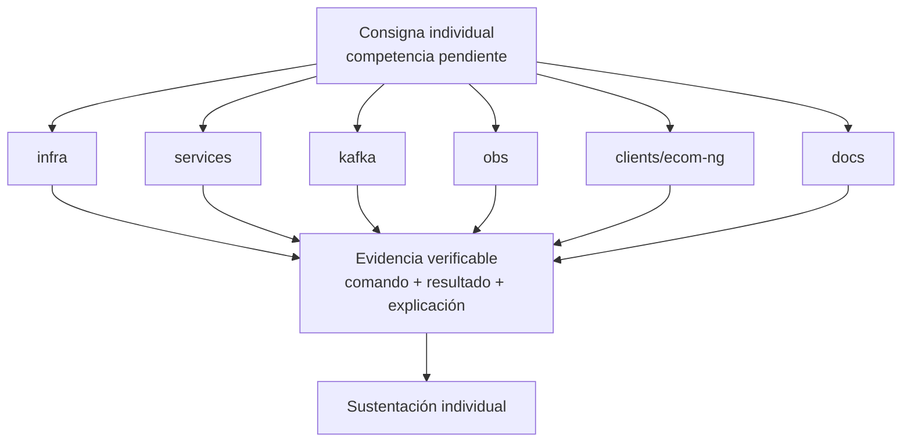

# S16 - Evaluación final

## 1. Instrucciones iniciales

Tiempo: 5 min.

### 1.1 Propósito

Brindar una instancia final para que estudiantes con competencias pendientes demuestren logro técnico de forma individual.

### 1.2 Resultado de aprendizaje

El estudiante demuestra que puede implementar, ejecutar, diagnosticar o defender una parte crítica del sistema sin depender del grupo.

### 1.3 Producto de sesión

Evidencia individual de logro de competencias pendientes.

### 1.4 Preguntas del docente durante la sustentación

La competencia profesional se demuestra cuando el estudiante puede operar, explicar y defender una parte del sistema bajo condiciones controladas.

Preguntas que el docente puede realizar a cada estudiante:

1. Qué competencia estas demostrando?
2. Qué comando ejecutaste y por qué?
3. Qué evidencia confirma el resultado?
4. Cómo corregirias el fallo presentado?
5. Qué aprendiste respecto a tu aporte en el sistema?

### 1.5 Ubicación en el curso

- Unidad: U3 - Validación y consolidación del producto del curso.
- Producto de unidad: producto final del curso validado, documentado, estabilizado y defendido.
- Avance del producto en esta sesión: demostración individual de competencias pendientes.

## 2. Encuadre de la evaluación

Tiempo: 10 min.

El docente presenta brevemente la arquitectura del producto del curso, comunica las consignas y el orden de participación, y pasa directamente a las demostraciones individuales.

### 2.1 Arquitectura del producto del curso

La consigna puede tomar cualquier componente del producto:

- `infra`.
- `services`.
- `kafka`.
- `obs`.
- `clients/ecom-ng`.
- `docs`.



### 2.2 Tiempo de evaluación

El tiempo de cada demostración se asigna según la cantidad de estudiantes convocados y la naturaleza de la competencia pendiente. No se realiza una nueva exposición grupal.

## 3. Demostración individual de competencias pendientes

Tiempo: 3h 45 min para la ronda de evaluación individual.

S16 no repite la defensa grupal ni exige una nueva entrega completa del producto U3. Participan los estudiantes que deben demostrar competencias pendientes de acuerdo con los resultados obtenidos en S15. El tiempo individual se distribuye según la cantidad de estudiantes convocados y las competencias que deban demostrar.

### 3.1 Evidencia para la evaluación

La evaluación final utiliza el producto integrado, la documentación y la presentación entregados en S15. No se solicita una segunda entrega grupal.

El archivo grupal del producto U3 corresponde a S15:

```text
S15_Equipo##_U3_Docs.pdf
```

En S16 el estudiante presenta directamente la evidencia y la demo de la competencia pendiente que le fue comunicada por el docente. Las correcciones realizadas después de S15 deben quedar trazables en GitHub y, cuando corresponda, en el anexo individual de la documentación.

#### 3.1.1 Datos del estudiante

- Nombre:
- Equipo:
- Sesión: S16 - Evaluación final de competencias pendientes
- Proyecto:
- Competencia pendiente:
- Consigna asignada:
- Link de GitHub:
- Link de documentación:
- Rama, commit o pull request de la corrección:

#### 3.1.2 Evidencia técnica individual

- Competencia demostrada.
- Consigna o parte del sistema trabajada.
- Comandos o acciones ejecutadas.
- Resultado verificable.
- Diagnóstico o explicación técnica.
- Evidencia de la corrección en GitHub, cuando corresponda.

### 3.2 Secuencia de demostración individual

1. Identificar la competencia pendiente.
2. Explicar brevemente el componente o flujo involucrado.
3. Ejecutar la consigna asignada.
4. Mostrar un resultado verificable.
5. Diagnosticar el fallo o justificar la decisión técnica solicitada.
6. Responder las preguntas del docente.

### 3.3 Criterios mínimos de aceptación

- Competencia identificada.
- Consigna ejecutada individualmente.
- Evidencia verificable.
- Diagnóstico o explicación técnica.
- Corrección trazable en GitHub cuando corresponda.
- Respuestas individuales a las preguntas del docente.

## 4. Retroalimentacion posterior

Tiempo: 4h fuera del aula.

### 4.1 Mejoras y recomendaciones finales

Después de la evaluación, cada estudiante debe implementar las mejoras y recomendaciones recibidas. Esta actividad no forma parte de la calificación de la evaluación final; sirve como cierre técnico y mejora del portafolio del curso.

Trabajo autónomo:

1. Corregir observaciones detectadas en la exposición.
2. Completar o ajustar la documentación del producto del curso.
3. Mejorar evidencias individuales incompletas.
4. Registrar en GitHub los cambios posteriores a la evaluación.
5. Preparar una breve reflexión técnica sobre la mejora aplicada.

## 5. Rúbrica de evaluación

La rúbrica evalúa exclusivamente la demostración individual de las competencias pendientes.

| Dimensión | Peso | 3 - Logro destacado | 2 - Logro | 1 - Proceso | 0 - Inicio | Puntuación obtenida |
|---|---:|---|---|---|---|---:|
| 1. Ejecución técnica | 2 | Ejecuta la consigna correctamente y explica cada paso. | Ejecuta la consigna principal. | Ejecución parcial. | No ejecuta la consigna. | |
| 2. Diagnóstico | 2 | Diagnostica síntomas, causa y solución. | Explica causa probable. | Diagnóstico parcial. | No diagnostica. | |
| 3. Evidencia verificable | 2 | Presenta evidencia clara, reproducible y suficiente. | Evidencia suficiente. | Evidencia incompleta. | No presenta evidencia. | |
| 4. Sustentación individual y demo de aporte | 2 | Responde con autonomía, criterio técnico y demuestra en vivo la parte que trabajó. | Responde y demuestra su parte adecuadamente. | Responde o demuestra parcialmente. | No sustenta. | |
| 5. Reflexión técnica | 1 | Explica aprendizajes, límites y decisiones técnicas con claridad. | Explica aprendizajes o decisiones principales. | Reflexión poco clara. | No reflexiona. | |
| 6. Orden y trazabilidad | 1 | Presenta evidencia ordenada y la corrección queda claramente trazable en GitHub. | La evidencia y la trazabilidad son suficientes. | La evidencia es poco clara o la trazabilidad es incompleta. | No presenta evidencia suficiente. | |

Puntuación acumulada = suma de (`Peso` * `Puntuacion obtenida`) = ____.

Nota final = (`Puntuacion acumulada` / 30) * 20 = ____.

Para usar la rúbrica con IA, solicita:

```text
Evalúa la demostración individual, la evidencia técnica y la trazabilidad en GitHub usando la rúbrica de la sesión.
Para cada dimensión selecciona la puntuación obtenida usando la escala Inicio=0, Proceso=1, Logro=2, Logro destacado=3.
Justifica brevemente cada puntuación.
Calcula la puntuación acumulada con la fórmula: suma de (Peso * Puntuación obtenida).
Calcula la nota final sobre 20 con la fórmula: (Puntuación acumulada / 30) * 20.
Indica 2 fortalezas y 2 recomendaciones.
```
