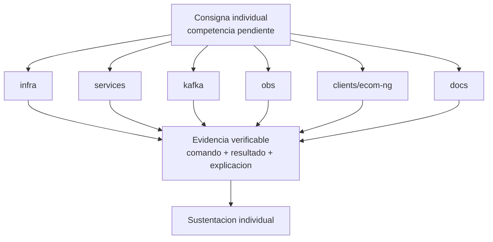

# S16 - Evaluacion final

## 1. Instrucciones iniciales

Tiempo: 5 min.

### 1.1 Proposito

Brindar una instancia final para que estudiantes con competencias pendientes demuestren logro tecnico de forma individual.

### 1.2 Resultado de aprendizaje

El estudiante demuestra que puede implementar, ejecutar, diagnosticar o defender una parte critica del sistema sin depender del grupo.

### 1.3 Producto de sesion

Evidencia individual de logro de competencias pendientes.

### 1.4 Preguntas del docente durante la sustentacion

La competencia profesional se demuestra cuando el estudiante puede operar, explicar y defender una parte del sistema bajo condiciones controladas.

Preguntas que el docente puede realizar a cada estudiante:

1. Que competencia estas demostrando?
2. Que comando ejecutaste y por que?
3. Que evidencia confirma el resultado?
4. Como corregirias el fallo presentado?
5. Que aprendiste respecto a tu aporte en el sistema?

### 1.5 Ubicacion en el curso

- Unidad: U3 - Validacion y consolidacion del producto del curso.
- Producto de unidad: producto final del curso validado, documentado, estabilizado y defendido.
- Avance del producto en esta sesion: demostracion individual de competencias pendientes.

## 2. Encuadre de la evaluacion

Tiempo: 10 min.

El docente presenta brevemente la arquitectura del producto del curso, recuerda la distribucion de tiempo por equipo y pasa directamente a las exposiciones.

### 2.1 Arquitectura del producto del curso

La consigna puede tomar cualquier componente del producto:

- `infra`.
- `services`.
- `kafka`.
- `obs`.
- `clients/ecom-ng`.
- `docs`.



### 2.2 Tiempo de exposicion por equipo

Cada grupo dispone de hasta 18 minutos:

- 10 minutos de exposicion del proyecto final.
- 5 minutos de demo tecnica.
- 3 minutos de preguntas del docente a integrantes del equipo.

## 3. Presentacion y sustentacion del producto

Tiempo: 3h 45 min para la ronda de evaluacion de equipos.

En esta sesion se realiza la exposicion y evaluacion final. Cada equipo dispone de hasta 18 minutos para presentar el producto del curso, mostrar la demo y responder preguntas. La rubrica se aplica al cierre de la exposicion de cada equipo.

### 3.1 Plantilla de entrega

La evaluacion final requiere tres entregables:

1. Documentacion MkDocs del producto final del curso, organizada por unidad/sesion y con guias reproducibles.
2. PDF grupal de la evaluacion generado como impresion o exportacion de la documentacion MkDocs y subido a la plataforma BLearning (BL).
3. Presentacion final del proyecto (PPT o equivalente) subida a BL.

El link de la documentacion MkDocs debe aparecer en el `index` del PDF. La documentacion no presenta productos aislados de sesion: organiza el producto final del curso por unidad y sesion para evidenciar la evolucion del proyecto. Para el producto final, el equipo debe juntar e integrar los productos de sesion y de unidad desarrollados por todos los integrantes en una rama comun del equipo. No basta con mostrar ramas o PR separados: debe evidenciarse el merge o integracion, la resolucion de conflictos si aplica y la ejecucion del sistema integrado. Ademas, el repositorio GitHub debe evidenciar el aporte o participacion individual de cada integrante mediante commits, ramas, merges o pull requests de codigo y documentacion. Esa evidencia debe incluirse tambien en MkDocs como anexos, un anexo por integrante, para que al imprimir o exportar el sitio se genere un PDF ordenado. Cada integrante debe mostrar una demo de la parte que trabajó.

El PDF de esta evaluacion debe ser la impresion o exportacion directa del sitio MkDocs. No se acepta un PDF armado manualmente fuera de la documentacion.

Entrega el PDF grupal:

```text
S16_Equipo##_U3_MkDocs.pdf
```

Entrega la presentacion final con el siguiente nombre:

```text
ProductoCurso_Equipo##_Presentacion.pdf
```

La documentacion MkDocs debe estar en el repositorio GitHub y publicada o ejecutable localmente con `mkdocs serve`.

#### 3.1.1 Datos del equipo

- Equipo:
- Sesion: S16 - Evaluacion final
- Proyecto:
- Link de GitHub:
- Link de MkDocs:
- Rama integrada evaluada:
- Evidencia de integracion o merge:
- Integrantes:
- Productos de sesion y unidad integrados por el equipo:
- Anexos individuales incluidos:

#### 3.1.2 Evidencia tecnica del producto final

- Competencia demostrada.
- Consigna o parte del sistema trabajada.
- Comandos o acciones ejecutadas.
- Resultado verificable.
- Diagnostico o explicacion tecnica.
- Producto final del curso integrado.

#### 3.1.3 Presentacion final del proyecto

La presentacion debe incluir:

- Nombre del proyecto y equipo.
- Problema o flujo de negocio implementado.
- Arquitectura final.
- Flujo end-to-end.
- Seguridad, eventos, consistencia y observabilidad.
- Ejecucion DEV y PROD local.
- Evidencias principales.
- Aporte individual de cada integrante.
- Evidencia de participacion individual de cada integrante en GitHub.
- Demo asignada a cada integrante.
- Riesgos, incidencias y mejoras futuras.

#### 3.1.4 Documentacion MkDocs del producto del curso

La documentacion debe seguir una estructura ordenada por unidad, sesion y anexos. Cada unidad y sesion documenta la evolucion del proyecto final y debe integrar los aportes realizados por los integrantes del equipo:

- U1: artefactos de S01 a S05.
- U2: artefactos de S06 a S12.
- U3: validacion end-to-end, estabilizacion, defensa y evaluacion final.
- Anexos: evidencia de participacion individual, un anexo por integrante.

Cada guia debe contener comandos, orden de arranque, puertos, variables de entorno, rutas, datos de prueba, evidencias esperadas, troubleshooting y criterios de verificacion. El `index` debe incluir el link de la documentacion MkDocs publicada o ejecutable.

Cada anexo individual debe contener:

- Nombre del integrante.
- Rol o responsabilidad.
- Rama de trabajo, commits, merges o PR de codigo.
- Rama de trabajo, commits, merges o PR de documentacion.
- Evidencia breve de la parte que demostrará en vivo.
- Evidencia de que su aporte quedo integrado en la rama comun del equipo.

### 3.2 Secuencia sugerida de presentacion

1. Presentar nombre del proyecto, equipo y repositorio GitHub.
2. Explicar el problema o flujo de negocio implementado.
3. Explicar la arquitectura final del producto.
4. Ejecutar la demo end-to-end.
5. Mostrar seguridad, eventos, consistencia y observabilidad.
6. Mostrar documentacion MkDocs y guia de reproduccion.
7. Mostrar participacion de cada integrante en GitHub.
8. Cada integrante muestra la parte que trabajó.
9. Cerrar con riesgos, incidencias y mejoras futuras.

### 3.3 Criterios minimos de aceptacion

- PDF grupal generado desde MkDocs y subido a BL con nombre correcto.
- Presentacion final del proyecto subida a BL.
- Documentacion MkDocs reproducible del producto del curso.
- Productos de sesion y unidad de todos los integrantes integrados en el producto final.
- Rama comun del equipo con aportes integrados y ejecutables.
- Evidencia de merge, integracion o resolucion de conflictos cuando aplique.
- MkDocs incluye anexos de participacion individual, uno por integrante.
- GitHub evidencia aporte individual de cada integrante mediante ramas, commits, merges o PR de codigo y documentacion.
- Cada integrante demuestra en vivo la parte que trabajó.
- Competencia identificada.
- Consigna ejecutada.
- Evidencia verificable.
- Sustentacion individual.

## 4. Retroalimentacion posterior

Tiempo: 4h fuera del aula.

### 4.1 Mejoras y recomendaciones finales

Despues de la evaluacion, cada estudiante debe implementar las mejoras y recomendaciones recibidas. Esta actividad no forma parte de la calificacion de la evaluacion final; sirve como cierre tecnico y mejora del portafolio del curso.

Trabajo autonomo:

1. Corregir observaciones detectadas en la exposicion.
2. Completar o ajustar la documentacion MkDocs del producto del curso.
3. Mejorar evidencias individuales incompletas.
4. Registrar en GitHub los cambios posteriores a la evaluacion.
5. Preparar una breve reflexion tecnica sobre la mejora aplicada.

## 5. Rubrica de evaluacion

La rubrica evalua el entregable y la sustentacion del producto final presentados durante la sesion.

| Dimension | Peso | 3 - Logro destacado | 2 - Logro | 1 - Proceso | 0 - Inicio | Puntuacion obtenida |
|---|---:|---|---|---|---|---:|
| 1. Ejecucion tecnica | 2 | Ejecuta la consigna correctamente y explica cada paso. | Ejecuta la consigna principal. | Ejecucion parcial. | No ejecuta la consigna. | |
| 2. Diagnostico | 2 | Diagnostica sintomas, causa y solucion. | Explica causa probable. | Diagnostico parcial. | No diagnostica. | |
| 3. Evidencia verificable | 2 | Presenta evidencia clara, reproducible y suficiente. | Evidencia suficiente. | Evidencia incompleta. | No presenta evidencia. | |
| 4. Sustentacion individual y demo de aporte | 2 | Responde con autonomia, criterio tecnico y demuestra en vivo la parte que trabajó. | Responde y demuestra su parte adecuadamente. | Responde o demuestra parcialmente. | No sustenta. | |
| 5. Reflexion tecnica | 1 | Explica aprendizajes, limites y decisiones tecnicas con claridad. | Explica aprendizajes o decisiones principales. | Reflexion poco clara. | No reflexiona. | |
| 6. Orden, presentacion, documentacion y GitHub | 1 | PDF grupal generado desde MkDocs con estructura por unidad/sesion y anexos por integrante, presentacion final clara, link MkDocs en el index y participacion verificable en GitHub. | Evidencia suficiente con presentacion, documentacion y GitHub. | Evidencia poco clara, documentacion incompleta o GitHub poco trazable. | Evidencia insuficiente. | |

Puntuacion acumulada = suma de (`Peso` * `Puntuacion obtenida`) = ____.

Nota final = (`Puntuacion acumulada` / 30) * 20 = ____.

Para usar la rubrica con IA, solicita:

```text
Evalua el PDF, la presentacion, la documentacion MkDocs, la participacion en GitHub y la demo individual usando la rubrica de la sesion.
Para cada dimension selecciona la puntuacion obtenida usando la escala Inicio=0, Proceso=1, Logro=2, Logro destacado=3.
Justifica brevemente cada puntuacion.
Calcula la puntuacion acumulada con la formula: suma de (Peso * Puntuacion obtenida).
Calcula la nota final sobre 20 con la formula: (Puntuacion acumulada / 30) * 20.
Indica 2 fortalezas y 2 recomendaciones.
```
