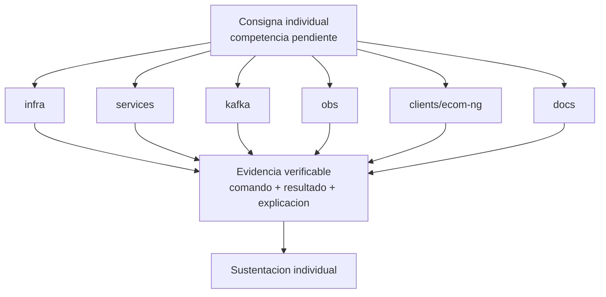

# S16 - Evaluacion final

## 1. Instrucciones iniciales

Tiempo: 5 min.

### 1.1 Proposito

Brindar una instancia final para que estudiantes con competencias pendientes demuestren logro tecnico de forma individual.

### 1.2 Resultado de aprendizaje

El estudiante demuestra que puede implementar, ejecutar, diagnosticar o defender una parte critica del sistema sin depender del grupo.

### 1.3 Producto de sesion

Evidencia individual de logro de competencias pendientes.

### 1.4 Preguntas del docente durante la sustentacion

La competencia profesional se demuestra cuando el estudiante puede operar, explicar y defender una parte del sistema bajo condiciones controladas.

Preguntas que el docente puede realizar a cada estudiante:

1. Que competencia estas demostrando?
2. Que comando ejecutaste y por que?
3. Que evidencia confirma el resultado?
4. Como corregirias el fallo presentado?
5. Que aprendiste respecto a tu aporte en el sistema?

### 1.5 Ubicacion en el curso

- Unidad: U3 - Validacion y consolidacion del producto del curso.
- Producto de unidad: producto final del curso validado, documentado, estabilizado y defendido.
- Avance del producto en esta sesion: demostracion individual de competencias pendientes.

## 2. Encuadre de la evaluacion

Tiempo: 10 min.

El docente presenta brevemente la arquitectura del producto del curso, comunica las consignas y el orden de participacion, y pasa directamente a las demostraciones individuales.

### 2.1 Arquitectura del producto del curso

La consigna puede tomar cualquier componente del producto:

- `infra`.
- `services`.
- `kafka`.
- `obs`.
- `clients/ecom-ng`.
- `docs`.



### 2.2 Tiempo de evaluacion

El tiempo de cada demostracion se asigna segun la cantidad de estudiantes convocados y la naturaleza de la competencia pendiente. No se realiza una nueva exposicion grupal.

## 3. Demostracion individual de competencias pendientes

Tiempo: 3h 45 min para la ronda de evaluacion individual.

S16 no repite la defensa grupal ni exige una nueva entrega completa del producto U3. Participan los estudiantes que deben demostrar competencias pendientes de acuerdo con los resultados obtenidos en S15. El tiempo individual se distribuye segun la cantidad de estudiantes convocados y las competencias que deban demostrar.

### 3.1 Evidencia para la evaluacion

La evaluacion final utiliza el producto integrado, la documentacion y la presentacion entregados en S15. No se solicita una segunda entrega grupal.

El archivo grupal del producto U3 corresponde a S15:

```text
S15_Equipo##_U3_Docs.pdf
```

En S16 el estudiante presenta directamente la evidencia y la demo de la competencia pendiente que le fue comunicada por el docente. Las correcciones realizadas despues de S15 deben quedar trazables en GitHub y, cuando corresponda, en el anexo individual de la documentacion.

#### 3.1.1 Datos del estudiante

- Nombre:
- Equipo:
- Sesion: S16 - Evaluacion final de competencias pendientes
- Proyecto:
- Competencia pendiente:
- Consigna asignada:
- Link de GitHub:
- Link de documentacion:
- Rama, commit o pull request de la correccion:

#### 3.1.2 Evidencia tecnica individual

- Competencia demostrada.
- Consigna o parte del sistema trabajada.
- Comandos o acciones ejecutadas.
- Resultado verificable.
- Diagnostico o explicacion tecnica.
- Evidencia de la correccion en GitHub, cuando corresponda.

### 3.2 Secuencia de demostracion individual

1. Identificar la competencia pendiente.
2. Explicar brevemente el componente o flujo involucrado.
3. Ejecutar la consigna asignada.
4. Mostrar un resultado verificable.
5. Diagnosticar el fallo o justificar la decision tecnica solicitada.
6. Responder las preguntas del docente.

### 3.3 Criterios minimos de aceptacion

- Competencia identificada.
- Consigna ejecutada individualmente.
- Evidencia verificable.
- Diagnostico o explicacion tecnica.
- Correccion trazable en GitHub cuando corresponda.
- Respuestas individuales a las preguntas del docente.

## 4. Retroalimentacion posterior

Tiempo: 4h fuera del aula.

### 4.1 Mejoras y recomendaciones finales

Despues de la evaluacion, cada estudiante debe implementar las mejoras y recomendaciones recibidas. Esta actividad no forma parte de la calificacion de la evaluacion final; sirve como cierre tecnico y mejora del portafolio del curso.

Trabajo autonomo:

1. Corregir observaciones detectadas en la exposicion.
2. Completar o ajustar la documentacion del producto del curso.
3. Mejorar evidencias individuales incompletas.
4. Registrar en GitHub los cambios posteriores a la evaluacion.
5. Preparar una breve reflexion tecnica sobre la mejora aplicada.

## 5. Rubrica de evaluacion

La rubrica evalua exclusivamente la demostracion individual de las competencias pendientes.

| Dimension | Peso | 3 - Logro destacado | 2 - Logro | 1 - Proceso | 0 - Inicio | Puntuacion obtenida |
|---|---:|---|---|---|---|---:|
| 1. Ejecucion tecnica | 2 | Ejecuta la consigna correctamente y explica cada paso. | Ejecuta la consigna principal. | Ejecucion parcial. | No ejecuta la consigna. | |
| 2. Diagnostico | 2 | Diagnostica sintomas, causa y solucion. | Explica causa probable. | Diagnostico parcial. | No diagnostica. | |
| 3. Evidencia verificable | 2 | Presenta evidencia clara, reproducible y suficiente. | Evidencia suficiente. | Evidencia incompleta. | No presenta evidencia. | |
| 4. Sustentacion individual y demo de aporte | 2 | Responde con autonomia, criterio tecnico y demuestra en vivo la parte que trabajó. | Responde y demuestra su parte adecuadamente. | Responde o demuestra parcialmente. | No sustenta. | |
| 5. Reflexion tecnica | 1 | Explica aprendizajes, limites y decisiones tecnicas con claridad. | Explica aprendizajes o decisiones principales. | Reflexion poco clara. | No reflexiona. | |
| 6. Orden y trazabilidad | 1 | Presenta evidencia ordenada y la correccion queda claramente trazable en GitHub. | La evidencia y la trazabilidad son suficientes. | La evidencia es poco clara o la trazabilidad es incompleta. | No presenta evidencia suficiente. | |

Puntuacion acumulada = suma de (`Peso` * `Puntuacion obtenida`) = ____.

Nota final = (`Puntuacion acumulada` / 30) * 20 = ____.

Para usar la rubrica con IA, solicita:

```text
Evalua la demostracion individual, la evidencia tecnica y la trazabilidad en GitHub usando la rubrica de la sesion.
Para cada dimension selecciona la puntuacion obtenida usando la escala Inicio=0, Proceso=1, Logro=2, Logro destacado=3.
Justifica brevemente cada puntuacion.
Calcula la puntuacion acumulada con la formula: suma de (Peso * Puntuacion obtenida).
Calcula la nota final sobre 20 con la formula: (Puntuacion acumulada / 30) * 20.
Indica 2 fortalezas y 2 recomendaciones.
```
