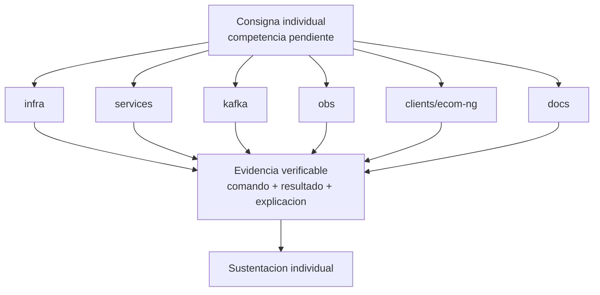

# S16 - Evaluacion final

## 1. Introduccion

Tiempo: 20 min.

### 1.1 Proposito

Brindar una instancia final para que estudiantes con competencias pendientes demuestren logro tecnico de forma individual.

### 1.2 Resultado de aprendizaje

El estudiante demuestra que puede implementar, ejecutar, diagnosticar o defender una parte critica del sistema sin depender del grupo.

### 1.3 Producto de sesion

Evidencia individual de logro de competencias pendientes.

### 1.4 Motivacion de la sesion

La competencia profesional se demuestra cuando el estudiante puede operar, explicar y defender una parte del sistema bajo condiciones controladas.

### 1.5 Ubicacion en el curso

- Unidad: U3 - Validacion y consolidacion del producto del curso.
- Producto de unidad: producto final del curso validado, documentado, estabilizado y defendido.
- Avance del producto en esta sesion: demostracion individual de competencias pendientes.

## 2. Explica

Tiempo: 15 min.

### 2.1 Conceptos clave

- Competencia pendiente.
- Consigna individual.
- Evidencia verificable.
- Diagnostico tecnico.
- Sustentacion individual.

### 2.2 Arquitectura del producto en `ecom`

La consigna puede tomar cualquier componente del producto:

- `infra`.
- `services`.
- `kafka`.
- `obs`.
- `clients/ecom-ng`.
- `docs`.



### 2.3 Observabilidad y diagnostico

La evaluacion puede incluir diagnosticar una falla provocada por el docente y explicar la ruta de revision.

## 3. Aplica: actividad practica guiada

Tiempo: 3h.

### 3.1 Identificar competencia pendiente

El docente define la competencia que el estudiante debe demostrar.

### 3.2 Asignar consigna individual

Ejemplos:

- Probar un endpoint.
- Corregir una ruta.
- Diagnosticar un 503.
- Obtener token y consumir una ruta protegida.
- Verificar un evento.
- Consultar BD.
- Explicar un componente.

### 3.3 Ejecutar y evidenciar

El estudiante ejecuta comandos, muestra resultados y explica lo realizado.

### 3.4 Sustentar resultado

El estudiante responde preguntas sobre su procedimiento, errores y decisiones.

## 4. Crea: actividad autonoma

Tiempo: 4h fuera del aula.

### 4.1 Plantilla de evidencia individual

La evaluacion final requiere tres entregables:

1. Evidencia individual en PDF.
2. Presentacion final del proyecto (PPT o equivalente).
3. Documentacion MkDocs del producto del curso con guias reproducibles de los artefactos de sesion.

Ademas, el repositorio GitHub debe evidenciar el aporte o participacion de cada integrante del equipo, y cada integrante debe mostrar una demo de la parte que trabajo.

Entrega el PDF:

```text
S16_Equipo##_ApellidoNombre.pdf
```

Entrega la presentacion final con el siguiente nombre:

```text
ProductoCurso_Equipo##_Presentacion.pdf
```

La documentacion MkDocs debe estar en el repositorio y publicada o ejecutable localmente con `mkdocs serve`.

#### 4.1.1 Datos del estudiante

- Nombre:
- Equipo:
- Sesion: S16 - Evaluacion final
- Rol o aporte realizado:
- Link de GitHub:
- Evidencia de participacion en GitHub:
- Parte del sistema que demostrara en vivo:

#### 4.1.2 Trabajo autonomo realizado

1. Registrar competencia demostrada.
2. Documentar consigna asignada.
3. Mostrar comandos o evidencias.
4. Explicar diagnostico o resultado.
5. Registrar mejora o aprendizaje.

#### 4.1.3 Presentacion final del proyecto

La presentacion debe incluir:

- Nombre del proyecto y equipo.
- Problema o flujo de negocio implementado.
- Arquitectura final.
- Flujo end-to-end.
- Seguridad, eventos, consistencia y observabilidad.
- Ejecucion DEV y PROD local.
- Evidencias principales.
- Aporte individual de cada integrante.
- Evidencia de participacion de cada integrante en GitHub.
- Demo asignada a cada integrante.
- Riesgos, incidencias y mejoras futuras.

#### 4.1.4 Documentacion MkDocs del producto del curso

La documentacion debe incluir guias para reproducir los artefactos evaluados durante el curso:

- U1: artefactos de S01 a S05.
- U2: artefactos de S06 a S12.
- U3: validacion end-to-end, estabilizacion, defensa y evaluacion final.

Cada guia debe contener comandos, orden de arranque, puertos, variables de entorno, rutas, datos de prueba, evidencias esperadas, troubleshooting y criterios de verificacion.

### 4.2 Criterios minimos de aceptacion

- PDF con nombre correcto.
- Presentacion final del proyecto entregada.
- Documentacion MkDocs reproducible del producto del curso.
- GitHub evidencia aporte o participacion de cada integrante.
- Cada integrante demuestra en vivo la parte que trabajo.
- Competencia identificada.
- Consigna ejecutada.
- Evidencia verificable.
- Sustentacion individual.

## 5. Cierre evaluativo

Tiempo: 20 min.

### 5.1 Resultados esperados

- Competencia pendiente demostrada.
- Evidencia individual presentada.
- Resultado registrado.
- Retroalimentacion final aplicada.
- Demo individual de la parte trabajada por cada integrante.
- Participacion de cada integrante verificable en GitHub.

### 5.2 Evidencia del producto de sesion

Entrega individual:

```text
S16_Equipo##_ApellidoNombre.pdf
```

El equipo entrega ademas la presentacion final del proyecto y la documentacion MkDocs del producto del curso.

### 5.3 Preguntas de defensa y reflexion

1. Que competencia estas demostrando?
2. Que comando ejecutaste y por que?
3. Que evidencia confirma el resultado?
4. Como corregirias el fallo presentado?
5. Que aprendiste respecto a tu aporte en el sistema?

### 5.4 Rubrica de evaluacion

| Dimension | Peso | 3 - Logro destacado | 2 - Logro | 1 - Proceso | 0 - Inicio | Puntuacion obtenida |
|---|---:|---|---|---|---|---:|
| 1. Ejecucion tecnica | 2 | Ejecuta la consigna correctamente y explica cada paso. | Ejecuta la consigna principal. | Ejecucion parcial. | No ejecuta la consigna. | |
| 2. Diagnostico | 2 | Diagnostica sintomas, causa y solucion. | Explica causa probable. | Diagnostico parcial. | No diagnostica. | |
| 3. Evidencia verificable | 2 | Presenta evidencia clara, reproducible y suficiente. | Evidencia suficiente. | Evidencia incompleta. | No presenta evidencia. | |
| 4. Sustentacion individual y demo de aporte | 2 | Responde con autonomia, criterio tecnico y demuestra en vivo la parte que trabajo. | Responde y demuestra su parte adecuadamente. | Responde o demuestra parcialmente. | No sustenta. | |
| 5. Correccion o mejora | 1 | Corrige o propone mejora pertinente. | Propone mejora general. | Mejora poco clara. | No propone mejora. | |
| 6. Orden, presentacion, documentacion y GitHub | 1 | PDF ordenado, presentacion final clara (PPT o equivalente), MkDocs reproducible y participacion verificable en GitHub. | Evidencia suficiente con presentacion, documentacion y GitHub. | Evidencia poco clara, documentacion incompleta o GitHub poco trazable. | Evidencia insuficiente. | |

Puntuacion acumulada = suma de (`Peso` * `Puntuacion obtenida`) = ____.

Nota final = (`Puntuacion acumulada` / 30) * 20 = ____.

Para usar la rubrica con IA, solicita:

```text
Evalua el PDF, la presentacion y la documentacion MkDocs usando la rubrica de la sesion.
Para cada dimension selecciona la puntuacion obtenida usando la escala Inicio=0, Proceso=1, Logro=2, Logro destacado=3.
Justifica brevemente cada puntuacion.
Calcula la puntuacion acumulada con la formula: suma de (Peso * Puntuacion obtenida).
Calcula la nota final sobre 20 con la formula: (Puntuacion acumulada / 30) * 20.
Indica 2 fortalezas y 2 recomendaciones.
```
